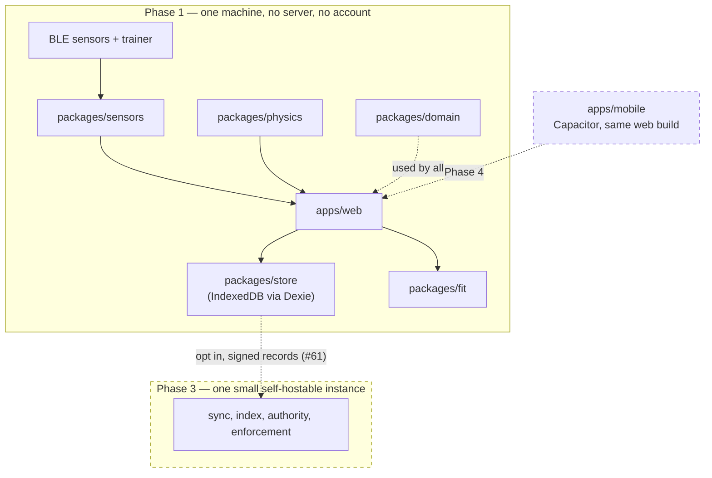

# Architecture

The layout of this repository, the boundaries between its components, and the index of decisions
that produced them.

The reasoning lives in the ADRs — this file describes **what** the structure is and **where** each
line falls. [`docs/adr/0005-tech-stack.md`](adr/0005-tech-stack.md) says why.

> **Status: none of `apps/` or `packages/` exists yet.** The layout is fixed here because roughly
> thirty sub-issues reference it by name, and moving it later means touching most of them.
> [#23](https://github.com/openzigs/onyourleft/issues/23) creates it.

## The shape of the product

**Local-first.** The athlete's own device holds the canonical copy: rides are recorded locally,
stored locally, encoded to FIT and signed with a per-athlete keypair. The signed file plus its signed
summary is the canonical artefact, so an athlete with their files needs no server to have their
history.

**One small instance, self-hostable, later.** It does only the four things a server is genuinely
required for — inbound reachability for clients that cannot listen, indexing, authority for real-time
state, and enforcement of privacy and erasure. Federation between instances is over signed records.
This is Phase 3, [#7](https://github.com/openzigs/onyourleft/issues/7).

**Not peer-to-peer.** A browser cannot be a peer; hole punching fails hardest on mobile-carrier
symmetric NAT; and a CRDT/P2P history makes privacy zones, enforced visibility and account deletion
unenforceable by construction. Recorded in the local-first ADR
([#57](https://github.com/openzigs/onyourleft/issues/57)).



## Layout

```
apps/                 AGPL-3.0-or-later, without exception
  web/                browser client — the Phase 1 product
  mobile/             Capacitor shell wrapping the same web build (Phase 4)

packages/             Apache-2.0, without exception
  domain/             units, core types, validation, signing, analysis
  fit/                FIT / GPX / TCX codec
  sensors/            sensor abstraction and BLE transport — BLE only
  physics/            cycling power/speed model
  store/              local activity and stream store

docs/
  architecture.md     this file
  adr/                numbered architecture decision records

scripts/              dependency-free repository checks; run on a bare clone

.github/
  workflows/rules.yml runs those checks on every pull request and on main
```

There is deliberately **no `apps/api`** (Phase 1 has no server — owner decision D6), **no `infra/`**
(Phase 1 deploys nothing; deployment is [#17](https://github.com/openzigs/onyourleft/issues/17)), and
**nothing anywhere for ANT+** (owner decision D2).

## Component boundaries

The licence boundary and the dependency boundary are the same line, which is what makes both
checkable.

| Component | Licence | Owns | Must not depend on | Issues |
|---|---|---|---|---|
| `apps/web` | AGPL-3.0-or-later | Routing, screens, design system, accessibility baseline, the live ride screen | — | #48–#51 |
| `apps/mobile` | AGPL-3.0-or-later | Capacitor shell, native permissions, foreground service | — | #85, #87 |
| `packages/domain` | Apache-2.0 | Canonical units and types; every conversion in the program; signing/verification; analysis computations | **Any platform API at all** — no DOM, no Node globals, no I/O, no network types | #25, #61, #66, #75–#78 |
| `packages/fit` | Apache-2.0 | FIT / GPX / TCX decode and encode | Anything server-specific; anything under `apps/` | #29–#32 |
| `packages/sensors` | Apache-2.0 | BLE sensor and trainer abstraction; Web Bluetooth transport | Anything server-specific. Web Bluetooth types must not escape above the transport boundary | #39–#44 |
| `packages/physics` | Apache-2.0 | Power → speed, as separately testable terms | Any rendering, BLE or platform API | #88 |
| `packages/store` | Apache-2.0 | Local activity and stream persistence, and its migrations | Anything under `apps/` | #27 |

**Dependencies point one way: `apps/` → `packages/`, never the reverse.** Combined with the licence
rule that is not a coincidence — Apache-2.0 code may be combined into an AGPL-3.0 work, but not the
other way round, so a `packages/` → `apps/` import would be a licence violation as well as a layering
one.

### Where the shared/deployment-specific line falls, and why it is not the usual one

Because the client owns the data and the **same computations must run identically on the device in
Phase 1 and on an instance in Phase 3**, the shared packages are not "code the client and server
happen to both need". They are **everything that is a function of the data rather than of the
deployment**.

That is why the constraint on `packages/domain` is *no platform dependency at all*, not *no server
API dependency*. A package that imports `window` or `fs` cannot run on both sides of a federation
boundary. The same code signs a record on a phone and verifies it on an instance.

What stays deployment-specific is narrow: reachability, indexing, authority and enforcement. All four
belong to the instance, and none exists in Phase 1.

### Boundaries that are enforced, not merely documented

A boundary maintained by review discipline will not survive a program this size. These are
lint-enforced by [#23](https://github.com/openzigs/onyourleft/issues/23):

- No platform or network type in `packages/domain` (#25, #45, #66, #75).
- No Web Bluetooth type above the transport boundary in `packages/sensors` (#39, #40).
- No routing-engine type above the `RoutingProvider` interface (#70).
- No import from `packages/*` into a client-only or server-only module.

And these are enforced today, with no toolchain, by `scripts/check-repo-rules.sh` and
`scripts/check-licence-hashes.sh`:

| Rule | Fails when |
|---|---|
| `LIC001` / `LIC002` | a source file's SPDX header does not match the licence its directory requires |
| `LIC003` | a package manifest declares a licence its path does not permit |
| `LIC004` | a package under `packages/` has no `LICENSE` file of its own |
| `LIC005` | a licence text no longer matches the digest ADR 0001 records for it, or ADR 0001 no longer records one |
| `SCOPE001` | ANT+ is referenced anywhere in a source tree |
| `WF001` | `pull_request_target` appears in a workflow — it receives secrets and bypasses the fork-approval gate |
| `ADR001` / `ADR002` | two ADRs share a number, or a filename is not `NNNN-kebab-case.md` |

**Both run in CI**, on every pull request and every push to `main`, from
[`.github/workflows/rules.yml`](../.github/workflows/rules.yml). Before that workflow existed the
rules were checkable but unchecked — a distinction worth keeping in mind about every other row in
this document that says "enforced".

## Technology

Decided in [ADR 0005](adr/0005-tech-stack.md). Summary only; the reasoning and the rejected
alternatives are there.

| Concern | Choice |
|---|---|
| Language | TypeScript 6.0.3 — *not* 7.x, because typed linting does not support it yet |
| Runtime | Node 24 "Krypton" (Active LTS until 2026-10-20) |
| Package manager | pnpm 11 workspaces |
| Web client | React 19 + Vite 8 |
| Mobile client | Capacitor, wrapping the same web build |
| Local data layer | IndexedDB via Dexie 4.4.5 |
| Migrations | Dexie's own versioned schema; `up`/`down` pairs with a tested `down` |
| Instance data layer | **deferred to #7** |
| Test runner | Vitest 4.1.11 |
| Coverage gate | **no percentage** — every new code path covered by a test proven to fail without the change |
| Linter / formatter | ESLint 10 + typescript-eslint + Prettier 3 |
| Real-time transport | deferred to [#16](https://github.com/openzigs/onyourleft/issues/16) |

## Decision record index

Numbers are unique, and `scripts/check-repo-rules.sh` rule `ADR001` fails the build if two files ever
share one.

### Written

| ADR | Title | Issue |
|---|---|---|
| [0001](adr/0001-licence.md) | Licensing — AGPL-3.0 app + Apache-2.0 leaf packages | #18 |
| [0005](adr/0005-tech-stack.md) | Technology stack and workspace layout | #22 |

### Claimed by open issues — **check here before you pick a number**

> ⚠️ **Three numbers are claimed twice.** Read from the issue bodies on 2026-09-03, and tracked in
> [#97](https://github.com/openzigs/onyourleft/issues/97). Until that is settled, whoever writes the
> second ADR of a colliding pair must renumber, and amend the acceptance criterion in their own issue
> when they do.

| Number | Claimed by | Also claimed by |
|---|---|---|
| 0002 | #19 — clean-room posture | **#57 — local-first architecture** (ADR 0001 already refers to the local-first decision as "ADR 0002") |
| 0003 | #20 — platform support matrix | — |
| 0004 | #21 — privacy and location | — |
| **0005** | **#22 — tech stack (written)** | **#57 — local-first architecture** |
| 0006 | #58 — FIT codec licensing | **#27 — stream storage** |
| 0007 | #59 — patent posture | — |
| 0008 | #86 — mobile client architecture | **#60 — tiles and routing** |

### Dependencies between decisions

- **ADR 0005 depends on ADR 0008 (#86).** #86 chose Capacitor + TypeScript for the mobile client
  precisely so the leaf packages and the web build are *shared* rather than reimplemented in a second
  language. Overturning TypeScript in ADR 0005 would invalidate ADR 0008; the dependency runs both
  ways and is recorded in both.
- **ADR 0005 depends on the local-first decision (#57).** The architecture is what decides where the
  boundary between shared domain code and deployment-specific code falls, which is what makes
  `packages/domain` platform-free rather than merely server-free.
- **ADR 0005 is stricter than ADR 0001.** ADR 0001 permits per-package licence declaration; ADR 0005
  makes the boundary structural, decided by path. Deliberate: a path cannot be silently mis-declared.
- **ADR 0001 is constrained by #58 and #59.** If #58 concludes the Garmin FIT licence conflicts with
  every licence ADR 0001 could have chosen, ADR 0001 is reopened rather than the codec shipped.
