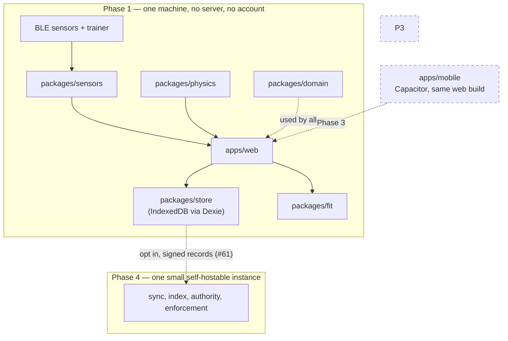
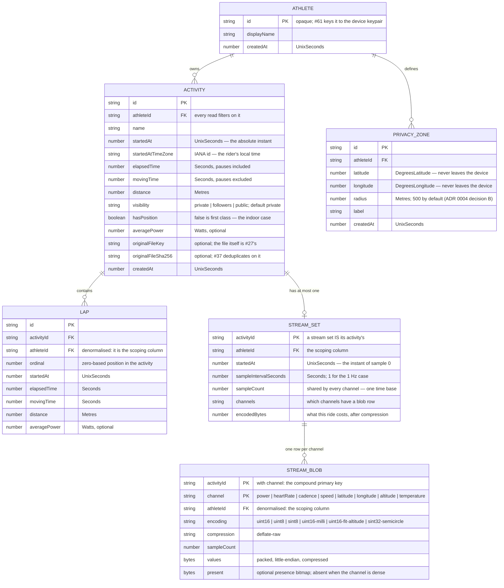

# Architecture

The layout of this repository, the boundaries between its components, and the index of decisions
that produced them.

The reasoning lives in the ADRs — this file describes **what** the structure is and **where** each
line falls. [`docs/adr/0005-tech-stack.md`](adr/0005-tech-stack.md) says why.

> **Status: `apps/web`, `packages/domain`, `packages/sensors`, `packages/fit`, `packages/store`
> and `packages/physics` exist.** The first two were created by [#23](https://github.com/openzigs/onyourleft/issues/23)
> with the pnpm workspace, the toolchain, a committed lockfile and the lint-enforced boundaries;
> `packages/sensors` by [#39](https://github.com/openzigs/onyourleft/issues/39) and
> [#40](https://github.com/openzigs/onyourleft/issues/40)–[#44](https://github.com/openzigs/onyourleft/issues/44),
> `packages/fit` by [#107](https://github.com/openzigs/onyourleft/issues/107) and
> [#30](https://github.com/openzigs/onyourleft/issues/30)–[#32](https://github.com/openzigs/onyourleft/issues/32),
> and `packages/store` by [#26](https://github.com/openzigs/onyourleft/issues/26)–[#28](https://github.com/openzigs/onyourleft/issues/28)
> and [#46](https://github.com/openzigs/onyourleft/issues/46), and `packages/physics` by
> [#88](https://github.com/openzigs/onyourleft/issues/88). ⚠️ **`packages/matching` existed
> between [#65](https://github.com/openzigs/onyourleft/issues/65) and
> [#66](https://github.com/openzigs/onyourleft/issues/66) and does not any more** — it was the #65
> spike, and #66 hardened its algorithm into `packages/domain/src/segment/` and deleted it.
> **`apps/mobile`
> ([#85](https://github.com/openzigs/onyourleft/issues/85)) does not exist yet**; it is created by
> the issue that owns its content, using `packages/domain` as the template.
> The layout is fixed here because roughly thirty sub-issues reference it by name, and moving it
> later means touching most of them. The workspace globs (`apps/*`, `packages/*`) and every rule
> below are written against these paths already, so a package arrives inside the rules rather than
> beside them.
>
> Reconciled once, after those branches landed, by
> [#110](https://github.com/openzigs/onyourleft/issues/110) — which exists because three concurrent
> branches editing this paragraph is two rebases and a conflict.

## The shape of the product

**Local-first.** The athlete's own device holds the canonical copy: rides are recorded locally,
stored locally, encoded to FIT and signed with a per-athlete keypair. The signed file plus its signed
summary is the canonical artefact, so an athlete with their files needs no server to have their
history.

**One small instance, self-hostable, later.** It does only the four things a server is genuinely
required for — inbound reachability for clients that cannot listen, indexing, authority for real-time
state, and enforcement of privacy and erasure. Federation between instances is over signed records.
This is Phase 4, [#7](https://github.com/openzigs/onyourleft/issues/7).

**Not peer-to-peer.** A browser cannot be a peer; roughly half of all peer pairs never reach a
direct connection; a commit-reveal anti-cheat scheme has a latency floor set by the slowest rider;
a global leaderboard is a global aggregate and needs an aggregator; and a CRDT/P2P history makes
privacy zones, enforced visibility and account deletion unenforceable by construction. Decided, with
the measurements and their sources, in [ADR 0002](adr/0002-local-first-architecture.md)
([#57](https://github.com/openzigs/onyourleft/issues/57)).



## Layout

```
apps/                 AGPL-3.0-or-later, without exception
  web/                browser client — the Phase 1 product
    src/a11y/           the accessibility gate: rules, per-route audit, contrast (#48)
    src/athlete/        what the rider weighs (#325): the one place a missing mass
                        is substituted, the one place a typed weight becomes a
                        kilogram, and the narrow write that puts it on the
                        athlete row. The mass here is the ATHLETE's — the bicycle
                        is added by src/game/rider.ts and only there
    src/camera/         the camera: its port, its consent and the sign that says it
                        is on (#382). ADR 0029 is the whole of why this is its
                        own directory rather than a sensor channel: a frame is
                        its OWN data class (D-1), it is discarded after it has
                        been looked at unless the rider keeps this ride's (D-2),
                        it is stripped at capture by being re-encoded from raw
                        pixels rather than filtered (D-9), and no message this
                        module produces may carry a frame, a crop, a thumbnail
                        or a locator for one (D-8). The bystander sentence in
                        consent.ts is D-5's, VERBATIM, and consent.test.ts reads
                        the ADR off disk to keep it so. No platform camera type
                        leaves the directory — boundary.test.ts, in the shape
                        packages/sensors states about Web Bluetooth
    src/credits/        the in-app attribution, generated from ASSETS.toml (#358):
                        the reader for the manifest's own TOML subset, which
                        entries are credited and why, and the one line that
                        inlines the manifest at build time rather than fetching
                        it. ADR 0023 D-3 — for a CC-BY asset this screen is the
                        obligation, not a nicety
    src/design/         design tokens, theme.css and the primitives (#48)
    src/detail/         the ride detail view's data layer (#50): the read budget, the
                        gap-preserving downsampler, the SVG trace, and the
                        privacy-zone trim behind the shared view
    src/library/        the activity library's row model and its port (#62)
    src/map/            the ride map (#63): the basemap configuration and its
                        origin proof, the GeoJSON conversion, the once-per-app
                        protocol registration, and the MapLibre adapter — which
                        is also the one place the tile-parsing worker's URL is
                        set, without which a built map draws no tile at all
    src/recording/      the composition root: engine + checkpoints + recovery (#46)
    src/routes/         saved routes (#73): the store port, the edit decision and
                        its concurrency token, the shared-route payload, the
                        one wording of what each of the two GPX importers makes,
                        shared by the three screens that say it (#232), and the
                        import form itself (#296) — the one place a rider claims
                        a file is a loop, and the refusal when it is not
    src/routing/        planning a route (#70, #71, #72): the draft and the legs
                        an edit makes stale, undo over whole drafts, the draft
                        kept across a reload, and the elevation profile. The
                        INTERFACE is in packages/domain; there is no engine
                        adapter — CLAUDE.md section 4i says why
    src/ride/           the live ride screen's state machine and its panels (#49)
    src/shell/          the hash route table, the router hook and AppShell (#48)
    src/support/        browser-capability detection and its notice (#48)
    src/units/          which units a rider reads in (#238): the one place a
                        number becomes a unit, the context a component asks,
                        and the source scan that stops a future screen writing
                        a unit literal by hand. ADR 0020
    src/transfer/       file import and export: the batch importer, the codec's
                        first production caller, the export writer (#51), the
                        distance an imported track derives from its own
                        positions when the file states none (#231), and whether
                        a GPX looked like a course rather than a ride — with the
                        one action that turns it into a route (#232)
    src/views/          one component per route (#48)
  mobile/             Capacitor shell wrapping the same web build (Phase 3)

packages/             Apache-2.0, without exception
  domain/             units, core types, validation, signing, analysis
    recording/          the recording session state machine and the stream merge (#45)
    routing/            the engine-agnostic routing interface (#70): the named
                        product options a rider chooses, and the one place an
                        engine's numbers are checked before anything believes
                        them
    route/              the route profile (#89): elevation and gradient as a
                        function of distance, the three windows it is built
                        from, and the loop wrap; and since #326 the heading at
                        a distance and the wind resolved against it — the one
                        place a wind vector becomes a headwind, here because
                        `packages/physics` says that resolution needs a course
                        and a compass and it has neither
    trainer/            the gradient setpoint driver (#90): the grade at the
                        rider's position, and whether it is worth a write
    pacer/              the bot pacer's pacing rule and its gap (#92): a target
                        w/kg at a fixed 75 kg, ramped with the gradient
  fit/                FIT / GPX / TCX codec
    src/route/          route import (#89): the #32 decoder composed with the
                        profile, and the refusals a rider can act on
  sensors/            sensor abstraction and BLE transport — BLE only
    src/                the transport-agnostic abstraction; no platform API at all
    protocol/           the GATT profile clients (#41, #42, #43); no platform API either
    web-bluetooth/      the browser transport (#40); the one place a BluetoothDevice exists
  physics/            cycling power/speed model — Martin et al. 1998, as separate terms
  store/              local activity, stream and recording-checkpoint store

docs/
  architecture.md     this file
  cost-model.md       what "free to the end user" costs and who pays it (#54).
                      Its arithmetic is a gate: `pnpm run check:cost-model`
                      recomputes every figure from the inputs stated beside it
  adr/                numbered architecture decision records
  spikes/             numbered spike write-ups — a dated measurement, not a decision
  validation/         numbered hardware-validation procedures — a script for one
                      afternoon, with its result tables empty until somebody runs it

scripts/              dependency-free repository checks; run on a bare clone

.github/
  workflows/rules.yml runs those checks on every pull request and on main
```

There is deliberately **no `apps/api`** (Phase 1 has no server — owner decision D6), **no `infra/`**
(Phase 1 deploys nothing; deployment is [#17](https://github.com/openzigs/onyourleft/issues/17)), and
**nothing anywhere for ANT+** (owner decision D2).

## Component boundaries

The licence boundary and the dependency boundary are the same line, which is what makes both
checkable.

| Component | Licence | Owns | Must not depend on | Issues |
|---|---|---|---|---|
| `apps/web` | AGPL-3.0-or-later | Routing, screens, design system, accessibility baseline, the live ride screen, file import and export | — | #48–#51 |
| `apps/mobile` | AGPL-3.0-or-later | Capacitor shell, native permissions, foreground service | — | #85, #87 |
| `packages/domain` | Apache-2.0 | Canonical units and types; every conversion in the program; signing/verification; analysis computations; **the segment matcher, the effort it produces and the comparison of two of them** (#66, #67); **the route profile** (#89) | **Any platform API at all** — no DOM, no Node globals, no I/O, no network types | #25, #61, #66, #75–#78, #89 |
| `packages/fit` | Apache-2.0 | FIT / GPX / TCX decode and encode | Anything server-specific; anything under `apps/`; **anything carrying the Garmin FIT Protocol License — see [ADR 0006](adr/0006-fit-codec-licensing.md)** | #29–#32 |
| `packages/sensors/src` | Apache-2.0 | BLE sensor and trainer abstraction, and the simulator | **Any platform API at all**, as `packages/domain` — plus any BLE library, because an abstraction that names one has chosen it for all three stacks | #39, #44 |
| `packages/sensors/protocol` | Apache-2.0 | The GATT profile clients: Heart Rate, Cycling Speed and Cadence and Cycling Power — service and characteristic UUIDs, bounds-checked payload decoding, and the `GattProfile` seam itself | **Any platform API at all**, as `packages/sensors/src` — it is compiled by the same platform-free program, because the same decoders serve the browser adapter and the native stacks | #41, #42 |
| `packages/sensors/web-bluetooth` | Apache-2.0 | The browser transport: the `DeviceId → device/server/service/characteristic` map, the global GATT operation queue, the profile registry `packages/sensors/protocol` fills, and — since #49 — the **production `FitnessMachineChannel`**, which is the only place in the program that writes to a GATT characteristic | Anything server-specific; every platform global except `navigator`. **Web Bluetooth types must not escape above the transport boundary** | #40, #49 |
| `packages/physics` | Apache-2.0 | Power → speed, as separately testable terms | Any rendering, BLE or platform API | #88 |
| `packages/store` | Apache-2.0 | Local activity and stream persistence, its migrations, and the round-trip test harness | Anything under `apps/` | #26, #27, #28 |

`packages/domain` is filled in as of [#25](https://github.com/openzigs/onyourleft/issues/25): the
canonical representation of each quantity, the conversions into and out of the wire formats (FIT
semicircles, the FIT 1989 epoch, the FIT altitude scale and offset, the wrapping 1/1024 s and 1/2048
s event-time counters), and the validation that runs where an untrusted number becomes a typed one.
Each is tabulated with its unit, its sign rule and the bug it prevents in
[`packages/domain/README.md`](../packages/domain/README.md), which is the reference a consumer reads
rather than this file.

`packages/fit` holds the **FIT activity file decoder** as of
[#30](https://github.com/openzigs/onyourleft/issues/30), alongside the synthetic fixture corpus and
generator from [#29](https://github.com/openzigs/onyourleft/issues/29). `decodeFitActivity(bytes)`
returns the file's contents in `@onyourleft/domain` quantities plus every recoverable fault, each
carrying the byte offset it was found at; it opens nothing, so
[`packages/fit/tsconfig.platform-free.json`](../packages/fit/tsconfig.platform-free.json) compiles
`src/` with `lib: ["ES2024"]` and `types: []` and a `TextDecoder` is a compile error there. The
profile it reads is the narrow, enumerated subset [ADR 0006](adr/0006-fit-codec-licensing.md) R2
requires, and the provenance of every number in it — with the two that rest on the fixture corpus
alone named as such — is in [`packages/fit/README.md`](../packages/fit/README.md), which is the
reference a consumer reads rather than this file.

It also holds the **FIT activity file encoder** as of
[#31](https://github.com/openzigs/onyourleft/issues/31) — `encodeFitActivity(activity)`, the same
shape in the other direction, so `encode(decode(x))` needs no adapter — and **GPX 1.1 and TCX v2
import and export** as of [#32](https://github.com/openzigs/onyourleft/issues/32). The two text
formats share one shape of their own (`TrackActivity`) rather than reusing the FIT one, because a
GPX file has no `file_id`, no developer fields and no `date_time` union; what they share with
everything else is the units. `packages/fit` still depends on nothing but `@onyourleft/domain` at
runtime — including for XML, which it parses with its own reader rather than a dependency, so that
a `<!DOCTYPE` can be refused by the grammar rather than disabled by a setting. Its one
devDependency of note is `fit-file-parser` (MIT), a test-time-only independent FIT reader adopted
under #31's ruling; `packages/fit/README.md` §1 records why that is consistent with ADR 0006.

`packages/physics` is filled in as of [#88](https://github.com/openzigs/onyourleft/issues/88): the
**Martin et al. 1998** road-cycling power model, with a separately exported function for each term
of the force balance — aerodynamic drag at the air velocity, rolling resistance, the along-slope
component of gravity, wheel-bearing friction, the rotating mass of the wheels and the drivetrain
loss — plus the forward model (`powerRequired`, Equations 13 and 15), its steady-state inverse
(`steadyStateSpeedMetresPerSecond`) and the deterministic, time-step-independent tick (`advance`).
Every constant records the sentence of the paper it came from, and the ones that do not — the split
of the drag area into a coefficient and an area, and a chain efficiency the paper states twice with
two values — are flagged as such in [`packages/physics/README.md`](../packages/physics/README.md)
§2, the way `packages/fit/README.md` §3 flags a protocol number resting on weaker evidence.

It is platform-free through one `tsconfig.json` rather than two, because unlike `packages/fit` and
`packages/sensors` it has no directory that needs a platform at all. Two names escape that closure
and are handled in `eslint.config.js` instead: **`Date` and `Math.random` are ECMAScript built-ins**
and survive `lib: ["ES2024"]` exactly as `DataView` does in `packages/sensors`. They matter here
because #88 makes determinism and time-step independence acceptance criteria, and a model that reads
a wall clock is precisely the frame-rate coupling those exist against. Elapsed time arrives as a
`Seconds`.

⚠️ **Nothing consumes it yet.** #88 is scoped to the package and #51 was running in parallel, so no
screen renders a speed from this model; [#90](https://github.com/openzigs/onyourleft/issues/90),
[#91](https://github.com/openzigs/onyourleft/issues/91) and
[#94](https://github.com/openzigs/onyourleft/issues/94) are the issues that will.

`packages/store` is filled in as of [#26](https://github.com/openzigs/onyourleft/issues/26) — the
athlete, activity, lap and privacy-zone object stores, the indexes each read goes through, the
referential behaviour IndexedDB cannot declare, and the migration `up`/`down` contract — and of
[#27](https://github.com/openzigs/onyourleft/issues/27), which adds per-second streams as schema
version 2 and decides their shape in [ADR 0011](adr/0011-stream-storage.md), and of
[#46](https://github.com/openzigs/onyourleft/issues/46), which adds **recording checkpoints** as
schema version 3, and of [#61](https://github.com/openzigs/onyourleft/issues/61), which adds the
**device keypair and the signed activity record** as schema version 4 and decides their shape in
[ADR 0014](adr/0014-portable-identity.md), and of
[#64](https://github.com/openzigs/onyourleft/issues/64) and
[#66](https://github.com/openzigs/onyourleft/issues/66), which add **segments** as schema version 5
and **segment efforts and the match checkpoint** as schema version 6, and of
[#89](https://github.com/openzigs/onyourleft/issues/89), which adds **saved routes** as schema
version 7. All six later versions are purely additive and change no existing record's shape, which
is why `SCHEMA_MIGRATIONS` is still empty. The entity model:



Three things that diagram does not say, and that a reader coming from a relational schema will
otherwise assume:

- **`FK` is a description, not a mechanism.** IndexedDB has no foreign keys and no `ON DELETE`
  clause. Deleting an athlete cascades to their activities, laps and zones, and deleting an activity
  cascades to its laps — because `packages/store` does it, in one transaction, and not because the
  engine does. The choice and its cost are argued in `packages/store/src/activity-store.ts`.
- **`visibility` is present from version 1 with a `private` default**, per
  [ADR 0004](adr/0004-privacy-and-location.md) decision A. There is no stored start position to go
  with it: that ADR forbids a `start_lat`/`start_lng` pair a list query would select, so `hasPosition`
  carries the one bit the activity list needs.
- **Streams are packed binary, never per-sample rows.** One `Uint8Array` per channel per activity,
  each channel at a declared resolution, gaps carried as a packed presence bitmap so an absent
  sample is distinguishable from a zero. **A four-hour 1 Hz eight-channel ride costs a measured
  22.2 KiB per recorded hour** — 88.6 KiB stored, 239 KiB packed, 2.70× from `deflate-raw`. The
  reasoning, the alternatives and every measured figure are in
  [ADR 0011](adr/0011-stream-storage.md). Devices and gear are still additive object stores in a
  later schema version.
- **A recording in progress is a session header plus append-only chunks**, and it is a different
  shape from a finished ride for a different job: written every few seconds rather than once,
  appended rather than replaced, and **packed but not compressed**, because deflate on a
  five-sample window costs more than it saves and its asynchrony would put a suspension point in
  the one path that must complete before the tab dies. Recovery reads the **contiguous prefix** and
  stops at the first hole — joining the rows either side of a lost flush would shift every later
  sample onto the wrong second while producing an array of exactly the length a caller expects. The
  reasoning and the measured cost (**239.07 KiB packed for a four-hour ride**) are in
  [`packages/store/README.md`](../packages/store/README.md) §"Recording checkpoints".
- **The recording engine is generic over a channel map and lives in `packages/domain`.** It cannot
  name the eight channels: `@onyourleft/store` and `@onyourleft/sensors` both already do and both
  depend on it, so `apps/web/src/recording/channels.ts` is the composition root that instantiates
  the engine at the store's own `StreamChannelValue` and adapts a `SensorMeasurement` into a
  reading. The engine reads no clock and schedules nothing — every instant is a parameter — which is
  what lets #85's native shell reuse it unchanged and what makes every timing case testable without
  fake timers.

- **The athlete's identity is a keypair, and the ride's authenticity is a signed record.** Schema
  version 4 adds `deviceKeys` — one row per athlete, holding a **non-extractable** Ed25519
  `CryptoKey` that can sign and cannot be exported — and `activityRecords`, one row per ride holding
  the publishable artefact. The record format is specified below; the decision is
  [ADR 0014](adr/0014-portable-identity.md).

The indexes, the query each one serves, and the reasoning for every field are in
[`packages/store/README.md`](../packages/store/README.md).

### The signed activity record

Decided in [ADR 0014](adr/0014-portable-identity.md) (#61). **This section is the specification.**
It is written so that somebody with no access to this repository can write a verifier from it, which
is the point of the whole exercise — `packages/store/src/identity-verifier.test.ts` contains one
written this way, and it verifies records the app produced.

**Scheme, library and version, with the date read**, because a signature format is effectively
permanent once records exist:

| | |
|---|---|
| Signature scheme | **Ed25519**, RFC 8032. 32-byte public key, 64-byte signature |
| Digest | **SHA-256**, FIPS 180-4 |
| Canonicalisation | **RFC 8785**, the JSON Canonicalization Scheme (Informational, June 2020) |
| Implementation | **the platform's `crypto.subtle`. There is no third-party cryptography dependency** |
| Availability, **read 2026-09-06** | WebKit — Safari 17.0; Gecko — Firefox 129 (August 2024); Blink — Chrome 137 (May 2025); Node — verified on 24.20.0 |
| Record format version | **1**, and provisional until [#56](https://github.com/openzigs/onyourleft/issues/56) |

A record is a JSON object with exactly **seven** members and no others:

```json
{
  "algorithm": "Ed25519",
  "claims": {
    "activityId": "activity-1",
    "distance": 120000,
    "elapsedTime": 14400,
    "hasPosition": false,
    "movingTime": 14200,
    "name": "Zwift Watopia",
    "startedAt": 1700100000,
    "startedAtTimeZone": "Europe/London"
  },
  "contentHash": "sha256:9f86d081884c7d659a2feaa0c55ad015a3bf4f1b2b0b822cd15d6c15b0f00a08",
  "format": "onyourleft.activity-record",
  "publicKey": "d75a980182b10ab7d54bfed3c964073a0ee172f3daa62325af021a68f707511a",
  "signature": "e5564300c360ac729086e2cc806e828a84877f1eb8e5d974d873e065224901555fb8821590a33bacc61e39701cf9b46bd25bf5f0595bbe24655141438e7a100b",
  "version": 1
}
```

**To verify one:**

1. Check `format` is `onyourleft.activity-record`, `version` is `1` and `algorithm` is `Ed25519`.
   A version or algorithm you do not know is **unsupported**, which is not the same answer as a bad
   signature — see below.
2. Remove the `signature` member. Serialise what remains with **RFC 8785**, and **UTF-8 encode** it.
   That byte string is the signing input; nothing else is hashed, prefixed or wrapped.
3. Decode `publicKey` from lowercase hex into 32 raw bytes, and `signature` into 64.
4. Ed25519-verify the signature over the signing input with that key.
5. Independently, SHA-256 the activity file's bytes and check that `contentHash` equals `sha256:`
   followed by the lowercase hex of that digest.

**The rules a record must satisfy**, which are narrowings of RFC 8785 and are what an implementation
has to match:

- Member names are sorted by **UTF-16 code unit** — a plain byte/code-unit sort, never a locale one.
- Numbers use the **ECMAScript `Number::toString`** algorithm (shortest representation that
  round-trips), and negative zero serialises as `0`.
- Strings escape only `"`, `\`, the five short control forms (`\b \t \n \f \r`) and `\u00xx` in
  **lowercase** hex for the remaining characters below U+0020. Everything else is literal UTF-8.
- **`null` never appears.** "No value" is spelled by the member being **absent**. `averagePower` is
  the only optional claim.
- **Unpaired surrogates are invalid** (RFC 8785 §3.2.3). A canonicalisation that substitutes U+FFFD
  is not injective and would give two different records the same signing input.
- **Any member not listed above makes the record invalid**, at both levels. A verifier must reject
  rather than ignore: ignoring would mean re-canonicalising bytes that are not the bytes that were
  signed, and the record would then read as a forgery instead of as malformed. It is also what
  guarantees a record cannot smuggle a coordinate.

**The claims carry no location.** The ride's shape is in the activity file, referenced by content
hash; `hasPosition` is one bit and is not a coordinate. That is
[ADR 0004](adr/0004-privacy-and-location.md) applied to a document designed to be published — see
ADR 0014 D-5.

**A failed verification has five answers, not two**, and the difference matters to whoever reads it:
`verified`; `content-mismatch` (the record is authentic and the *file* is not the one it vouches
for — the signature is still valid); `signature-mismatch` (altered after signing, or a different
key); `unsupported` (a version or scheme this build does not know — **not** a forgery); and
`malformed`. ⚠️ **`content-mismatch` is only reachable after step 4 has passed**, which is why step 4
comes before step 5 above. It is an *authenticated* answer — it says the record is genuine — so a
verifier that compared the content hash first would hand it, and the `expected` string inside it, to
a record nobody signed.

**Key rotation and key loss** are documented behaviours with stated consequences, in
[ADR 0014](adr/0014-portable-identity.md) §Consequences and in
[`packages/store/README.md`](../packages/store/README.md) §"Identity". The short version: records
already signed verify forever; a lost key cannot be recovered, cannot be backed up — it is
non-extractable by design — and the answer is a new identity and a history with two provable eras.
There is no rotation in Phase 1 and replacing a key is refused.

**How a record travels in an export** — [ADR 0019](adr/0019-signed-records-in-an-export.md), #221.
It is **its own file**, `<the activity file's name>.record.json`, holding the seven-member object
above and nothing wrapping it. Not inline in the account manifest (which carries the athlete's
privacy zones and is therefore the most sensitive file in the archive, where a record is the least),
and not inside the FIT file as a developer field (which is circular: `contentHash` is the SHA-256 of
the file the record vouches for, and embedding the record changes those bytes). The account
manifest's entry for each ride carries a `signedRecord` member naming that file, or an explicit
`null` for a ride that has none — records are written by the recorder, so an imported ride never had
one, and the absence must be readable rather than inferred.

⚠️ **Step 5 above does not apply to a file taken out of an export.** The activity file in an archive
is a *re-encode* of the stored ride, and the same ride exported as GPX and as TCX is two files and
one record — so it is generally not the byte string `contentHash` names, and running step 5 against
it returns `content-mismatch`, correctly. Steps 1–4 are the whole of what an archive supports, and
they are what `verifyRecordSignature` performs; step 5 belongs to the file the record actually names.

### `apps/web`: the shell, the design system and the accessibility baseline

Added by [#48](https://github.com/openzigs/onyourleft/issues/48), which also carries the design
system — [ADR 0009](adr/0009-clean-room-posture.md) §419 attributes it to #49, and the mismatch is
recorded here rather than by editing a protected ADR in place.

Three decisions were made in that issue rather than by adding a dependency, and each is reversible
in one file:

- **Routing is hash-based and written here** (`src/shell/routes.ts`, `useRoute.ts`), not
  `react-router`. Path routing needs a server that rewrites unknown paths to `index.html`, and
  Phase 1 has no server at all (owner decision D6) — so a refresh on a deep link would 404 against
  whatever static host is serving the files. A fragment never reaches a server, works from
  `file://`, and makes every navigation a plain `<a href="#/activities">` whose keyboard, middle-click
  and open-in-new-tab behaviour is the browser's rather than ours. Revisit with
  [#7](https://github.com/openzigs/onyourleft/issues/7).
- **The design system is ours** (`src/design/`): tokens in TypeScript, one hand-written stylesheet,
  four primitives. No CSS framework and no component library. `theme.css` is asserted equal to
  `tokens.ts` in both directions, which is what makes the token-level contrast check a statement
  about what the browser paints.
- **The accessibility checker is ours too** (`src/a11y/`), for the licence and headless-DOM reasons
  in CLAUDE.md §4e. It runs on every route, in CI, as a step of its own, and it fails the build.

[#307](https://github.com/openzigs/onyourleft/issues/307) gave that design system the three things
it did not have, and each is checkable rather than a matter of taste:

- **Elevation is a surface colour, never a shadow** (`tokens.ts` §`ELEVATION_SURFACES`). Four levels,
  darkening with height because `canvas` is already `#ffffff` and there is nothing lighter to move
  toward. A shadow is invisible to every gate this repository owns — the contrast suite reads
  colours, jsdom performs no layout, and the browser gate renders a map and a 3D scene and no
  chrome — so a shadow-based system would be the one part of the design system nothing could check.
  `tokens.test.ts` requires the ramp to be monotone and every adjacent step to fall inside a stated
  band, which is what a token set to a nonsense value breaks.
- **The type scale has a ratio**: base 1 rem, ratio 1.25, steps −1 to 3 for reading and 6 for a live
  ride metric. The sizes are literals and `tokens.test.ts` re-derives them — a ladder computed from
  its own ratio agrees by construction and could not fail.
- **Every token is painted by a rule.** `theme.a11y.test.ts` fails on a custom property no `var()`
  reads. It found two that nothing read: `--oyl-font-size-xl` and `--oyl-space-xl`, both declared,
  both asserted equal to `tokens.ts`, both painting nothing — which is why the headings were at the
  user agent's own sizes and the client "read as an unstyled document".

**The native controls are styled and still native.** `appearance: none` removes the platform's
drawing of a closed `<select>` and nothing else: the popup, the keyboard model, typeahead and the
accessibility tree stay the platform's, which is the line between styling a control and building a
listbox out of `<div>`s ([#305](https://github.com/openzigs/onyourleft/issues/305)). It is reverted
under `forced-colors: active`, because a control whose OS skin has been removed *and* whose
replacement skin is then flattened has no affordance left at all.

⚠️ **#307's review added a fourth thing, and it is a gate rather than a system.** The first three are
all checkable *without a browser* — a colour ratio, a number against a ratio, a `var()` against a
declaration — and that is exactly why the one part of #307 nothing could check went wrong. It made
`.oyl-header` sticky and gave `.oyl-main` a `scroll-margin-top`, and at 320×256 — the viewport WCAG
2.2 SC 1.4.10 names, and what a 1280×1024 window becomes at 400% zoom — the header covered **70% of
the screen** and "Skip to main content" landed the `<h1>` entirely behind it. Every gate stayed
green, because **this repository had no way to measure a layout**: jsdom performs none,
`theme.a11y.test.ts` reads the stylesheet as a file, and the browser gate rendered a map and a 3D
scene and never the chrome.

So the header now sticks only where it is cheap — `@media (min-width: 64rem) and (min-height: 40rem)`,
whose worst admitted case is a 97 px header on a 640 px viewport — and `apps/web/browser/shell.html`
measures it. The general rule that falls out is worth more than the fix: **`position`, `z-index`,
`scroll-margin` and the size of persistent chrome are reviewed by measuring them in the pinned
Chromium, never by reading the CSS.** CLAUDE.md §4f is the record.

**The unsupported-browser experience is a feature of this component, not an error path.**
`src/support/bluetooth-support.ts` classifies the browser into six states —
available, adapter-unavailable, not-permitted, insecure-context, absent, incomplete — by probing
capability through `@onyourleft/sensors/web-bluetooth`, never by reading a user agent.
[ADR 0003](adr/0003-platform-support-matrix.md) decision D-7 is the source: the two states a
`'bluetooth' in navigator` check cannot tell apart are Chrome-on-Linux, where the object is present
and the adapter is unusable, and a page served over plain HTTP, where the object is withheld and the
browser gets the blame. Where the browser cannot pair, **no pairing control is rendered at all** —
a disabled one is out of the tab order and announces no reason, which is the silent failure the
issue exists to prevent.

### `apps/web/src/transfer`: import and export, and the sample grid nobody else owns

Added by [#51](https://github.com/openzigs/onyourleft/issues/51), and it is `packages/fit`'s **first
production caller**. Everything about the three file formats stays in the codec; what lives here is
the part the codec deliberately does not know about — the 1 Hz sample grid
[ADR 0011](adr/0011-stream-storage.md) stores a ride on, and the store writes either side of it.

Three things about it are load-bearing rather than incidental:

- **The batch is per file.** `import-batch.ts` gives every file its own outcome, named by filename,
  and a failure is an outcome rather than an exception. A bulk export from another platform contains
  files this project cannot read — a summary spreadsheet, a compressed ride, whatever else — and an
  importer that stops at the first one turns a decade of history into "import failed".
- **A distance the file does not state is derived from the track, and only then** —
  [#231](https://github.com/openzigs/onyourleft/issues/231). GPX has no lap totals and no per-point
  cumulative distance, so a file carrying five thousand positions and nothing else imported as
  **0.0 km**. `track-distance.ts` derives one from the positions, behind both of the file's own
  numbers rather than over them, and it is deliberately **not** the rule `recording/finish.ts`
  uses: a recorded ride integrates its distance from *speed*, which is right for a live sensor and
  turns an import's richest channel into a zero. Three rejections keep the sum honest — an interval
  longer than a minute is a hole rather than a straight line, a step slower than walking pace is the
  receiver drifting rather than the rider moving, and a step implying more than any bicycle has ever
  gone is a fix that jumped. The anchor is what makes the middle one work: a rejected step does not
  move it, so drift is measured as displacement from where the receiver actually was rather than one
  metre at a time forever.
- **A `.gpx` means two things, and this screen says which one it makes** —
  [#232](https://github.com/openzigs/onyourleft/issues/232). The Files screen turns a file into an
  *activity*; the Routes screen turns one into a *route*, which is what the Trainer game rides.
  "Files" is where a rider goes to import a file and it is the wrong screen for a downloaded course,
  so a course imported here used to succeed, as a ride, with the game's picker left correctly empty
  and nothing anywhere saying why. `course-shaped.ts` judges whether a GPX looked like a course and
  `route-from-import.ts` is the one action that makes a route out of it, re-reading the file from
  the rider's own disk rather than retaining three hundred files' bytes in case one of them is
  wanted. ⚠️ **The heuristic decides the sentence and never the offer**: the button is on every GPX
  the screen read, flagged or not, which is what makes a wrong guess in either direction cost one
  click. And it is deliberately **not** "the file has no speed channel" — #231's file is a real
  89-minute ride with positions, elevation, a time on every point and no speed at all, so that rule
  would file a ride as a course. Two signals together do it instead: no sensor channel of any kind,
  *and* an implied pace that never leaves a ten-per-cent band, which is a planner's assumed speed
  rather than anything a rider holds.
- **The resource bound on an import is this component's, not the codec's.** A file's *timestamps*
  decide how long the sample arrays are, and two well-formed records a decade apart ask for 315
  million slots per channel. `MAXIMUM_IMPORTED_SAMPLES` is checked before anything is allocated. The
  codec's own bound (#127) covers what it retains while decoding and cannot cover this, because the
  codec has no sample grid.
- **An export carries the athlete's real track.** [ADR 0004](adr/0004-privacy-and-location.md)'s
  privacy zones exist for what gets *published*, and Phase 1 publishes nothing (owner decision D6).
  There is no zone lookup in `export-activity.ts` and there must not be one; a share or publish path
  is a different function, and it arrives with [#7](https://github.com/openzigs/onyourleft/issues/7).
- **What the erase destroys, the export has to carry** —
  [#221](https://github.com/openzigs/onyourleft/issues/221). Two rows went in `deleteAthlete`'s
  cascade and came out in no export: a ride's **laps**, and its **signed record**. The laps were a
  plain omission in `export-activity.ts`, which read the streams and never `listLaps`, and losing
  them cost a single-ride export as much as an account one. The record needed a decision, taken in
  [ADR 0019](adr/0019-signed-records-in-an-export.md): it leaves as `<ride>.record.json` beside the
  activity file, and the account manifest names it per ride or says `null`. **Nothing here signs
  anything** — ADR 0014 forbids re-minting a record for a ride that has none, and the recorder is
  the only thing that may make one. Whenever a row is added to the cascade, this bullet is the
  question to ask about it.

What the screen may say about another platform is [ADR 0009](adr/0009-clean-room-posture.md) R3's
template, used verbatim, and `TransferView.test.tsx` asserts both approved strings and the absence of
every unapproved one. There is no "connect an account" control because there is nothing to connect
to.

**Dependencies point one way: `apps/` → `packages/`, never the reverse.** Combined with the licence
rule that is not a coincidence — Apache-2.0 code may be combined into an AGPL-3.0 work, but not the
other way round, so a `packages/` → `apps/` import would be a licence violation as well as a layering
one.

### Where the shared/deployment-specific line falls, and why it is not the usual one

Because the client owns the data and the **same computations must run identically on the device in
Phase 1 and on an instance in Phase 4**, the shared packages are not "code the client and server
happen to both need". They are **everything that is a function of the data rather than of the
deployment**.

That is why the constraint on `packages/domain` is *no platform dependency at all*, not *no server
API dependency*. A package that imports `window` or `fs` cannot run on both sides of a federation
boundary. The same code signs a record on a phone and verifies it on an instance.

What stays deployment-specific is narrow: reachability, indexing, authority and enforcement. All four
belong to the instance, and none exists in Phase 1.

### Boundaries that are enforced, not merely documented

A boundary maintained by review discipline will not survive a program this size.

**Enforced by `eslint.config.js`** since [#23](https://github.com/openzigs/onyourleft/issues/23):

| Rule | Fails when |
|---|---|
| `boundaries/dependencies` | anything under `packages/*` imports anything under `apps/*`, in either the relative or the `@onyourleft/…` workspace spelling |
| `@typescript-eslint/no-restricted-imports` | `packages/domain` names **any** Node builtin — the pattern list is derived from `builtinModules` rather than typed out, so `events`, `util` and `stream/promises` fail exactly as `node:fs` does — or `react`, `react-dom`, `vite` or `dexie` |
| `no-restricted-globals` | `packages/domain`, `packages/physics`, `packages/sensors/src` or `packages/sensors/protocol` names a DOM global (`window`, `document`, `navigator`, `location`, `history`, `localStorage`, `sessionStorage`, `indexedDB`, `caches`), a Node global (`process`, `Buffer`, `__dirname`, `__filename`, `global`, `require`) or a network global (`fetch`, `XMLHttpRequest`, `WebSocket`, `EventSource`, `Request`, `Response`, `Headers`). A named list, not a closure — the closure is the typechecker |
| `no-restricted-globals`, again | `packages/sensors/web-bluetooth` names any of the same list **except `navigator`**, which is the one platform API the transport boundary is allowed. The exception is derived by subtraction from that list rather than written out, so the two cannot drift |
| `headers/header-format` | a `.ts`/`.tsx` file's first line is not the SPDX identifier its directory requires |

`packages/domain/tsconfig.json` is what makes the platform rules a *closure* rather than a denylist:
`lib: ["ES2024"]` with `types: []` leaves no ES-external name and no `@types` package in scope, so
`fetch`, `WebSocket`, `process` and `import … from 'events'` are all compile errors, not just the
ones somebody remembered to list.

That closure is conditional and it was broken until this section was written. `types: []` suppresses
the automatic `@types` lookup but does not stop a `/// <reference types="node" />` inside a `.d.ts`
the package imports, and `packages/domain/vitest.config.ts` used to import `vitest/config` — which
pulled Vite's declarations, and through them `@types/node`, into the same TypeScript program as
`src/`. Everything above typechecked cleanly inside the package that forbids it. That config file now
imports nothing. **Any import added to a file in this package's program can reopen it**, which is why
the ESLint rules above are not redundant with the tsconfig, and why a row in this table is checked by
writing the file it forbids and running both gates — never by reading the row.

`packages/sensors` carries the same closure in two programs, for the reason `packages/fit` does.
`tsconfig.json` covers the whole package and admits the DOM, because ESLint's project service
resolves every file to the nearest one and a file outside every program is reported as "not found by
the project service" rather than as anything useful. **`tsconfig.platform-free.json` is the program
that enforces**: `src/` **and `protocol/`**, `lib: ["ES2024"]`, `types: []`, so a `navigator` or a
`BluetoothDevice` is a compile error in either. `pnpm run typecheck` runs both.

⚠️ This paragraph used to add "or a `DataView` of GATT payload" to that list, and that was never
true — `DataView` is an ECMAScript built-in and is in `lib: ["ES2024"]`. #41 depends on it being
there: a decoder that could not name a `DataView` could not be the *same parser, unchanged* for the
native stacks. What keeps GATT payload out of `packages/sensors/src` is that directory's documented
rule and review, not the typechecker.

**Still to be enforced**, by the issue that introduces the code it constrains:

- No routing-engine type above the `RoutingProvider` interface (#70).

And these are enforced with no toolchain at all, by `scripts/check-repo-rules.sh`,
`scripts/check-licence-hashes.sh` and `scripts/check-env-example.sh`:

| Rule | Fails when |
|---|---|
| `LIC001` / `LIC002` | a source file's SPDX header does not match the licence its directory requires |
| `LIC003` | a package manifest declares a licence its path does not permit |
| `LIC004` | a package under `packages/` or `apps/` has no `LICENSE` file of its own |
| `LIC005` | a licence text no longer matches the digest ADR 0001 records for it, or ADR 0001 no longer records one, or a leaf package's own `LICENSE` is not byte-identical to the canonical text its path requires |
| `SCOPE001` | ANT+ is referenced anywhere in a source tree |
| `WF001` | `pull_request_target` appears in a workflow — it receives secrets and bypasses the fork-approval gate |
| `ADR001` / `ADR002` | two ADRs share a number, or a filename is not `NNNN-kebab-case.md` |
| `ADR003` | an ADR's `## Amendments` section is not the last section, or there are two of them, or an entry does not open with a bold ISO date — see [ADR 0013](adr/0013-adr-amendments.md) |
| `XML001` / `XML002` | a `--` inside an XML comment, or a comment that is never closed — the two ways an `.xml` file this repository authors can be something no parser accepts. #225; not full well-formedness validation, and `scripts/check-repo-rules.sh` says what it therefore misses |
| `XML003` / `XML004` | a CDATA section or a processing instruction that is never closed. #229: both are regions that SUPPRESS scanning, so an unclosed one switched `XML001` and `XML002` off for the remainder of the file and it reported clean. Closure is decided where the region opens, which is what lets the file report the unclosed region *and* the violations after it |
| `ENV001` | a source file reads an environment variable `.env.example` does not list, or `.env.example` is missing |

**All of them run in CI**, on every pull request and every push to `main`, from
[`.github/workflows/rules.yml`](../.github/workflows/rules.yml). Before that workflow existed the
rules were checkable but unchecked — a distinction worth keeping in mind about every other row in
this document that says "enforced".

## Technology

Decided in [ADR 0005](adr/0005-tech-stack.md). Summary only; the reasoning and the rejected
alternatives are there.

| Concern | Choice |
|---|---|
| Language | TypeScript 6.0.3 — *not* 7.x, because typed linting does not support it yet |
| Runtime | Node 24 "Krypton" (Active LTS until 2026-10-20) |
| Package manager | pnpm 11 workspaces |
| Web client | React 19 + Vite 8 |
| Mobile client | Capacitor, wrapping the same web build — **not scaffolded yet**; #85 |
| Local data layer | IndexedDB via Dexie 4.4.5 — installed by #26, in `packages/store` |
| Migrations | Dexie's own versioned schema; `up`/`down` pairs with a tested `down` |
| Instance data layer | **deferred to #7** |
| Test runner | Vitest 4.1.11 |
| Coverage gate | **no percentage** — every new code path covered by a test proven to fail without the change |
| Linter / formatter | ESLint 10 + typescript-eslint + Prettier 3 |
| Map rendering | **MapLibre GL JS 6.10.0** + **`pmtiles` 4.5.0**, both BSD-3-Clause — installed by #63, in `apps/web` (ADR 0010 D-1) |
| Basemap | Protomaps basemap as a PMTiles archive on storage this project controls. ⚠️ **This row used to read "not published yet — #53" and no longer does**: #53 published a continental-US extract of a pinned daily build on 2026-09-16, and #63's browser gate has rendered from it. It is not in `.env.example` — see below. The gate's *default* archive is still the synthetic one built by `apps/web/browser/pmtiles-fixture.ts`, which contains no OpenStreetMap data |
| Real-time transport | deferred to [#16](https://github.com/openzigs/onyourleft/issues/16) |

Installed as of #23: the toolchain above, React 19.2.8, React DOM 19.2.8 and Vite 8.3.0. Everything
else in the table is a decision that no `package.json` has acted on yet. `CLAUDE.md` section 4b
keeps that list; the commands are in section 4a.

### The map dependencies, recorded because #63's definition of done asks for it

| Package | Version installed | Licence, verified from the installed tree on 2026-09-22 |
|---|---|---|
| `maplibre-gl` | **6.10.0** | BSD-3-Clause |
| `pmtiles` | **4.5.0** | BSD-3-Clause |

⚠️ **`maplibre-gl` read 6.7.0 here until [#489](https://github.com/openzigs/onyourleft/issues/489)**,
which took Dependabot's 6.10.0 after re-running the browser gate against it; a reviewer who
remembers 6.7.0 is reading the old file. The bump added `bidi-js` and `require-from-string` to the
closure below, both MIT, so its licence sentence is unchanged.

Both land in `apps/web`, which is AGPL-3.0-or-later; BSD-3 is admissible there and under `packages/`
alike, and what keeps them in `apps/` is the DOM rather than the licence (ADR 0010 D-1 says so in as
many words). `pnpm why maplibre-gl --recursive` lists `@onyourleft/web` and nothing else, so neither
reaches `packages/*` — unlike the devDependencies that arrive there through Vitest, which `CLAUDE.md`
§3 records as the trap.

Their closure adds BSD-2-Clause, ISC, MIT and one `(MIT OR Apache-2.0)` and no GPL, no AGPL and
nothing non-OSI. `maplibre-gl` is **1 006 kB minified** (977 kB at 6.7.0), which is why `apps/web/src/map/maplibre.ts` is
reached through a dynamic `import()` and lands in its own chunk: a rider who only opens indoor rides
never downloads it.

⚠️ **MapLibre v6 needs a second file emitted beside that chunk, and no bundler emits it by
itself.** Every vector tile is parsed in a Web Worker, and MapLibre finds that worker with
`new URL('./maplibre-gl-worker.mjs', import.meta.url)` — under a bundler `import.meta.url` is the
hashed chunk MapLibre was bundled into, and the expression is built from a variable, so it is not
statically analysable and the file is never emitted. The request 404s, the `Worker` is constructed
anyway, every tile-parse message is sent into it and never answered, and the map fetches all its
tiles and draws none of them, with no error anywhere.

`maplibre.ts` therefore calls `setWorkerUrl` with a URL imported as
`maplibre-gl/dist/maplibre-gl-worker.mjs?worker&url`. **`?worker&url` and not `?url`**: the dist
worker imports its sibling `maplibre-gl-shared.mjs`, so a verbatim copy of one file fails on its
first import and produces the same blank map by a different route. `pnpm run build` emits
`assets/maplibre-gl-worker-*.js` (~486 kB, referenced only from the lazy map chunk, so the code
split is unaffected).

This was found by #63's browser gate only once it had a real archive to render — see below.

### What a cold map load costs, measured

[#63](https://github.com/openzigs/onyourleft/issues/63)'s eighth criterion asks for time to first
painted tile on a cold cache, *recorded in the PR*. It is recorded there and, because a number in a
pull request body ages out of sight, in [spike 0004](spikes/0004-cold-load-first-painted-tile.md).

| | Loopback fixture archive | Hosted archive over the internet |
|---|---|---|
| First painted tile, from `renderer.create` | 206.0 ms (205.3 – 208.8) | **525.6 ms** (488.4 – 561.6) |
| From navigation start | 246.1 ms | 564.6 ms |

Medians of seven runs each, macOS on Apple silicon, Chromium 1243, 2026-09-16. The hosted
configuration therefore costs **about 320 ms more**, against [ADR 0010](adr/0010-map-tiles-and-routing.md)
D-1's estimate of *"up to ~300 ms on a cold request"* — close, and slightly optimistic. An amendment
on that ADR records it.

⚠️ **Every response carried `cf-cache-status: DYNAMIC`**, so nothing is cached at the CDN edge and
each range request is an origin hit. That is the largest available improvement to the figure and it
is a configuration change on #53's side, not a code change here.

⚠️ **The hosted half of the browser gate is opt-in and CI does not run it.**
`OYL_HOSTED_BASEMAP_URL` turns it on; unset, the block is skipped, because a gate that needs
somebody else's CDN fails on an aeroplane. `apps/web/browser/hosted-archive.ts` argues that trade and
says what is done about the skip — chiefly that everything decidable without a network is decided
there and asserted in `pnpm run test`.

### Segment matching: every tolerance, and that each is ours

[#66](https://github.com/openzigs/onyourleft/issues/66)'s definition of done asks for the chosen
tolerances to be recorded here **with their justification, labelled as our own tunables**. They are.

⚠️ **None of these is parity with anything.** Strava's documentation names an endpoint proximity
rule and a "Gap Threshold" and **publishes no number for either**; #65's body records that, and
describing any figure below as matching another product would be inventing a comparison nobody can
check.

| Tunable | Value | Why that number |
|---|---|---|
| `DEFAULT_ENDPOINT_RADIUS_METRES` | **15 m** | Roughly three times the 3–5 m horizontal error commonly quoted for a consumer receiver under open sky. Admits an ordinary bad fix without admitting the next street over. Stored **per endpoint**, because the right value is a property of the road — a segment ending at a roundabout wants more slack than one on a straight |
| Endpoint *reach* radius | `radius + spacing / 2`, **derived per ride** | Not configured. A rider who passes exactly through an endpoint records a sample no further than half the sample spacing from it, so detecting everyone who genuinely came within the radius requires exactly this and nothing wider. A 1 Hz ride gates at ~19 m and a 10 s ride at ~57 m, and the difference is a property of the two recordings |
| `DEFAULT_BEARING_TOLERANCE_DEGREES` | **60°** | Deliberately loose. Its job is to reject travelling the *other way* — 180° off, nowhere near this — not to check that a rider held a line. The bearing is estimated from two GNSS samples metres apart, which is noisy at low speed, and that noise is why it is not 20° |
| `SIMILARITY_METRES` | **25 m** | Two-sided. Not larger: a road and the cycleway beside it are commonly 15–25 m apart, and a false effort is the failure that destroys a board. Not smaller: an honest traversal through a built-up section misses at 10 m and the rider is told nothing |
| `GAP_SECONDS` | **20 s** | Derived. A device recording every 10 s — the slowest smart-recording interval in common use — produces a legitimate 10 s spacing, so the threshold must sit above it or every such ride is one long gap. Twice that admits one dropped sample and refuses two |
| `COMPARISON_STEP_METRES` | **10 m** | Both compared paths are resampled to this step before the curve comparison. Discrete Fréchet couples *vertices*, so its value otherwise carries a floor of half the coarser path's spacing — about 42 m for a ride recorded every 10 s, against a 25 m threshold. At a 10 m step the floor is ~5 m |
| `CELL_DEGREES` | **0.01°** (~1.1 km) | The prefilter cell. Much smaller and a 400 m segment's cover spans several cells for no gain; much larger and a city's whole corpus lands in one cell and the prefilter stops filtering |
| `PREFILTER_MARGIN_METRES` | **100 m** | How far outside its own footprint a **corpus** cover reaches (#291). Not smaller: stage 1 must not reject a pair a later stage could still report, and the widest tolerance downstream is the endpoint gate at ~57 m for a 10 s recording. Not larger: the margin *is* the dilation of stage 1's corridor, and [spike 0003](spikes/0003-segment-prefilter-margin.md) measures 10–16% more candidates at 100 m against 57–123% for the one-cell halo #291 proposed. **The ride's cover is not padded** — a set intersection is symmetric, and the ride's is the larger set |
| `MINIMUM_SEGMENT_LENGTH_METRES` | **400 m** | #64's, derived there: ~30 m of combined endpoint uncertainty held to about 7.5% of the segment |
| `COMPARISON_CHECKPOINTS` | **21** (every 5%) | A display budget for #67's overlay, not a resolution claim: twenty-one rows is a table a person can read, and neither effort has finer resolution anyway — a ride recorded every 10 s has one sample per 83 m |
| `EFFORT_LIMIT` | **200 efforts** | What one segment screen decodes. Each row costs one activity lookup, and the store returns efforts fastest first, so the truncated tail is the slow end — the personal best is never the part that is cut |
| `SWEEP_PAGE_SIZE` | **25 activities** | A latency budget rather than a throughput one. The sweep yields to the caller between pages so the tab keeps painting; raising it makes the sweep marginally faster and the page perceptibly worse |

⚠️ **Do not tune any of these to improve a miss rate without re-running the false-positive cases.**
That is the exercise #65 warns makes the failure worse rather than better, and both cases are
written — a parallel road rejected at the endpoint gate, and a detour sharing both endpoints
rejected by similarity. They fail at *different stages*, so one of them alone leaves the other
threshold untested behind a passing test.

⚠️ **`COMPARISON_STEP_METRES` buys its accuracy with an assumption**: that a rider travelled in a
straight line between two recorded samples. At an 83 m spacing on a curving road that is worth tens
of metres, and it makes a false positive *more* likely at a coarse interval than at 1 Hz.
`packages/domain/src/segment/frechet.ts` states it where the code is, because the honest position
is that at a 10 s interval the recording does not contain the information and the choice is between
a stated assumption and refusing to match those rides at all.

### The route profile: the three windows, and what each one costs

[#89](https://github.com/openzigs/onyourleft/issues/89) asks for the smoothing window to be recorded
with its rationale. There are three windows rather than one, and splitting them is what lets the
issue's two named failure modes be avoided at the same time rather than traded against each other:
*"too little and the trainer oscillates; too much and a real 12 % wall arrives as a gentle 6 %"*.

| Tunable | Value | Why that number |
|---|---|---|
| `PROFILE_RESOLUTION_METRES` | **10 m** | The distance grid elevation is resampled onto. The same step `segment/frechet.ts` uses, and for a related reason: a rider at 25 km/h covers 7 m in a second, so a 1 Hz recording carries no detail below it and an SRTM elevation grid is coarser still. A **target** — the grid is stretched by up to half a metre so its last sample lands exactly on the route's end, which is what makes a loop's wrap exact |
| `DESPIKE_WINDOW_METRES` | **30 m** (three samples) | A **median**, not an average. It removes an isolated bad elevation reading completely and leaves a real step exactly where it is, so it costs nothing in fidelity — which is what lets the slope window below stay narrow. Three is the smallest window a median can act on and enough: after resampling, a lone bad reading is a single sample |
| `GRADIENT_WINDOW_METRES` | **100 m** | The baseline the least-squares slope is taken over. A 2 m elevation error is 2 % of gradient here and 20 % over a 10 m baseline; against that, a constant grade longer than the window reads at its true value in the middle, so a sustained 12 % is still 12 % |
| `ASCENT_THRESHOLD_METRES` | **3 m** | Total ascent is accumulated by *run* rather than by step: a climb counts once it has risen more than this above the last turning point, and then at its **full** height. About the vertical accuracy of the sources a route arrives with, so below it a rise is not distinguishable from noise |
| `LOOP_CLOSURE_METRES` | **25 m** | How near a route's two ends must be for `loop: true` to be honest. One recording sample at 90 km/h, and inside the width of a road junction. A route marked as a loop whose ends are further apart than this is **refused**, rather than wrapping a rider from a hilltop to a valley floor |

⚠️ **The median removes ONE bad sample and not two adjacent ones**, and that boundary is asserted
rather than assumed — `packages/domain/src/route/profile.test.ts` has the case both ways. Widening
`DESPIKE_WINDOW_METRES` is the lever if a source ever needs it, at the cost of removing real
two-sample features along with them.

⚠️ **The 100 m slope window flattens a real feature shorter than about 100 m.** A 30 m ramp at 15 %
between two flat stretches reads a few percent. That is the deliberate trade and the alternative is
worse: a shorter baseline makes a 2 m elevation error worth 10 % of gradient, and #90 writes this
number to a device that applies physical resistance to a person who is pedalling.

### Route planning: an interface, a draft, and no engine

[#70](https://github.com/openzigs/onyourleft/issues/70), [#71](https://github.com/openzigs/onyourleft/issues/71)
and [#72](https://github.com/openzigs/onyourleft/issues/72) split across the licence boundary the way
#39 and #40 do, and for a reason [ADR 0010](adr/0010-map-tiles-and-routing.md) D-4 states rather than
one invented here.

| Piece | Where | Why there |
| --- | --- | --- |
| `RoutingProvider`, the named riding preferences, the response validation | `packages/domain/src/routing/` | D-4: *"the interface outlives the transport… a permissive engine can be compiled in and a GPL one cannot."* An Apache-2.0 leaf is where that stays possible. Validation is here rather than in an adapter so the second engine #70 requires does not get a second, weaker copy of the rule |
| The draft, undo, the reload, the profile, the screen | `apps/web/src/routing/`, `apps/web/src/views/RouteBuilderView.tsx` | Product decisions and a DOM |
| The HTTP adapter | **nowhere** | Nothing is running. #53 stands Valhalla up; until it does, an adapter would be code a reviewer reads as evidence an engine was talked to |

**Two things about the profile are worth finding here rather than in a diff.** The ascent, the
despiking and the least-squares gradient are `routeProfile` from `packages/domain`, unchanged — a
route drawn in the builder and one imported from a GPX file must not disagree about the same road,
which is #73's own criterion. What is *not* shared is the void handling, and the two differ on
purpose: `routeProfile` interpolates across a missing height, because for an imported ride a ramp
between two known heights beats moving the geometry; #72 requires a *planned* route to render the
hole as a hole and report its ascent as incomplete. So the interpolation still happens — a chart
needs numbers — and `ElevationCoverage` records where, so the screen can say the total is a floor.

And the elevation source is stored **with the route** and never substituted when absent. #72's
reason is comparability: two routes computed from different DEMs must not be read as comparable, and
a decoder that supplied a plausible default would make that undetectable. ADR 0010 D-5 adds a second
reason that is not about data quality at all — the Copernicus notice travels with adapted data, so a
dataset name that stopped at the screen would never reach the export.

### The route profile's first consumers, and how the trainer half is split

[#89](https://github.com/openzigs/onyourleft/issues/89) landed the profile with no consumer, exactly
as `packages/physics` did. It has two now, and they are split across packages for the reason the
recording engine is:

- **`packages/domain/src/trainer/`** ([#90](https://github.com/openzigs/onyourleft/issues/90))
  decides *what* gradient and *when* — the grade at the rider's position, the 1 Hz rate limit, the
  deadband. Written on the recording-engine pattern: **time arrives as a parameter**, nothing reads
  a clock, which is what makes *"at a +6 % section the trainer is told +6 %"* an assertion rather
  than a stopwatch exercise.
- **`packages/sensors/protocol/`** decides how to get it onto a control point that runs one
  procedure at a time. It **coalesces** rather than throttling: at most one write in flight, at most
  one waiting, and the waiting slot holds the *newest* offer. Refusing new offers would also bound
  the queue and would leave the trainer simulating the oldest hill in the backlog until it drained.
- **`apps/web/src/routes/`** ([#73](https://github.com/openzigs/onyourleft/issues/73)) is the other
  consumer: a rider imports a GPX route, names it and saves it, and the profile is what gets stored.
  ⚠️ **It is also the only producer of `RouteProfile.loop`**, and until
  [#296](https://github.com/openzigs/onyourleft/issues/296) there was none at all: every loop
  feature in the game — the wrapped road markings, the lap counter, the elevation strip's second
  lap — was correct, tested and unreachable, because nothing a rider could do set the flag.
  `import-form.ts` is the tick box that sets it and records why the geometry is not read instead.
- **`packages/domain/src/pacer/` and `packages/physics/src/pacer.ts`**
  ([#92](https://github.com/openzigs/onyourleft/issues/92)) are the third: a synthetic rider pacing
  the same profile. The split across two packages is **forced rather than chosen** — the rule needs
  `gradeAt`, which is in domain; the rider needs `advance`, which is in physics, and physics depends
  on domain, so the reverse would be a cycle.
  ⚠️ **That pair had no caller under `apps/` until
  [#237](https://github.com/openzigs/onyourleft/issues/237)**, and a reader who remembers this list
  as three producers and no consumer is reading the old file. `advanceBot` is now called by
  `apps/web/src/game/simulation.ts`, inside the **same fixed-step loop as the rider** — so the bot
  goes through one integrator with the rider rather than two that agree, and a backgrounded phone
  that costs the rider steps costs the bot exactly the same ones. It was built, tested, green and
  unreachable for five weeks, which is the shape #237 names: *an optional parameter nobody supplies
  and a function nobody calls are both perfectly well typed*, and no gate here looks at wiring.

⚠️ **The bot pacer is outside Peloton's leaderboard claims by construction, not by argument**, and
[ADR 0007](adr/0007-patent-posture.md) D4 is where that is decided. '026 claim 1 needs *"archived
performance data … previously generated by the other users"* and '886 claim 19 needs *"live
performance parameters"*; a bot has neither, because **there is no recorded ride behind it** — not
this rider's, not anyone's. Its whole input surface is a chosen intensity, a constant mass, a route
profile with no time axis, and an elapsed time the caller supplies. #92's fifth criterion asks for
that to be *checked rather than assumed*, so it is enforced three ways: a compile-time constraint on
`BotPacerPlan` that sends every non-scalar field to `never`, a runtime key allowlist in the tests,
and the platform-isolation gates that leave no I/O through which stored data could arrive. Own-ride
ghosts (#93) are a separate question that D4 rules on separately.

⚠️ **A route is not a ride, and the sharing rules differ because of it.** ADR 0004's privacy zones
trim a ride's track and leave a shareable ride. A route's endpoints are usually the athlete's front
door and *are the point of the route*, so `apps/web/src/routes/share.ts` **refuses** to publish one
whose start or end a zone would remove rather than publishing a truncated line that begins somewhere
the rider never starts. There is no "hide the first 200 m" that leaves a usable route.

⚠️ **Editing a route updates in place and is guarded by `RouteRecord.updatedAt`.** With no server
there is no lock to take, so an editor keeps the `updatedAt` it read and hands it back; a mismatch
is refused. The comparison is on the value read rather than on which timestamp is newer, because two
saves inside one second is exactly what a second tab produces.

### The camera seam: one port, one consent, and where each guarantee is actually kept

[#382](https://github.com/openzigs/onyourleft/issues/382) built the camera, and
[ADR 0029](adr/0029-camera-imagery-as-a-data-class.md) is the document every part of it implements.
Owner decision D-C on [#377](https://github.com/openzigs/onyourleft/issues/377) is why there is
exactly one of everything here — *"ONE camera-capture pipeline and ONE consent flow, built once,
used by both"* — and `boundary.test.ts` is what keeps that a fact, because **`check:wiring` cannot
catch a duplicate: two wired modules are both wired.**

| Part | Where | What holds it |
|---|---|---|
| The port (D-1) | `apps/web/src/camera/camera-port.ts` — availability, request, start, capture, stop | the `*-port.ts` suffix puts it in `check:wiring`'s watched set (§4j); `boundary.test.ts` asserts it is the only one |
| The consent (D-5) | `consent.ts` — a pure decision, two independent answers, and D-5's sentence **verbatim** | `consent.test.ts` reads `docs/adr/0029-…` off disk and compares word for word. An ADR body is never edited in place, so a difference means the code changed |
| The camera being **off** by default (D-2) | `session.ts` §`CameraController.turnOn` refuses **without calling the port** | `session.test.ts` asserts the port recorded no call — an assertion a disabled-button test cannot make |
| Stripping at capture (D-9) | `browser-camera.ts` §`canvasFrameGrabber` re-encodes from pixels; `frame.ts` §`capturedFrame` **refuses** bytes that carry a marker | `frame.test.ts` for the refusal; `shell.browser.spec.ts` §"the camera, in a real engine" for the re-encode, against Chromium's synthetic camera |
| No frame in any message (D-8) | `notice.ts` — five fixed sentences, no interpolation, and the platform's own error discarded at the adapter | `notice.test.ts`, `browser-camera.test.ts` §"never carries the platform's own message", `CameraView.test.tsx` |
| The live indicator (D-5) | `indicator.tsx`, rendered by `AppShell` **above the router and through a ride** | `indicator.test.tsx` both directions; `indicator-style.test.ts` for the stacking order; `shell.browser.spec.ts` §"the live camera indicator" for the scroll and the hit test |
| The quality rung | `game/quality.ts` §`QualitySettings.capture` — given up on the first step down, before any frame rate | `quality.test.ts` §"#382", stated as an order between two derived indices rather than a rung number |
| The per-ride keep (D-2) | `camera/keep.ts` — off on construction, off again at every camera switch-on, persisted **nowhere** | `keep.test.ts` over the round-trip harness, including a source scan for a global "always keep" |
| The record (D-1) | `packages/store` §`CameraFrameRecord`, schema version 10 — its own table, no `activityId` and the gap stated | `camera-frame-store.test.ts`, `activity-store.scoping.test.ts`'s derived probes, `activity-store.erasure.test.ts`'s derived table list |
| The export (D-3) | `transfer/export-everything.ts` §`CameraManifest` — every kept picture as its own file, untrimmed, named in the manifest with what an activity file cannot carry | `export-everything.test.ts`, including that no ride file contains the picture's bytes |
| The erase (D-4) | `transfer/erase-device.ts` — `ERASE_REMOVES` names the pictures **and everything derived from one** | `erase-device.test.ts`, reading back through a fresh connection |
| The walk's blindness (D-9) | `privacy/boundaries.ts`'s header, and it is an acceptance criterion rather than a courtesy | `boundaries.test.ts` §"the walk cannot see inside image bytes", which demonstrates it rather than describing it |

⚠️ **The interface and both implementations are in `apps/web`, and that is CLAUDE.md §4h rather than
an oversight.** `apps/mobile/capacitor.config.ts` sets `webDir: '../web/dist'`, so a capture
pipeline under `apps/mobile/src` would typecheck, test green and never be copied into the APK — and
`apps/web` already depends on `@onyourleft/mobile`, so the reverse dependency would be a workspace
cycle. The shape is `support/shell-support-port.ts`'s: the shell supplies what only Android knows,
as data.

⚠️ **The most sensitive row this program stores is normally absent.** ADR 0029 D-2 discards a frame
after it has been looked at unless the rider turns on that ride's keep, and the switch is off every
time — so the ordinary state of a device is one with no pictures on it at all. D-11 rests on that
rather than on an access control this program does not have anywhere: a housemate scrolling the
library meets no photograph because there is nothing to meet, and where a rider did keep some, the
only screen that names them shows **a count**.

⚠️ **What this seam cannot see is what `privacy/boundaries.ts` cannot see.** `coordinatesIn` walks a
JavaScript structure for finite numeric `latitude`/`longitude`; an Exif GPS IFD is bytes, so a
boundary declared over a payload containing a frame is **green for a reason unrelated to the frame**.
That is why D-9 puts the rule at capture and why the check on it is a refusal rather than a walk.

### The realistic world: what is built, and how a rider chooses it

[ADR 0026](adr/0026-realistic-game-world.md) builds the realistic world in four layers and offers it
to a rider only when it is whole (D-12). Three of them landed together — #430, #425, #474 and #369,
asked for as one bundle by the owner — and layer 3, the structures, with #481.
⚠️ **Since [#475](https://github.com/openzigs/onyourleft/issues/475) a rider can choose it**, and a
reader who remembers this section saying *"nothing in the shipped app can reach any of it"* is
reading the old file: a **Game world** switch in Settings, kept on the device and **off by default
on every device** (D-3). Where each part lives:

| Part | Where | What holds it |
|---|---|---|
| The pipeline (#430) | `apps/web/tools/realistic/` — the sources and their licence pages, the input lock, headless-Blender scripts, `realistic:fetch` / `realistic:process [--check]` / `realistic:stage` | `ASSET007` (a derived asset records its input, input digest, script and pinned tool), `provenance.test.ts` (every committed file is the pipeline's, with the manifest entry its recipe produces), and `--check`, run by hand: every file reproduced **byte for byte** by Blender 4.4.3 twice running — which took one thread for Cycles and an ordered sum in the thinning to get to |
| The assets | `apps/web/public/realistic/` → `dist/realistic/` — 17 files, 30.8 MiB when layers 1, 2 and 4 landed; 31 files, 33 264 450 bytes (31.7 MiB) with layer 3's structure surfaces, measured for #475 | `ASSETS.toml` rows, `ASSET001`–`ASSET007`; `realistic-assets.test.ts` in both directions |
| The budget (D-6) | `apps/web/src/game/realistic-budget.ts`, set from #457's 30-second device windows and **re-set from validation 0002 Part Z's twenty-minute soak by #475 — every figure stood**, and the driver's 310 MiB against a 136 MiB estimate is recorded there as the open finding | `realistic-budget.test.ts`, reading the committed bytes through `realistic-bytes-testing.ts` |
| The ladder (D-3) | `quality.ts` §`REALISTIC_LADDER`, §`nextWorldQuality` — above the stylised ladder, left for the stylised ladder's top and never re-entered | `quality.test.ts` |
| The renderer (D-9–D-11) | `three-renderer.ts` — both paths in one file: the HDRI as background and PMREM environment, solved against `world.ts`'s ambient share (`realistic-light.ts`); photographic road (the photograph a bounded grain on the gradient tint) and ground; `RealisticVegetationBelt` (nearest-N meshes, impostors beyond); `RealisticRiderBelt` (MakeHuman body posed from `bicycle.ts` §`riderJoints`, bicycle built from `bicycle.ts`'s parts) | `realistic-renderer.test.ts` (jsdom), `game.browser.spec.ts` §"the realistic world" (a real engine: fallback, D-11 over a live scene, one-call road, the tint's contrast after AgX, the legs and the cranks, the step down) |
| The precache (D-7) | `tools/precache/precache.ts` §`PRECACHE_EXCLUSIONS` — `realistic/` by rule | `precache.test.ts` and `offline.browser.spec.ts`, both ways |
| The choice (D-3, #475) | `game/world-preference.ts` (the device's `localStorage`, off unless it holds exactly `on`); `views/SettingsView.tsx` §`GameWorldPanel`, the switch; `game/GameView.tsx`, which reads it when a ride starts, asks the renderer's `loadRealisticWorld` only then, and feeds `nextWorldQuality` | `realistic-choice.test.tsx` (no choice, no load; a failed load or a hot device lands on the stylised top and says so; a ride ended before the world arrived is untouched), `SettingsView.test.tsx` §"the game world", and `realistic-offered.test.ts`: `GameView.tsx` is the ONE module the product ships that may name a way in, and it reads the choice |
| The fallback, said (D-7) | before the ride on the route picker and in Settings (`realistic-assets.ts` §`realisticWorldChosenText`), and on the stage when it happens (§`realisticWorldNotice`, §`REALISTIC_WORLD_LEFT_NOTICE`) for a standing notice's fifteen seconds | `realistic-choice.test.tsx` |
| The owner's page | `apps/web/browser/realistic.html`, staged into a local debug APK, unchanged | — |

**Water stays #459's shader on the realistic rungs, argued rather than defaulted** (#481): no D-4
source publishes a water surface, a tiled photograph of ripples is a frozen picture, and on a
realistic rung the shader reflects the HDRI's own zenith and horizon — `three-renderer.ts`
§`WaterBelt.update`. **What the soak left open** is filed rather than blocking the offer, because the
world is whole and off by default: the buildings have no openings
([#500](https://github.com/openzigs/onyourleft/issues/500)), and the water's banding, bank and bridge
seam, plus a soak route with no lake and no wall
([#501](https://github.com/openzigs/onyourleft/issues/501)).

## Spike write-ups

A spike is **not a decision**. It is a dated measurement that a decision may rest on, and it ages the
way a measurement does — nobody amends one, and a later run that contradicts it is a second
write-up. They live in `docs/spikes/NNNN-kebab-case.md`, and `ADR003` and `ADR004` are scoped to
`docs/adr/` and do not apply to them — a spike has no Status and no Decision to be missing.

⚠️ **A spike number IS gated now, and a reader who remembers this paragraph saying it is not — and
that the table below is therefore the only check — is reading the old file.**
[#493](https://github.com/openzigs/onyourleft/issues/493) gave
`scripts/check-repo-rules.sh` three rules: **`SPIKE001`** fails the build when two files here share
an `NNNN` prefix, **`SPIKE002`** when a filename is not `NNNN-kebab-case.md`, and **`SPIKE003`**
when `docs/spikes/` is absent or empty, which is what stops the first two walking nothing and
reporting clean for ever. They are **siblings of `ADR001` and `ADR002` rather than a widening** of
them: `ADR001` tells the reader to renumber the file that has not merged, and `CLAUDE.md` §7 says
of a spike *"Do not renumber one"* — the unmerged file takes the **next free number** instead, and
nothing is renumbered.

**The hole those rules close was real and was hit twice**, both live on 2026-09-22 and both caught
by a person reading two diffs: [#471](https://github.com/openzigs/onyourleft/pull/471) proposes a
second `0005` against a `main` that already has one, and **0006 was proposed twice by two branches
running in parallel**. Two differently-named files at one number are two new files, so git merges
them clean — which is why a uniqueness rule written against filenames rather than prefixes would
have passed the exact shape that shipped.

**The table below is still what to read before taking a number**, because it is the only thing that
knows which numbers an *open pull request* has claimed; the rules see the tree, not the branches.

| Spike | Question | Answer | Evidence |
|---|---|---|---|
| [0001](spikes/0001-segment-matching.md) | Which of two segment-matching approaches should #66 build? ([#65](https://github.com/openzigs/onyourleft/issues/65)) | Geometric matching against the athlete's own trace — but two of #64's endpoint parameters have to change first, and the road-graph approach is deferred rather than rejected | `packages/matching`, measured 2026-09-07. ⚠️ **That package is gone**: #66 acted on the recommendation, hardened the algorithm into `packages/domain/src/segment/` and deleted the prototype. The write-up carries a dated note saying which of its numbers no longer describe the shipped code |
| [0002](spikes/0002-background-recording.md) | Which of #15's six acceptance criteria can be verified from this environment at all? ([#15](https://github.com/openzigs/onyourleft/issues/15)) | Two of six. Criteria 5 and 6 were checked and the checks committed; 2, 3 and 4 need a phone, a real trainer and — for 4 — a Mac and a paid Apple Developer membership, and 1 is true today but was not asserted | Read against the repository on 2026-09-09. Records the hole it found in `SCOPE001`: the rule never scanned `package.json`, so an ANT+ **dependency** — a word #15's fifth criterion names — passed a rule described as what stops the scope quietly returning |
| [0003](spikes/0003-segment-prefilter-margin.md) | What does padding the segment prefilter's cover cost, now that an unpadded one has been found not to be conservative at a cell boundary? ([#291](https://github.com/openzigs/onyourleft/issues/291)) | A 100 m margin on the corpus side adds 10–16% to the candidates reaching stage 2 and takes a segment's index from 1.45 cells to 2.11; the one-cell halo #291 proposed adds 57–123% and takes it to 10.35. Spike 0001 §3's headline — fan-out bounded by the ride rather than the corpus — survives the padding | `prefilter-fanout.test.ts`, measured 2026-09-15. The second write-up spike 0001 §3 needs, because that measurement rests on an unpadded cover and a spike is never edited |
| [0004](spikes/0004-cold-load-first-painted-tile.md) | What does a map cost a rider on a cold cache, against the archive #53 published rather than against a loopback fixture? ([#63](https://github.com/openzigs/onyourleft/issues/63)) | First painted tile at a median of 525.6 ms, which is ~320 ms more than the same page against a loopback archive — close to ADR 0010 D-1's ~300 ms estimate and slightly above it. Every response was `cf-cache-status: DYNAMIC`, so none of it was edge-cached | `map.browser.spec.ts`'s hosted block, seven runs each side, measured 2026-09-16. Records the reading defect it found: a cross-origin resource with no `Timing-Allow-Origin` reports zero bytes, which the loopback measurement uses to mean "served from cache" |
| [0005](spikes/0005-live-racing-patent-read.md) | Is a LIVE race between riders — no replay of anything — inside the claims [ADR 0007](adr/0007-patent-posture.md) read, or others? ([#466](https://github.com/openzigs/onyourleft/issues/466)) | Outside ADR 0007 D4 as written, because D4 rules on **replay** and a live race replays nothing; but D4's silence is not clearance. Eleven granted US patents read first-hand on 2026-09-22, all Active. The **closest claim found is one ADR 0007 never read** — US 9,174,085 claim 1, the Peloton family's *live* multi-user comparison claim — and the whole distance to it is carried by **one** limitation, the *cycling class* delivered as video and audio from a server. Recommends a new ADR recording live-race constraints in D2's shape, and counsel on that one claim before any live-racing code is written | Claim text read from the granted patents through Google Patents, 2026-09-22; reproduce command in §1.3. ⚠️ **Not legal advice and not a freedom-to-operate opinion.** Records two corrections in ADR 0007 D7's shape: #466's own body understates what '886 claim 19 requires, and the Peloton family has **seven** granted US members where ADR 0007 read two. ⚠️ **§5 gained a dated note on 2026-09-22** ([#488](https://github.com/openzigs/onyourleft/issues/488), Q6): **Question A was NOT bought**, by the owner's decision on risk, and B and C are not bought either — so a reader who remembers counsel being pending is reading the old file, and the residual risk is accepted rather than resolved |
| [0006](spikes/0006-camera-bike-fit-patent-read.md) | Are the granted claims of **US 12,499,571** — or its neighbours — over the camera bike-fit analysis [#377](https://github.com/openzigs/onyourleft/issues/377) proposes? ([#381](https://github.com/openzigs/onyourleft/issues/381)) | **Outside all three of its independent claims on four elements** — a calibration factor, a calibrated model, a mobility assessment, and *selecting the sporting equipment from one or more models of sporting equipment* — and three of the four are absent for reasons that pre-date the patent being read, which is [ADR 0007](adr/0007-patent-posture.md) D2's test for a real design-around. Element (h) is a **closed Markush group of exactly two formulae**, one needing the rider's height in centimetres and the other a physical marker, so this is **a narrow claim wearing a broad title**. Shimano's US 9,381,417 needs *"at least three markers configured to be attached to a rider body"* and Giant's US 10,704,890 needs both affixed emitters **and** a stereo pair, so markerless single-camera is outside the incumbents' art by construction; Wahoo's US 11,534,657 is about sizing an **adjustable stationary bicycle device** from a photograph of a **bicycle** and is not about a rider at all | Four granted US patents, claim text read in full for every independent claim, 2026-09-22. ⚠️ **Not legal advice and not a freedom-to-operate opinion**, and the favourable conclusion is the one most likely to be mistaken for clearance. Records a correction in ADR 0007 D7's shape: **the title #381 and #377 both give for '571 is the marking page's, not the granted patent's** — the page under 35 U.S.C. § 287(a) does not reproduce the patent's own first line, which is the sharpest available demonstration of why claims are read rather than inherited. Ten further documents are listed **seen and not read**. ⚠️ Google Patents began returning **HTTP 503 to everything** after eleven fetches, and the extraction pipeline prints nothing and exits 0 on the error body — two of the four were read from the USPTO print server **by eye**, because it is a scanned image with no text layer |
| [0007](spikes/0007-race-room-under-workerd.md) | What does **one 50-rider race room** cost in CPU, memory and bandwidth, and does [ADR 0028](adr/0028-racing-fairness.md)'s re-simulating room run at all? ([#464](https://github.com/openzigs/onyourleft/issues/464)) | It runs, and the arithmetic is not what would limit it: an hour of 50 riders at 1 Hz cost **1.05 % of one core**, with re-simulating everybody only **45 %** of that — **the messages cost more than the physics**. Fan-out is **O(n²) in bytes** (4× the field is 15.4× the bytes) where CPU is near-linear. ⚠️ **Latency is two numbers**: what a rider waits is **p50 510 ms**, almost all of it cycle wait on the 1 Hz tick, while `workerd` itself answers in **2 ms**; quoting either alone misleads. Doubling the **ingest** rate alone halves the staleness for no outbound cost — and is the half Cloudflare bills | `workerd` 1.20260922.1 on an M4 Pro, measured 2026-09-22, with `packages/physics` doing the re-simulation. ⚠️ **No bill, no deployment, no account, no VM and no real network** — [ADR 0002](adr/0002-local-first-architecture.md) decision H's billing test is **still outstanding** and #464's first criterion is unmet, which is why its pull request says `Refs #464`. **No server ships** (owner decision D6); the code was built in a temporary directory and is committed nowhere, and `workerd` is in no manifest. Records the defect it caught in itself: a `/stats` read addressed to a different Durable Object than the sockets used, which is `CLAUDE.md` §5's *wrong key prefix* in a networked room. ⚠️ **Numbered 0007 rather than 0006**: 0006 was claimed the same day by the camera patent read ([#381](https://github.com/openzigs/onyourleft/issues/381)) in a pull request opened an hour earlier, and a spike is never renumbered once it lands |
| [0008](spikes/0008-eu-uk-medical-device-read.md) | Does the **EU MDR** or the **UK** regime qualify the camera analysis [#377](https://github.com/openzigs/onyourleft/issues/377) proposes as a medical device? ([#495](https://github.com/openzigs/onyourleft/issues/495) Q2, which is [ADR 0030](adr/0030-what-the-app-may-say-about-a-body.md)'s own open question 2) | **Nothing read blocks it under ADR 0030's rules as they stand, and the margin is THINNER than the US read produced.** In the EU the whole distance from a worked **class IIa** example is carried by **R5** — MDCG 2019-11 Rev.1's sub-rule 11a names *"a device intended to prevent the risk of illnesses or pathologies by analysing physiological parameters (e.g. placement of the dorsal vertebrae…)"*, and nothing but the prevention claim separates the two. ⚠️ **#495 Q1's wider claim helps here and costs in the US**: *"wellness or fitness apps"* is a **named exclusion** in that guidance, so a product claiming a fitness benefit describes itself in the guidance's own words. If it qualified at all the working assumption is **class IIa**, not the comforting *"all other software is class I"* — the guidance says sub-rule 11a is *"generally applicable to all MDSW"*. The **UK has diverged by standing still**: GB is on the Directive-derived UK MDR 2002 where a qualifying product of this shape is **class I, self-declared** under Rule 12, while **EU MDR applies in Northern Ireland**, so one APK on Play does not avoid the EU analysis | Seven documents fetched to disk, hashed and quoted, 2026-09-23: MDR as adopted **and** consolidated at 2024-07-09, MDCG 2019-11 **Rev.1**, the superseded 2019 text, MHRA's stand-alone software guidance v1.10f, UK MDR 2002 reg. 2, and MHRA's regulating-devices page. ⚠️ **Not legal advice and not a regulatory opinion.** Records a correction in ADR 0007 D7's shape: **the Commission's own site still serves the superseded October 2019 MDCG text at a URL a search returns**, byte-identical from two URLs, and the passage this spike turns on is only in Rev.1 — so a guidance citation needs a revision and a date, not a number. Article 2(1) and Rule 11 were compared as strings between the adopted and consolidated texts and are **identical**. ⚠️ Two gaps named: the **EU AI Act was not read at all**, and Article 2(12)'s *intended purpose* reaches the **store listing and the README**, which no gate here scans |

## Hardware validation procedures

A third kind of document, and it is neither of the first two. An ADR decides; a spike measures; a
**validation procedure** is a script somebody follows with hardware in front of them, and its
result tables are **empty until they do**. It lives in `docs/validation/NNNN-kebab-case.md`, the
`ADR00*` rules do not apply, and it is finished only when a dated result is written into it.

They exist because three issues in this repository need bytes that came off a real device and files
a real platform accepted, and no amount of test-writing substitutes. What *can* be prepared in
advance is everything up to the moment somebody gets on a bike — the tool, the files, the order of
the steps — and that is what these are.

| Procedure | What it discharges | State |
|---|---|---|
| [0001](validation/0001-trainer-and-sensors.md) | [#134](https://github.com/openzigs/onyourleft/issues/134) part 2 (frames off a real power meter and a real speed/cadence sensor), [#137](https://github.com/openzigs/onyourleft/issues/137) in full (the FTMS control point against a real trainer), [#138](https://github.com/openzigs/onyourleft/issues/138) in full (encoded files against two real platforms) | **Written 2026-09-09, not run.** Its tooling is built and tested: `apps/web/browser/capture.html` records the traffic, `pnpm --filter @onyourleft/fit run uploads:generate` builds the six upload files |
| [0002](validation/0002-android-shell-and-game.md) | The Android shell and the trainer game on a phone: [#87](https://github.com/openzigs/onyourleft/issues/87)'s device criteria, the Android half of [#85](https://github.com/openzigs/onyourleft/issues/85), and the parts later issues added (frame pacing, simulation mode, the offline cold start, the release of a trainer) | **Written 2026-09-09, partly run** — each part says which session filled it. ⚠️ This row was missing from this table until [#393](https://github.com/openzigs/onyourleft/issues/393) added the one below it |
| [0003](validation/0003-screen-reader-and-assistive-technology.md) | Whether a ride can be completed without sight: TalkBack inside the shell, the live-region announcements ([#394](https://github.com/openzigs/onyourleft/issues/394)–[#399](https://github.com/openzigs/onyourleft/issues/399)), the politeness question, the Bluetooth chooser (not this repository's DOM), what TalkBack costs a frame, and the non-speech sounds with headphones ([#400](https://github.com/openzigs/onyourleft/issues/400)) | **Written 2026-09-21 by [#393](https://github.com/openzigs/onyourleft/issues/393), not run.** Every table is empty; the parts marked *needs a screen-reader user* have no such person in the loop |

⚠️ **0001 reorders #137's five checks, and the reordering is the safety design.** *Disconnect
mid-ERG* runs last, at the lowest target the trainer will hold, with the rider off the bike —
because the honest answer to what a real trainer does then is that nobody knows, and it is the one
step that leaves the machine in an unknown state.

## Decision record index

Numbers are unique, and `scripts/check-repo-rules.sh` rule `ADR001` fails the build if two files ever
share one.

### Written

| ADR | Title | Issue |
|---|---|---|
| [0001](adr/0001-licence.md) | Licensing — AGPL-3.0 app + Apache-2.0 leaf packages | #18 |
| [0002](adr/0002-local-first-architecture.md) | Local-first architecture, one small self-hostable instance, and why not peer-to-peer | #57 |
| [0003](adr/0003-platform-support-matrix.md) | Platform support matrix and permanent platform gaps | #20 |
| [0004](adr/0004-privacy-and-location.md) | Activity privacy and the location-data model | #21 |
| [0005](adr/0005-tech-stack.md) | Technology stack and workspace layout | #22 |
| [0006](adr/0006-fit-codec-licensing.md) | FIT codec licensing — implement from the public protocol documentation | #58 |
| [0007](adr/0007-patent-posture.md) | Patent posture, and the segment-matching design-around | #59 |
| [0008](adr/0008-mobile-client-architecture.md) | Mobile client architecture and rendering stack — Capacitor, gated on a rendering spike | #86 |
| [0009](adr/0009-clean-room-posture.md) | Clean-room posture toward Strava and Zwift | #19 |
| [0010](adr/0010-map-tiles-and-routing.md) | Map tiles, routing and elevation — providers, licences and cost | #60 |
| [0011](adr/0011-stream-storage.md) | Activity stream storage — per-channel packed binary in IndexedDB | #27 |
| [0012](adr/0012-data-licence.md) | The data licence — when a stored segment inherits ODbL, and the shape chosen so it does not | #64 |
| [0013](adr/0013-adr-amendments.md) | Amending an accepted ADR — a dated, append-only `## Amendments` section | #147 |
| [0014](adr/0014-portable-identity.md) | Portable identity — an Ed25519 device keypair and signed, content-addressed activity records | #61 |
| [0015](adr/0015-dependency-licences.md) | Dependency licences — two closures, and a ruling on the six that were deferred | #24 |
| [0016](adr/0016-unlicense.md) | `Unlicense` — the first licence the fail-closed gate stopped, ruled on rather than waived | #87 |
| [0017](adr/0017-workout-file-format.md) | A workout file format of this project's own, and why not the de facto one | #202 |
| [0018](adr/0018-native-client-platform.md) | One client on more platforms — Capacitor for iOS, and no desktop client yet | #15 |
| [0019](adr/0019-signed-records-in-an-export.md) | How a signed activity record travels in an export — its own file beside the ride | #221 |
| [0020](adr/0020-display-units.md) | One display-unit switch, stored on the athlete — metric or imperial, and nothing below the formatting boundary knows | #238 |
| [0021](adr/0021-racing-another-riders-ghost.md) | Racing another rider's ghost — what spike 0005 changes, what it does not, and the one decision that is the owner's. ⚠️ It **does not** supersede or relax [ADR 0007](adr/0007-patent-posture.md) D4; D-7 is the question put to the owner | #330 |
| [0022](adr/0022-game-scenery-model-pack.md) | One CC0 model pack for the game's scenery, and what #240's procedural premise buys. ⚠️ **D-1 and D-2 are superseded by [0026](adr/0026-realistic-game-world.md)**, recorded by an appended amendment; its `Status` still reads *Accepted* because ADR 0013 D-2 does not let an amendment change it | #340 |
| [0023](adr/0023-cc-by-assets-and-attribution.md) | CC-BY is admitted for committed assets, and the attribution lives in the app | #357 |
| [0024](adr/0024-offline-and-caching-posture.md) | A hand-written service worker, the whole asset graph precached, and an update a rider asks for | #403 |
| [0025](adr/0025-app-store-additional-permission.md) | An AGPL §7 additional permission for the App Store and Google Play, adopted while there is one copyright holder | #432 |
| [0026](adr/0026-realistic-game-world.md) | The trainer game's world goes realistic — what is drawn changes, the engine and the placement do not. Supersedes ADR 0022 D-1, D-2 and D-7's means; narrows ADR 0024 D-2 to the stylised world | #431 |
| [0027](adr/0027-a-tab-left-behind-by-another-tabs-update.md) | A tab another tab's update took over is told so, and reloads only when the rider asks — the state ADR 0024 D-3 has no name for | #483 |
| [0028](adr/0028-racing-fairness.md) | How a race is fair — one physics for everyone, a room that re-simulates and wins, declared weight, no drafting in the first cut, and the six questions the owner has now answered. ⚠️ **Amended 2026-09-22** ([#488](https://github.com/openzigs/onyourleft/issues/488)): categories are **deferred rather than shipped**, so a reader who remembers W/kg bands in the first cut or five questions still open is reading the old file | #465 |
| [0029](adr/0029-camera-imagery-as-a-data-class.md) | Camera imagery is its own data class — discarded after analysis by default, stripped of metadata at capture, and Cloudflare Tunnel rejected by name because it terminates TLS | #378 |
| [0030](adr/0030-what-the-app-may-say-about-a-body.md) | What this app may say about a rider's body — a normative claim-shape table, no absolute joint angle ever, nothing in the frontal plane, and a silence rule for a live coach | #379 |
| [0031](adr/0031-model-licences-and-the-hosted-model-hole.md) | Model licences — committed weights are already covered by `ASSET001`–`ASSET007`, a hosted model is in no closure at all, and the bring-your-own-key path works because this client names no vendor | #380 |
| [0032](adr/0032-external-data-for-the-game-world.md) | **No external data source for the trainer game's world** — every candidate in #248's table ruled on, and the terrain beside the road stays synthesised from the route's own elevations. ⚠️ **Not a gap in this list**: 0029, 0030 and 0031 are live reservations held by the camera-decision work ([#378](https://github.com/openzigs/onyourleft/issues/378)–[#381](https://github.com/openzigs/onyourleft/issues/381)) in a parallel pull request, and a written ADR cannot be renumbered. Also carries [#376](https://github.com/openzigs/onyourleft/issues/376)'s street-level-imagery ruling rather than sending it to a second ADR | #248 |

**0012 is deliberately absent from that list and is not free** — see the row for it below.
⚠️ **0021 is no longer absent**: [#330](https://github.com/openzigs/onyourleft/issues/330) wrote it
on 2026-09-22 and the reservation is consumed, so a reader who remembers this paragraph saying it was
reserved and unwritten is reading the old file. The list is **still** not contiguous, for a new
reason: **0029, 0030 and 0031 are claimed by the camera-decision work
([#378](https://github.com/openzigs/onyourleft/issues/378)–[#381](https://github.com/openzigs/onyourleft/issues/381)),
in a pull request opened the same day as this one**, and **0032** is written above. That is why #248
took 0032 rather than 0029: a written ADR cannot be renumbered without breaking citations, so two
branches taking "the next free number" at once collide, and the cheap avoidance is a gap.

### An ADR may now carry a dated `## Amendments` section

[ADR 0013](adr/0013-adr-amendments.md) (#147) adds one mechanism beside supersession: a dated entry
**appended** to an `## Amendments` section at the end of an accepted ADR, recording that a statement
of fact in the body has become false. The body is still never edited, `Status` does not change, and
**reversing a decision still needs a superseding ADR**. Rule `ADR003` enforces the shape.

**This index does not gain a row per amendment** (ADR 0013 D-6): an amendment is a change within an
ADR, found by reading it, and a second partial copy of the amendment logs here would drift. Four
ADRs carry one today — [0001](adr/0001-licence.md), for the deferral pointer #119 reports;
[0008](adr/0008-mobile-client-architecture.md), for the rendering gate that was waived rather than
passed; [0010](adr/0010-map-tiles-and-routing.md), for the archive size #54 measured at 138.0 GB
against D-3's ~120 GB; and [0011](adr/0011-stream-storage.md), for the sentence #147 was opened for.
⚠️ This sentence said **two** until #54, and had been wrong since ADR 0008's was appended — which is
the drift D-6 predicts, arriving in the paragraph that explains why the index does not track them.

### Claimed by open issues — **check here before you pick a number**

The numbering below is **settled**. It was contested — 0002, 0006 and 0008 were each claimed by two
open issues (#97) — and it is resolved here in favour of the number that merged ADRs already cite,
because a citation in a merged document is a fact and an acceptance criterion in an open issue is
still a proposal.

| Number | Owner | Status |
|---|---|---|
| 0001 | #18 — licensing | Written |
| 0002 | #57 — local-first architecture | Written |
| 0003 | #20 — platform support matrix | Written |
| 0004 | #21 — privacy and location | Written |
| 0005 | #22 — tech stack | Written |
| 0006 | #58 — FIT codec licensing | Written |
| 0007 | #59 — patent posture | [Written](adr/0007-patent-posture.md) |
| 0008 | #86 — mobile client architecture | [Written](adr/0008-mobile-client-architecture.md). Cited as "ADR 0008" by `0005-tech-stack.md` (four times), by ADR 0003 and twice below. |
| 0009 | #19 — clean-room posture | [Written](adr/0009-clean-room-posture.md). Renumbered from 0002, which #57 holds. |
| 0010 | #60 — map tiles and routing | [Written](adr/0010-map-tiles-and-routing.md). Renumbered from 0008, which #86 holds. |
| 0011 | #27 — stream storage | [Written](adr/0011-stream-storage.md). Renumbered from 0006, which #58 holds. Records the measured cost: **22.2 KiB per recorded hour** for a 1 Hz eight-channel ride. |
| 0012 | #64 — the data licence, and the ODbL question for stored segment geometry | [Written](adr/0012-data-licence.md). The reservation this table made for it (#119) is now consumed. [ADR 0001](adr/0001-licence.md)'s *Data* section deferred the question and named "ADR 0007" as its destination — but 0007 is the [patent posture](adr/0007-patent-posture.md) (#59) and says nothing about ODbL, so the pointer resolved to the wrong document; ADR 0001 carries an amendment recording that, and this row is where it now lands. **ADR 0012 discharges the deferral rather than restating it**: a stored segment's geometry is the athlete's own recorded trace and carries no OSM Contents (D-1), so the segment corpus is not a Derivative Database and §4.4 is not engaged (D-2). The rule that binds later work is **D-3** — a matcher that needs OSM way identifiers stores them in a *separate* store which is then ODbL, never as fields on `SegmentRecord`. **#64 and #73 are unblocked.** ADR 0001's attribution constraint is untouched (D-5). |
| 0013 | #147 — amending an accepted ADR | [Written](adr/0013-adr-amendments.md). Took 0013 rather than 0012 **on purpose**: 0012 was reserved one row up and still unwritten, and consuming it in the same pull request that reserved it would have moved #119's dangling pointer down a row instead of repairing it. |
| 0014 | #61 — portable identity | [Written](adr/0014-portable-identity.md). Took 0014 rather than 0012, which was reserved one row up and unwritten at the time. |
| 0015 | #24 — dependency licences | [Written](adr/0015-dependency-licences.md). Classifies every dependency licence by **closure** rather than by path alone, and rules on the six that `CLAUDE.md` §3 had carried as deferred. Enforced by `DEP001`. |
| 0016 | #87 — `Unlicense` | [Written](adr/0016-unlicense.md). The first time ADR 0015 D-4's fail-closed branch actually fired: #87's `@capacitor/cli` reaches `bplist-parser` and `bplist-creator` (`Unlicense`) through `xcode`, and `DEP001` stopped the build. **Extends D-2's set rather than superseding anything** — build-time under either path, distributed under `apps/` only. ADR 0015 carries an amendment saying its own §Consequences named this as the example that had not happened yet. `Zlib`, the other name in that sentence, is deliberately still unruled. |
| 0017 | #202 — the workout file format | [Written](adr/0017-workout-file-format.md). #14's scope proposed adopting the de facto format; ADR 0009 R1 has no permitted route to its element set (no published specification, and every open implementation is GPL/AGPL, which §3 makes fatal under `packages/`) and ADR 0006 R2's provenance column would read "recalled". So the format is **ours** — JSON mirroring the model, one key that is both identity and version, and an unknown key refused rather than ignored because a silently dropped field would ride a different workout against a machine applying resistance to somebody. **Adopting the de facto format is filed as #210 rather than deferred inside the ADR.** The cost is stated plainly: the free library is not bought, and #14's corpus criterion is superseded rather than met. |
| 0018 | #15 — the native client platform | [Written](adr/0018-native-client-platform.md). #15 names this *"the decision this epic must make first"*. Extends [ADR 0008](adr/0008-mobile-client-architecture.md) D-1 to iOS rather than superseding it; strikes Flutter and Kotlin Multiplatform on #15's **first** criterion (a second sensor implementation in a second language is not an adapter addition) rather than on any licence, and defers a desktop client because `webbluetooth` ships licence-variant majors — 3.x MIT, 4.x BSD-3, **5.x GPL-3.0, 6.x BUSL-1.1**. **It does not claim background recording works**: that is [spike 0002](spikes/0002-background-recording.md)'s blocked column and D-4 is conditional on the measurement nobody here can take. |
| 0019 | #221 — how a signed activity record travels in an export | [Written](adr/0019-signed-records-in-an-export.md). A record leaves as **its own `.record.json` beside the activity file**. Rules out inlining it in the account manifest (the manifest carries the privacy zones and is the most sensitive file in the archive; a record is the least, and welding them means an athlete cannot share one ride's record without sharing their home address) and rules out a FIT developer field on a **technical** ground rather than a licensing one — it is circular, because `contentHash` is the digest of the file the record is being put inside. **The ADR 0006 question #221 asks is answered rather than dodged**: a developer field is not forbidden, and it is not worth a provenance argument for a publishing decision with a free alternative. Also records the distinction that matters to a holder of an archive — `verifyRecordSignature` applies, `verifyActivityRecord` does not, because the file beside the record is a re-encode. |
| 0020 | #238 — display units | [Written](adr/0020-display-units.md). Two questions the issue deferred, both answered by the owner before any code was written because both decide the shape of a **stored** setting: **one switch** covering distance, speed, elevation and weight rather than four, with the miles-for-distance-and-metres-for-climbing combination it forecloses named as an accepted cost; and **on the athlete row** rather than per device, so it travels with the account export and survives an erase-and-reimport. Also records what makes "every screen follows it" checkable rather than asserted — a formatter that returns a value and its label together, and a source scan that fails the build on a hand-written unit literal anywhere outside `apps/web/src/units/`. |
| 0021 | #330 — racing another rider's ghost | [Written](adr/0021-racing-another-riders-ghost.md), 2026-09-22. ⚠️ **The reservation is consumed and a reader who remembers this row saying *"Reserved, not written"* is reading the old file.** It was the first live reservation since #64 consumed 0012, and it is why [#340](https://github.com/openzigs/onyourleft/issues/340) took 0022; it was claimed before #340 was filed, while both this file and `CLAUDE.md` §7 still said 0021 was free with no reservation — the check `CLAUDE.md` §7 asks for is this table, so a claim that never reaches it is a claim that cannot be checked. ⚠️ **What it decides is not what its issue's title says.** #330 is titled *"superseding ADR 0007 D4's ban"* and its first acceptance criterion asks the ADR to supersede D4's ghost line; **ADR 0021 does not, and says why at length.** [ADR 0007](adr/0007-patent-posture.md) **D5** requires all three of a changed fact, a superseding ADR and the owner's decision on the record, **in that order**, and on 2026-09-22 the first and third were **not** satisfied: no claim has expired, been held unpatentable, been abandoned or been licensed to us, and the owner's [#488](https://github.com/openzigs/onyourleft/issues/488) Q6 decision is about **live racing**, which [ADR 0028](adr/0028-racing-fairness.md)'s own amendment says leaves D4 untouched. So 0021 is `Accepted` for **D-1 to D-6** — engineering and privacy rulings it is entitled to take — and its **D-7 is the question put to the owner**, with three options and their consequences. What it adds beyond the refusal is real: the claim chart [spike 0005](spikes/0005-live-racing-patent-read.md) deliberately did **not** draw, because that spike charts a **live** race and says *"a race with a ghost in it is D4's, not this document's"*; the finding that a replayed cross-rider ghost fails the same **archived class** element that carries the whole distance for a live race, **and** the ranked-list element, so more remains than D4's own sentence implies; a design-around list in ADR 0007 D2's shape; and **D-5, the privacy half, which is decided outright and does not wait on the owner** — consent is separate from sharing, a ghost whose privacy-zone trim touches the raced route is not offered at all, and #93's double-duty test is replaced by **two** tests built in a stated order. [ADR 0007](adr/0007-patent-posture.md) gains its **first** `## Amendments` entry, recording that D4's third bullet understates what remains and that D4 itself is unchanged. [#331](https://github.com/openzigs/onyourleft/issues/331) stays blocked. |
| 0022 | #340 — a CC0 model pack for the game's scenery | [Written](adr/0022-game-scenery-model-pack.md). Reverses [#240](https://github.com/openzigs/onyourleft/issues/240)'s founding premise that the world is *"generated at runtime from the athlete's own imported route and nothing else"*, on the owner's ruling of 2026-09-16 on #302, and says what that premise bought before it is traded: no asset to licence, no provenance to track, no third party to credit. Names **Kenney.nl** — one author, one house style — and the discriminator is checkable rather than aesthetic: Kenney publishes **GLB**, Quaternius publishes only *"FBX, OBJ, Blend"*, and a format the upstream pack does not publish means `ASSETS.toml`'s `source` and `sha256` columns describe different files. **Five of the six kinds get models**; `post` stays procedural because a 1.1 m marker has no silhouette to buy. **Only the geometry is bought** — every placement decision in `scatter.ts` stays generated, which is what keeps #240's *"a route the athlete imported is the one world"* true. Records that #341's cited baseline is not in fact committed: validation 0002 Part F's results table is empty and the real numbers are in a #323 comment. ⚠️ **Since [ADR 0026](adr/0026-realistic-game-world.md) (#431), D-1's *"one CC0 source"* and D-2's *"one author, one house style"* are superseded**, and a reviewer who remembers them as the rule for every asset is reading the old row: they still describe the **stylised** world, which is kept as the low rung, and the realistic world is governed by ADR 0026. D-4's list — every position still generated from the route — stands; its heading's *"only the geometry is bought"* does not, in the realistic world, where surfaces are bought too. |
| 0023 | #357 — CC-BY for committed assets | [Written](adr/0023-cc-by-assets-and-attribution.md). The second time a licence gate's fail-closed branch produced an ADR rather than a waiver, after [ADR 0016](adr/0016-unlicense.md) — and the first where the condition the checker itself named (*"a licence nobody has an asset for is a licence nobody has read"*) came true. Admits **`CC-BY-4.0` under `apps/` only**, on the owner's ruling that better-looking models are worth an attribution obligation. Its substance is not the widened list: CC-BY is the first identifier in either set that carries a **continuing** obligation, so `ASSETS.toml` gains `creator`, `url` and `modified`, a new **`ASSET006`** makes their absence a red build, and [#358](https://github.com/openzigs/onyourleft/issues/358) generates the in-app credits from them rather than from somebody maintaining a list. **`CC-BY-NC` stays forbidden everywhere** — two letters apart, non-OSI, and asserted with the attribution keys present so that recording them cannot be read as rescuing it. **ADR 0015's dependency tables are deliberately NOT extended**, so the asset sets and `DEP001`'s sets now differ; ADR 0015 carries a dated amendment and a test asserts the divergence. |
| 0024 | #403 — the offline and caching posture | [Written](adr/0024-offline-and-caching-posture.md). ⚠️ This table had no row for it, or for 0025, until #431: both were written and indexed above without reaching this table, which is the check `CLAUDE.md` §7 names. |
| 0025 | #432 — an app-store additional permission | [Written](adr/0025-app-store-additional-permission.md). |
| 0026 | #431 — the trainer game's world goes realistic | [Written](adr/0026-realistic-game-world.md). The owner's ruling of 2026-09-20, reaffirmed 2026-09-21. **Supersedes ADR 0022 D-1 and D-2**, and D-7's second bullet in its means — a derived asset reproducible from a recorded input by a committed script (#430) replaces D-1's committing of the upstream bytes, and coherence per quality rung replaces *"one author, one house style"*. **The engine, the renderer and the procedural placement do not change**; the stylised Kenney world is kept as the low rung, the default and the precached world, and the realistic set is fetched only when a rider asks for it, which **narrows ADR 0024 D-2**. Every question that needs the device is left to #457 by name, and the optional native renderer stays #433/#434's. ADR 0022 carries an amendment pointing here; ADR 0024 gets one only when the first realistic asset is excluded from the precache, because until then nothing in it is false (ADR 0013 D-3). ⚠️ **That has now happened**: the pull request that landed #430, #425, #474 and #369 committed the first realistic assets, excluded them by rule, and appended ADR 0024's amendment of 2026-09-22 — §"The realistic world" below. |
| 0027 | #483 — a tab left behind by another tab's update | [Written](adr/0027-a-tab-left-behind-by-another-tabs-update.md). An **ADR rather than an appended amendment to [ADR 0024](adr/0024-offline-and-caching-posture.md)**, which is the first question it had to answer: [ADR 0013](adr/0013-adr-amendments.md) D-3 puts the line at *"the moment a correction would change what a reader should **do**, it is a decision"*, and this adds a rider-facing state and a rule about when a page may reload. It **reverses nothing** in D-3 — all four rules stand — and applies D-3's own posture to a second tab: the left-behind tab is told (`superseded`), the repair is a rider's press rather than an automatic reload, and **nothing reloads a tab that is recording or paused** (`superseded-deferred`). Its substance is the **signal**: not `controllerchange`, which fires with nobody having asked on the first ever activation on an origin ([#467](https://github.com/openzigs/onyourleft/issues/467)) and would reload every first visit, but a worker this tab was *offering* leaving `installed` for anything other than `redundant`. Records what it does **not** repair — the stale chunk still fails until the reload — and the one case that is undetectable, a watcher built after the new worker has already activated. |
| 0028 | #465 — how a race is fair | [Written](adr/0028-racing-fairness.md). ⚠️ **Accepted, with five questions explicitly NOT decided and named as the owner's** — the alternative, `Proposed`, was rejected because four of its decisions bind work that is already filed and an ADR a reader is told not to rely on cannot bind anything, which is [ADR 0007](adr/0007-patent-posture.md)'s own reasoning for the same choice. Its **D-0** is why an Accepted status cannot cause code to be written against an unanswered question: nothing may be built until three blocks clear — [#7](https://github.com/openzigs/onyourleft/issues/7) (there is no server in Phase 1, owner decision D6), counsel on [spike 0005](spikes/0005-live-racing-patent-read.md) §5 Question A, and the five questions. **It does not supersede or relax [ADR 0007](adr/0007-patent-posture.md) D4**: a live race is outside D4 because it replays nothing, and a race with a ghost in it is still D4's. Decides one physics for everyone with a **race-fixed riding position rather than a height-derived frontal area** (D-1, against what #465 notes other platforms do, and the cost is named); a **room that re-simulates and whose position wins**, with the checking rule's shape written into the ADR rather than implemented (D-2 — a deliberate deviation from #465's third acceptance criterion, argued there); **declared weight**, with a video weigh-in refused outright while no prize exists (D-3); **W/kg bands with this project's own plain names** and a results-based rating deferred for want of any results at all (D-4); **no drafting in the first cut**, and `C_D·A`-only when it lands (D-5); and the device keypair as identity, with a **public** room BLOCKED on [#83](https://github.com/openzigs/onyourleft/issues/83) rather than merely wanting it (D-6). **D-7** carries spike 0005's patent constraints in ADR 0007 D2's shape. ⚠️ **Amended 2026-09-22** ([#488](https://github.com/openzigs/onyourleft/issues/488)): the owner answered all six questions, so §"What the owner has not decided" is a record of what was asked rather than a list of what is open, and a reader who remembers **five open questions** is reading the old file. Five answers ratify the body; **Q5 changes D-4** — W/kg bands are **deferred, not shipped**, and with no category the Q3 plausibility flags are the only guard in the first cut. **D-0 loses its counsel block** (Q6, no counsel bought, risk accepted) and **keeps its #7 block**, so nothing may still be built. Q3's four ceilings are written into the amendment with one named individual's performance behind each and a provenance word saying how it was read — **one of the four is first-hand, one is unanchored and marked so, and the 1 h ceiling sits about 13 % BELOW the hour-record lead**. |
| 0029 | #378 — camera imagery as its own data class | [Written](adr/0029-camera-imagery-as-a-data-class.md). ⚠️ **Accepted, with four questions explicitly NOT decided and named as the owner's**, in [ADR 0028](adr/0028-racing-fairness.md)'s shape and for [ADR 0007](adr/0007-patent-posture.md)'s reason: every Phase B and Phase C issue on [#377](https://github.com/openzigs/onyourleft/issues/377) is blocked on it, and an ADR a reader is told not to rely on cannot block anything. Its **D-0** is why an Accepted status cannot start any work. **It has its own threat model and does not restate [ADR 0004](adr/0004-privacy-and-location.md)'s** — #378 forbids relabelling that ADR's rows, on the ground that a photograph of a rider in their home is a materially more sensitive class than a coordinate, so the eleven rows are **paths a frame could take** (storage, a cache, a log, an error message, a TLS terminator, EXIF, a bystander, a shared device, a vendor's retention, an export handed on, a shared activity file) rather than adversaries reading a published page, and two of them are answered **"No"** in terms. It **extends** ADR 0004's decision D to a second channel: an error message, a log line, a toast or a crash report may never carry a frame, a crop, a thumbnail **or a path to one** (D-8), which binds harder than the coordinate rule because ADR 0004 D's own justification for keeping every other value does not transfer. Decides **discarded after analysis** with a per-ride keep the rider turns on each time (D-2, the narrower of #377's two options, and widening it is the owner's); the account export carries a kept frame and `accountManifest` names "a photograph of you" in the *what an activity file cannot carry* list, while a shared activity file never carries one at all (D-3); `ERASE_REMOVES` gains the frame **and everything derived from one**, and `ERASE_CANNOT_REACH` gains two honest lines about the copies another machine holds (D-4); a **sentence** for a bystander and **no blur**, with the second model and its missed-detection error mode named as the whole of the argument (D-5); and LAN-first transport with ⚠️ **Cloudflare Tunnel rejected by name** rather than by property, because it terminates TLS at its edge and a rule saying *"avoid proxies that terminate TLS"* is one nobody can check against a vendor page (D-6). Its sharpest engineering finding is **D-9**: `apps/web/src/privacy/boundaries.ts`'s `coordinatesIn` walks a JavaScript structure and **cannot see inside a `Blob`**, so a departing boundary declared over a payload holding a JPEG is green for a reason unrelated to the EXIF GPS tag inside it — the metadata strip is therefore at **capture**, not at the boundary. The consent wording for both D-5 and D-7 is **quoted verbatim** so Phase B implements a sentence somebody ruled on. **D-11** is the answer to the threat model's shared-device row and it refuses to invent an access control: there is no sign-in and **one** athlete per device (`local-athlete.ts`, owner decision D6), the store's athlete scoping is a query-correctness boundary and not an authenticator, so what is decided instead is that a kept frame is **never on a screen somebody who did not take it would meet by accident** — no thumbnail on a library row, no filmstrip, no default render, reached only from the report the rider opens. It says plainly that this defends the accidental case and not a person who is looking. ⚠️ **Amended 2026-09-23** ([#495](https://github.com/openzigs/onyourleft/issues/495)): the owner answered all four questions, so §"What the owner has not decided" is a record of what was asked rather than a list of what is open, and a reader who remembers **four open questions** is reading the old file. **Q2 and Q3 ratify D-2 and D-5 unchanged**; **Q1 amends the no-network promise** to *"no network except a local endpoint the rider configured and switched on"* — narrow, and the amendment names the ONE thing it does not cover on its face, **D-7's hosted model**, which is a question put back to the owner rather than answered. The three artefacts that move with it — the gate, `docs/privacy-policy.md` and `data-safety.ts` — **move together or not at all, and this amendment moves none of them.** **Q4** puts the camera on a second phone side-on at hip height, which is the placement D-5 itself names as the larger bystander chance: the quoted sentence is unchanged and its second limb — *"or leave the camera off"* — becomes the operative one, and the live indicator is now on a device across the room from the rider. D-0 keeps its no-camera-code block and gains a new one, [spike 0008](spikes/0008-eu-uk-medical-device-read.md). |
| 0030 | #379 — what the app may say about a rider's body | [Written](adr/0030-what-the-app-may-say-about-a-body.md). ⚠️ **Accepted, with two questions left to the owner**, in [ADR 0028](adr/0028-racing-fairness.md)'s shape. Its output is a **normative table of ten claim shapes whose rows are rules rather than examples**, so a sentence nobody anticipated can still be judged by a reviewer who was not in the discussion — the failure it prevents is a wording line kept as a habit. ⚠️ **It records a correction in [ADR 0007](adr/0007-patent-posture.md) D7's shape**: the sentence *"What matters most is not the technology itself but the claims made about what the product does"*, quoted as FDA guidance by both #377 and #379, **does not appear in the January 6, 2026 document**, which was read first-hand on 2026-09-22 — so it is quoted nowhere here and the intended-use framing at §III is what every decision rests on instead. The substance the primary read bought is the revision's **new non-invasive-sensing framework**, whose sixth condition (*"do not include values that mimic those used clinically unless validated"*) makes **D-3** — no absolute joint angle, ever — a rule with **two independent reasons**, only one of them accuracy: [#385](https://github.com/openzigs/onyourleft/issues/385) can therefore never unlock a number, and saying so before the spike runs is the point. **D-4** bans the frontal plane as a **word and an annotated picture** as well as a number, because a 2D knee abduction read −22° where 3D read −2.3° on the same landing and the soft verbal form carries no visible uncertainty at all. **D-6** permits a literature range only as cited prose and forbids placing the rider against it — the shape that looks compliant and is worse. **D-5**'s refusal to recommend equipment is also what keeps the feature outside US 12,499,571's independent claims ([spike 0006](spikes/0006-camera-bike-fit-patent-read.md)), which is the ideal design-around shape: nobody has to remember the patent reason for it to hold. **D-7** is the live coach's silence rule in `erg-safety.ts`'s shape, six conditions, silence never explained. **D-8** says plainly which two rules a source scan can check and that a green build is therefore **not** evidence the ADR was followed. ⚠️ **Amended 2026-09-23** ([#495](https://github.com/openzigs/onyourleft/issues/495)): the owner answered both questions and **Q1 went the WIDER way, against the body's chosen narrow reading** — the product claims a **fitness benefit**, so the six non-invasive-sensing conditions become obligations to satisfy rather than a framing to avoid, and the permitted wellness vocabulary is available. ⚠️ **Not one measurement rule loosens**: D-3, D-4, R1, R2, D-6 and D-7 stand exactly as written, and the amendment argues that the wider claim **raises** the cost of eroding them, because the general-wellness carve-out is conditional on all six conditions holding at once. Lawyer **Question A is retired** — its premise was a product that makes no claim. **Q2 makes the EU/UK read a GATE on camera code**, which is [spike 0008](spikes/0008-eu-uk-medical-device-read.md); a spike decides nothing, so what clears the gate is the owner reading it. D-0 keeps [#385](https://github.com/openzigs/onyourleft/issues/385). |
| 0031 | #380 — model licences, committed and hosted | [Written](adr/0031-model-licences-and-the-hosted-model-hole.md). The **only** one of #377's four Phase A documents that leaves nothing to the owner. **D-1** records that committed weights are a solved problem — [#339](https://github.com/openzigs/onyourleft/issues/339)'s `ASSETS.toml` discovery walks for binaries by **content**, so a `.tflite`, `.onnx`, `.task`, `.safetensors` or `.gguf` is inside `ASSET001`–`ASSET007` the day it lands with no edit to the checker — and #328's *"`DEP001` will not catch them because they are not a dependency"* is superseded by a comment pointing here. The real subject is the hole: **every licence gate in this repository is built on the lockfile or the working tree, and a hosted model is in neither** (D-3). ⚠️ **Neither [ADR 0015](adr/0015-dependency-licences.md)'s nor [ADR 0023](adr/0023-cc-by-assets-and-attribution.md)'s list is widened, and that is the decision**: every admissible class is already in them and every refused one fails `ASSET004`'s fail-closed branch, so widening a list to name a licence that must be refused would be the opposite of what fail-closed is for. **D-4** is the genuinely hard ruling — bring-your-own-key is **permitted**, and what makes it a rider's relationship rather than this project's is that the client ships **no vendor name, no list, no default endpoint and no vendor-specific request shaping**, which is a design consequence of targeting the OpenAI-compatible shape a local Ollama already serves. **D-5** refuses **Kimi K3 by name** with its §2 and §3 quoted from the licence **file** read first-hand on 2026-09-22 — and records the two clauses that cut in its favour (§2's MaaS carve-out for embedded end-user products, §4(a)'s internal-use exemption) rather than only the ones that do not. **D-7 deliberately writes no script rule**: there is no committed weights file and no hosted call, so a rule would pass vacuously from the day it landed — the *"guard that cannot fire"* shape, and worse than usual because a vacuous **licence** check reads as a licence check performed. It names the two triggers that make one owed instead. **D-8** is the one new obligation: a **quantised** weights file is a DERIVED asset under [ADR 0026](adr/0026-realistic-game-world.md) D-5, so `ASSET007`'s `input`, `inputsha256`, `script` and `tool` all apply — and quantising a Llama 4 release still produces a Llama-4-licensed file, because conversion is not laundering. |

**The next free number is 0033.** Every number from 0001 to 0028 is written — **0021 included, since
2026-09-22** — 0029, 0030 and 0031 were taken by the camera-decision work ([#378](https://github.com/openzigs/onyourleft/issues/378)–[#381](https://github.com/openzigs/onyourleft/issues/381))
in a pull request opened the same day as #248's and #330's, and 0032 was taken by #248. ⚠️ **This sentence said *"the next free
number is 0029"* and that 0021 was a live reservation, and both stopped being true on 2026-09-22**;
a reviewer who remembers either is reading the old file. It has said 0021, 0023, 0024, 0025, 0026,
0027, 0028 and 0029 in turn, each consumed by the issue named in the rows above, and the lesson each
time is the same one #340 learned first: **a written ADR cannot be renumbered without breaking
citations, so two branches taking "the next free number" at once collide**, and the cheap avoidance
is to leave a gap rather than to race. #248 left one on purpose. ⚠️ **0029–0031 landed first, so the gap #248 left is permanent and deliberate** — which is what
0012 and 0021 have each already cost once, and is the reason this table exists rather than the
sentence.

Three issues carry an acceptance criterion naming their old number — #19 (0002), #60 (0008) and #27
(0006). **The number here wins**; each issue has been commented with its new one. Renumbering a
written ADR would break citations in merged documents, which is the failure this table exists to
prevent. #57's own body asks for 0005, which ADR 0005 already holds; it was written as **0002** for
the same reason.

### Dependencies between decisions

- **ADR 0005 depends on ADR 0008 (#86).** #86 chose Capacitor + TypeScript for the mobile client
  precisely so the leaf packages and the web build are *shared* rather than reimplemented in a second
  language. Overturning TypeScript in ADR 0005 would invalidate ADR 0008; the dependency runs both
  ways and is recorded in both.
- **ADR 0005 depends on [ADR 0002](adr/0002-local-first-architecture.md) (#57).** The architecture is
  what decides where the boundary between shared domain code and deployment-specific code falls,
  which is what makes `packages/domain` platform-free rather than merely server-free.
- **ADR 0001's unconditional self-hosting depends on ADR 0002**, and ADR 0004 cites it three times —
  for the federation model, for "the athlete's signed record is the source of truth", and for
  "leaving an instance costs nothing but a re-sync". Those four citations are why 0002 is the number
  and why it could not be renumbered.
- **ADR 0005 is stricter than ADR 0001.** ADR 0001 permits per-package licence declaration; ADR 0005
  makes the boundary structural, decided by path. Deliberate: a path cannot be silently mis-declared.
- **ADR 0001 is constrained by #58 and #59.** #58 is now [ADR 0006](adr/0006-fit-codec-licensing.md)
  and it **discharges that constraint**: the codec is implemented from the public FIT protocol
  documentation and depends on nothing carrying Garmin's terms, so §2(d) never attaches and ADR 0001
  is not reopened. That conclusion is conditional — ADR 0006 names the three things that would
  overturn it, and the first is a Garmin FIT artefact reaching this repository, its lockfile, its CI
  or a contributor's toolchain. #59 is now [ADR 0007](adr/0007-patent-posture.md), which discharges
  the other half: it records what the two live patent families actually claim and the design
  constraints that keep #12's matching and #85's pacer clear of them, and it does not reopen ADR 0001
  either.
