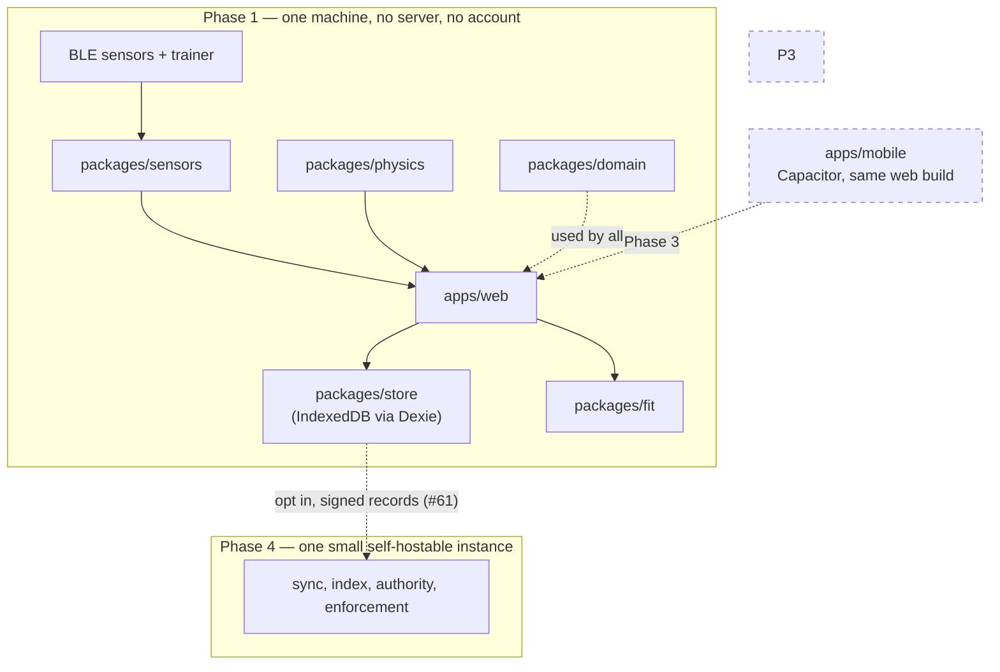
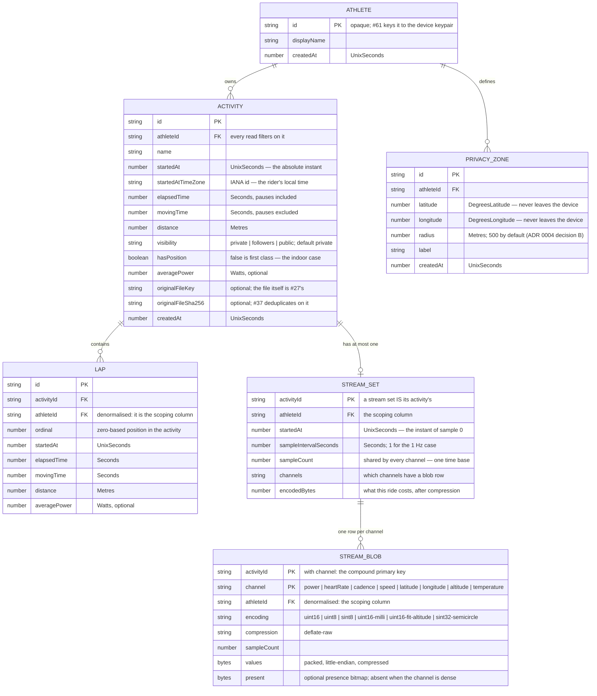

# Architecture

The layout of this repository, the boundaries between its components, and the index of decisions
that produced them.

The reasoning lives in the ADRs — this file describes **what** the structure is and **where** each
line falls. [`docs/adr/0005-tech-stack.md`](adr/0005-tech-stack.md) says why.

> **Status: `apps/web` and `packages/domain` exist**, created by
> [#23](https://github.com/openzigs/onyourleft/issues/23) with the pnpm workspace, the toolchain, a
> committed lockfile and the lint-enforced boundaries. The other four packages and `apps/mobile` do
> not; each is created by the issue that owns its content, using `packages/domain` as the template.
> The layout is fixed here because roughly thirty sub-issues reference it by name, and moving it
> later means touching most of them. The workspace globs (`apps/*`, `packages/*`) and every rule
> below are written against these paths already, so a package arrives inside the rules rather than
> beside them.

## The shape of the product

**Local-first.** The athlete's own device holds the canonical copy: rides are recorded locally,
stored locally, encoded to FIT and signed with a per-athlete keypair. The signed file plus its signed
summary is the canonical artefact, so an athlete with their files needs no server to have their
history.

**One small instance, self-hostable, later.** It does only the four things a server is genuinely
required for — inbound reachability for clients that cannot listen, indexing, authority for real-time
state, and enforcement of privacy and erasure. Federation between instances is over signed records.
This is Phase 4, [#7](https://github.com/openzigs/onyourleft/issues/7).

**Not peer-to-peer.** A browser cannot be a peer; roughly half of all peer pairs never reach a
direct connection; a commit-reveal anti-cheat scheme has a latency floor set by the slowest rider;
a global leaderboard is a global aggregate and needs an aggregator; and a CRDT/P2P history makes
privacy zones, enforced visibility and account deletion unenforceable by construction. Decided, with
the measurements and their sources, in [ADR 0002](adr/0002-local-first-architecture.md)
([#57](https://github.com/openzigs/onyourleft/issues/57)).



## Layout

```
apps/                 AGPL-3.0-or-later, without exception
  web/                browser client — the Phase 1 product
    src/a11y/           the accessibility gate: rules, per-route audit, contrast (#48)
    src/design/         design tokens, theme.css and the primitives (#48)
    src/recording/      the composition root: engine + checkpoints + recovery (#46)
    src/shell/          the hash route table, the router hook and AppShell (#48)
    src/support/        browser-capability detection and its notice (#48)
    src/views/          one component per route (#48)
  mobile/             Capacitor shell wrapping the same web build (Phase 3)

packages/             Apache-2.0, without exception
  domain/             units, core types, validation, signing, analysis
    recording/          the recording session state machine and the stream merge (#45)
  fit/                FIT / GPX / TCX codec
  sensors/            sensor abstraction and BLE transport — BLE only
    src/                the transport-agnostic abstraction; no platform API at all
    protocol/           the GATT profile clients (#41, #42, #43); no platform API either
    web-bluetooth/      the browser transport (#40); the one place a BluetoothDevice exists
  physics/            cycling power/speed model
  store/              local activity, stream and recording-checkpoint store

docs/
  architecture.md     this file
  adr/                numbered architecture decision records

scripts/              dependency-free repository checks; run on a bare clone

.github/
  workflows/rules.yml runs those checks on every pull request and on main
```

There is deliberately **no `apps/api`** (Phase 1 has no server — owner decision D6), **no `infra/`**
(Phase 1 deploys nothing; deployment is [#17](https://github.com/openzigs/onyourleft/issues/17)), and
**nothing anywhere for ANT+** (owner decision D2).

## Component boundaries

The licence boundary and the dependency boundary are the same line, which is what makes both
checkable.

| Component | Licence | Owns | Must not depend on | Issues |
|---|---|---|---|---|
| `apps/web` | AGPL-3.0-or-later | Routing, screens, design system, accessibility baseline, the live ride screen | — | #48–#51 |
| `apps/mobile` | AGPL-3.0-or-later | Capacitor shell, native permissions, foreground service | — | #85, #87 |
| `packages/domain` | Apache-2.0 | Canonical units and types; every conversion in the program; signing/verification; analysis computations | **Any platform API at all** — no DOM, no Node globals, no I/O, no network types | #25, #61, #66, #75–#78 |
| `packages/fit` | Apache-2.0 | FIT / GPX / TCX decode and encode | Anything server-specific; anything under `apps/`; **anything carrying the Garmin FIT Protocol License — see [ADR 0006](adr/0006-fit-codec-licensing.md)** | #29–#32 |
| `packages/sensors/src` | Apache-2.0 | BLE sensor and trainer abstraction, and the simulator | **Any platform API at all**, as `packages/domain` — plus any BLE library, because an abstraction that names one has chosen it for all three stacks | #39, #44 |
| `packages/sensors/protocol` | Apache-2.0 | The GATT profile clients: Heart Rate, Cycling Speed and Cadence and Cycling Power — service and characteristic UUIDs, bounds-checked payload decoding, and the `GattProfile` seam itself | **Any platform API at all**, as `packages/sensors/src` — it is compiled by the same platform-free program, because the same decoders serve the browser adapter and the native stacks | #41, #42 |
| `packages/sensors/web-bluetooth` | Apache-2.0 | The browser transport: the `DeviceId → device/server/service/characteristic` map, the global GATT operation queue, and the profile registry `packages/sensors/protocol` fills | Anything server-specific; every platform global except `navigator`. **Web Bluetooth types must not escape above the transport boundary** | #40 |
| `packages/physics` | Apache-2.0 | Power → speed, as separately testable terms | Any rendering, BLE or platform API | #88 |
| `packages/store` | Apache-2.0 | Local activity and stream persistence, its migrations, and the round-trip test harness | Anything under `apps/` | #26, #27, #28 |

`packages/domain` is filled in as of [#25](https://github.com/openzigs/onyourleft/issues/25): the
canonical representation of each quantity, the conversions into and out of the wire formats (FIT
semicircles, the FIT 1989 epoch, the FIT altitude scale and offset, the wrapping 1/1024 s and 1/2048
s event-time counters), and the validation that runs where an untrusted number becomes a typed one.
Each is tabulated with its unit, its sign rule and the bug it prevents in
[`packages/domain/README.md`](../packages/domain/README.md), which is the reference a consumer reads
rather than this file.

`packages/fit` holds the **FIT activity file decoder** as of
[#30](https://github.com/openzigs/onyourleft/issues/30), alongside the synthetic fixture corpus and
generator from [#29](https://github.com/openzigs/onyourleft/issues/29). `decodeFitActivity(bytes)`
returns the file's contents in `@onyourleft/domain` quantities plus every recoverable fault, each
carrying the byte offset it was found at; it opens nothing, so
[`packages/fit/tsconfig.platform-free.json`](../packages/fit/tsconfig.platform-free.json) compiles
`src/` with `lib: ["ES2024"]` and `types: []` and a `TextDecoder` is a compile error there. The
profile it reads is the narrow, enumerated subset [ADR 0006](adr/0006-fit-codec-licensing.md) R2
requires, and the provenance of every number in it — with the two that rest on the fixture corpus
alone named as such — is in [`packages/fit/README.md`](../packages/fit/README.md), which is the
reference a consumer reads rather than this file.

It also holds the **FIT activity file encoder** as of
[#31](https://github.com/openzigs/onyourleft/issues/31) — `encodeFitActivity(activity)`, the same
shape in the other direction, so `encode(decode(x))` needs no adapter — and **GPX 1.1 and TCX v2
import and export** as of [#32](https://github.com/openzigs/onyourleft/issues/32). The two text
formats share one shape of their own (`TrackActivity`) rather than reusing the FIT one, because a
GPX file has no `file_id`, no developer fields and no `date_time` union; what they share with
everything else is the units. `packages/fit` still depends on nothing but `@onyourleft/domain` at
runtime — including for XML, which it parses with its own reader rather than a dependency, so that
a `<!DOCTYPE` can be refused by the grammar rather than disabled by a setting. Its one
devDependency of note is `fit-file-parser` (MIT), a test-time-only independent FIT reader adopted
under #31's ruling; `packages/fit/README.md` §1 records why that is consistent with ADR 0006.

`packages/store` is filled in as of [#26](https://github.com/openzigs/onyourleft/issues/26) — the
athlete, activity, lap and privacy-zone object stores, the indexes each read goes through, the
referential behaviour IndexedDB cannot declare, and the migration `up`/`down` contract — and of
[#27](https://github.com/openzigs/onyourleft/issues/27), which adds per-second streams as schema
version 2 and decides their shape in [ADR 0011](adr/0011-stream-storage.md), and of
[#46](https://github.com/openzigs/onyourleft/issues/46), which adds **recording checkpoints** as
schema version 3. The entity model:



Three things that diagram does not say, and that a reader coming from a relational schema will
otherwise assume:

- **`FK` is a description, not a mechanism.** IndexedDB has no foreign keys and no `ON DELETE`
  clause. Deleting an athlete cascades to their activities, laps and zones, and deleting an activity
  cascades to its laps — because `packages/store` does it, in one transaction, and not because the
  engine does. The choice and its cost are argued in `packages/store/src/activity-store.ts`.
- **`visibility` is present from version 1 with a `private` default**, per
  [ADR 0004](adr/0004-privacy-and-location.md) decision A. There is no stored start position to go
  with it: that ADR forbids a `start_lat`/`start_lng` pair a list query would select, so `hasPosition`
  carries the one bit the activity list needs.
- **Streams are packed binary, never per-sample rows.** One `Uint8Array` per channel per activity,
  each channel at a declared resolution, gaps carried as a packed presence bitmap so an absent
  sample is distinguishable from a zero. **A four-hour 1 Hz eight-channel ride costs a measured
  22.2 KiB per recorded hour** — 88.6 KiB stored, 239 KiB packed, 2.70× from `deflate-raw`. The
  reasoning, the alternatives and every measured figure are in
  [ADR 0011](adr/0011-stream-storage.md). Devices and gear are still additive object stores in a
  later schema version.
- **A recording in progress is a session header plus append-only chunks**, and it is a different
  shape from a finished ride for a different job: written every few seconds rather than once,
  appended rather than replaced, and **packed but not compressed**, because deflate on a
  five-sample window costs more than it saves and its asynchrony would put a suspension point in
  the one path that must complete before the tab dies. Recovery reads the **contiguous prefix** and
  stops at the first hole — joining the rows either side of a lost flush would shift every later
  sample onto the wrong second while producing an array of exactly the length a caller expects. The
  reasoning and the measured cost (**239.07 KiB packed for a four-hour ride**) are in
  [`packages/store/README.md`](../packages/store/README.md) §"Recording checkpoints".
- **The recording engine is generic over a channel map and lives in `packages/domain`.** It cannot
  name the eight channels: `@onyourleft/store` and `@onyourleft/sensors` both already do and both
  depend on it, so `apps/web/src/recording/channels.ts` is the composition root that instantiates
  the engine at the store's own `StreamChannelValue` and adapts a `SensorMeasurement` into a
  reading. The engine reads no clock and schedules nothing — every instant is a parameter — which is
  what lets #85's native shell reuse it unchanged and what makes every timing case testable without
  fake timers.

The indexes, the query each one serves, and the reasoning for every field are in
[`packages/store/README.md`](../packages/store/README.md).

### `apps/web`: the shell, the design system and the accessibility baseline

Added by [#48](https://github.com/openzigs/onyourleft/issues/48), which also carries the design
system — [ADR 0009](adr/0009-clean-room-posture.md) §419 attributes it to #49, and the mismatch is
recorded here rather than by editing a protected ADR in place.

Three decisions were made in that issue rather than by adding a dependency, and each is reversible
in one file:

- **Routing is hash-based and written here** (`src/shell/routes.ts`, `useRoute.ts`), not
  `react-router`. Path routing needs a server that rewrites unknown paths to `index.html`, and
  Phase 1 has no server at all (owner decision D6) — so a refresh on a deep link would 404 against
  whatever static host is serving the files. A fragment never reaches a server, works from
  `file://`, and makes every navigation a plain `<a href="#/activities">` whose keyboard, middle-click
  and open-in-new-tab behaviour is the browser's rather than ours. Revisit with
  [#7](https://github.com/openzigs/onyourleft/issues/7).
- **The design system is ours** (`src/design/`): tokens in TypeScript, one hand-written stylesheet,
  four primitives. No CSS framework and no component library. `theme.css` is asserted equal to
  `tokens.ts` in both directions, which is what makes the token-level contrast check a statement
  about what the browser paints.
- **The accessibility checker is ours too** (`src/a11y/`), for the licence and headless-DOM reasons
  in CLAUDE.md §4e. It runs on every route, in CI, as a step of its own, and it fails the build.

**The unsupported-browser experience is a feature of this component, not an error path.**
`src/support/bluetooth-support.ts` classifies the browser into six states —
available, adapter-unavailable, not-permitted, insecure-context, absent, incomplete — by probing
capability through `@onyourleft/sensors/web-bluetooth`, never by reading a user agent.
[ADR 0003](adr/0003-platform-support-matrix.md) decision D-7 is the source: the two states a
`'bluetooth' in navigator` check cannot tell apart are Chrome-on-Linux, where the object is present
and the adapter is unusable, and a page served over plain HTTP, where the object is withheld and the
browser gets the blame. Where the browser cannot pair, **no pairing control is rendered at all** —
a disabled one is out of the tab order and announces no reason, which is the silent failure the
issue exists to prevent.

**Dependencies point one way: `apps/` → `packages/`, never the reverse.** Combined with the licence
rule that is not a coincidence — Apache-2.0 code may be combined into an AGPL-3.0 work, but not the
other way round, so a `packages/` → `apps/` import would be a licence violation as well as a layering
one.

### Where the shared/deployment-specific line falls, and why it is not the usual one

Because the client owns the data and the **same computations must run identically on the device in
Phase 1 and on an instance in Phase 4**, the shared packages are not "code the client and server
happen to both need". They are **everything that is a function of the data rather than of the
deployment**.

That is why the constraint on `packages/domain` is *no platform dependency at all*, not *no server
API dependency*. A package that imports `window` or `fs` cannot run on both sides of a federation
boundary. The same code signs a record on a phone and verifies it on an instance.

What stays deployment-specific is narrow: reachability, indexing, authority and enforcement. All four
belong to the instance, and none exists in Phase 1.

### Boundaries that are enforced, not merely documented

A boundary maintained by review discipline will not survive a program this size.

**Enforced by `eslint.config.js`** since [#23](https://github.com/openzigs/onyourleft/issues/23):

| Rule | Fails when |
|---|---|
| `boundaries/dependencies` | anything under `packages/*` imports anything under `apps/*`, in either the relative or the `@onyourleft/…` workspace spelling |
| `@typescript-eslint/no-restricted-imports` | `packages/domain` names **any** Node builtin — the pattern list is derived from `builtinModules` rather than typed out, so `events`, `util` and `stream/promises` fail exactly as `node:fs` does — or `react`, `react-dom`, `vite` or `dexie` |
| `no-restricted-globals` | `packages/domain`, `packages/sensors/src` or `packages/sensors/protocol` names a DOM global (`window`, `document`, `navigator`, `location`, `history`, `localStorage`, `sessionStorage`, `indexedDB`, `caches`), a Node global (`process`, `Buffer`, `__dirname`, `__filename`, `global`, `require`) or a network global (`fetch`, `XMLHttpRequest`, `WebSocket`, `EventSource`, `Request`, `Response`, `Headers`). A named list, not a closure — the closure is the typechecker |
| `no-restricted-globals`, again | `packages/sensors/web-bluetooth` names any of the same list **except `navigator`**, which is the one platform API the transport boundary is allowed. The exception is derived by subtraction from that list rather than written out, so the two cannot drift |
| `headers/header-format` | a `.ts`/`.tsx` file's first line is not the SPDX identifier its directory requires |

`packages/domain/tsconfig.json` is what makes the platform rules a *closure* rather than a denylist:
`lib: ["ES2024"]` with `types: []` leaves no ES-external name and no `@types` package in scope, so
`fetch`, `WebSocket`, `process` and `import … from 'events'` are all compile errors, not just the
ones somebody remembered to list.

That closure is conditional and it was broken until this section was written. `types: []` suppresses
the automatic `@types` lookup but does not stop a `/// <reference types="node" />` inside a `.d.ts`
the package imports, and `packages/domain/vitest.config.ts` used to import `vitest/config` — which
pulled Vite's declarations, and through them `@types/node`, into the same TypeScript program as
`src/`. Everything above typechecked cleanly inside the package that forbids it. That config file now
imports nothing. **Any import added to a file in this package's program can reopen it**, which is why
the ESLint rules above are not redundant with the tsconfig, and why a row in this table is checked by
writing the file it forbids and running both gates — never by reading the row.

`packages/sensors` carries the same closure in two programs, for the reason `packages/fit` does.
`tsconfig.json` covers the whole package and admits the DOM, because ESLint's project service
resolves every file to the nearest one and a file outside every program is reported as "not found by
the project service" rather than as anything useful. **`tsconfig.platform-free.json` is the program
that enforces**: `src/` **and `protocol/`**, `lib: ["ES2024"]`, `types: []`, so a `navigator` or a
`BluetoothDevice` is a compile error in either. `pnpm run typecheck` runs both.

⚠️ This paragraph used to add "or a `DataView` of GATT payload" to that list, and that was never
true — `DataView` is an ECMAScript built-in and is in `lib: ["ES2024"]`. #41 depends on it being
there: a decoder that could not name a `DataView` could not be the *same parser, unchanged* for the
native stacks. What keeps GATT payload out of `packages/sensors/src` is that directory's documented
rule and review, not the typechecker.

**Still to be enforced**, by the issue that introduces the code it constrains:

- No routing-engine type above the `RoutingProvider` interface (#70).

And these are enforced with no toolchain at all, by `scripts/check-repo-rules.sh`,
`scripts/check-licence-hashes.sh` and `scripts/check-env-example.sh`:

| Rule | Fails when |
|---|---|
| `LIC001` / `LIC002` | a source file's SPDX header does not match the licence its directory requires |
| `LIC003` | a package manifest declares a licence its path does not permit |
| `LIC004` | a package under `packages/` or `apps/` has no `LICENSE` file of its own |
| `LIC005` | a licence text no longer matches the digest ADR 0001 records for it, or ADR 0001 no longer records one, or a leaf package's own `LICENSE` is not byte-identical to the canonical text its path requires |
| `SCOPE001` | ANT+ is referenced anywhere in a source tree |
| `WF001` | `pull_request_target` appears in a workflow — it receives secrets and bypasses the fork-approval gate |
| `ADR001` / `ADR002` | two ADRs share a number, or a filename is not `NNNN-kebab-case.md` |
| `ENV001` | a source file reads an environment variable `.env.example` does not list, or `.env.example` is missing |

**All of them run in CI**, on every pull request and every push to `main`, from
[`.github/workflows/rules.yml`](../.github/workflows/rules.yml). Before that workflow existed the
rules were checkable but unchecked — a distinction worth keeping in mind about every other row in
this document that says "enforced".

## Technology

Decided in [ADR 0005](adr/0005-tech-stack.md). Summary only; the reasoning and the rejected
alternatives are there.

| Concern | Choice |
|---|---|
| Language | TypeScript 6.0.3 — *not* 7.x, because typed linting does not support it yet |
| Runtime | Node 24 "Krypton" (Active LTS until 2026-10-20) |
| Package manager | pnpm 11 workspaces |
| Web client | React 19 + Vite 8 |
| Mobile client | Capacitor, wrapping the same web build — **not scaffolded yet**; #85 |
| Local data layer | IndexedDB via Dexie 4.4.5 — installed by #26, in `packages/store` |
| Migrations | Dexie's own versioned schema; `up`/`down` pairs with a tested `down` |
| Instance data layer | **deferred to #7** |
| Test runner | Vitest 4.1.11 |
| Coverage gate | **no percentage** — every new code path covered by a test proven to fail without the change |
| Linter / formatter | ESLint 10 + typescript-eslint + Prettier 3 |
| Real-time transport | deferred to [#16](https://github.com/openzigs/onyourleft/issues/16) |

Installed as of #23: the toolchain above, React 19.2.8, React DOM 19.2.8 and Vite 8.2.2. Everything
else in the table is a decision that no `package.json` has acted on yet. `CLAUDE.md` section 4b
keeps that list; the commands are in section 4a.

## Decision record index

Numbers are unique, and `scripts/check-repo-rules.sh` rule `ADR001` fails the build if two files ever
share one.

### Written

| ADR | Title | Issue |
|---|---|---|
| [0001](adr/0001-licence.md) | Licensing — AGPL-3.0 app + Apache-2.0 leaf packages | #18 |
| [0002](adr/0002-local-first-architecture.md) | Local-first architecture, one small self-hostable instance, and why not peer-to-peer | #57 |
| [0003](adr/0003-platform-support-matrix.md) | Platform support matrix and permanent platform gaps | #20 |
| [0004](adr/0004-privacy-and-location.md) | Activity privacy and the location-data model | #21 |
| [0005](adr/0005-tech-stack.md) | Technology stack and workspace layout | #22 |
| [0006](adr/0006-fit-codec-licensing.md) | FIT codec licensing — implement from the public protocol documentation | #58 |
| [0007](adr/0007-patent-posture.md) | Patent posture, and the segment-matching design-around | #59 |
| [0008](adr/0008-mobile-client-architecture.md) | Mobile client architecture and rendering stack — Capacitor, gated on a rendering spike | #86 |
| [0009](adr/0009-clean-room-posture.md) | Clean-room posture toward Strava and Zwift | #19 |
| [0010](adr/0010-map-tiles-and-routing.md) | Map tiles, routing and elevation — providers, licences and cost | #60 |
| [0011](adr/0011-stream-storage.md) | Activity stream storage — per-channel packed binary in IndexedDB | #27 |

### Claimed by open issues — **check here before you pick a number**

The numbering below is **settled**. It was contested — 0002, 0006 and 0008 were each claimed by two
open issues (#97) — and it is resolved here in favour of the number that merged ADRs already cite,
because a citation in a merged document is a fact and an acceptance criterion in an open issue is
still a proposal.

| Number | Owner | Status |
|---|---|---|
| 0001 | #18 — licensing | Written |
| 0002 | #57 — local-first architecture | Written |
| 0003 | #20 — platform support matrix | Written |
| 0004 | #21 — privacy and location | Written |
| 0005 | #22 — tech stack | Written |
| 0006 | #58 — FIT codec licensing | Written |
| 0007 | #59 — patent posture | [Written](adr/0007-patent-posture.md) |
| 0008 | #86 — mobile client architecture | [Written](adr/0008-mobile-client-architecture.md). Cited as "ADR 0008" by `0005-tech-stack.md` (four times), by ADR 0003 and twice below. |
| 0009 | #19 — clean-room posture | [Written](adr/0009-clean-room-posture.md). Renumbered from 0002, which #57 holds. |
| 0010 | #60 — map tiles and routing | [Written](adr/0010-map-tiles-and-routing.md). Renumbered from 0008, which #86 holds. |
| 0011 | #27 — stream storage | [Written](adr/0011-stream-storage.md). Renumbered from 0006, which #58 holds. Records the measured cost: **22.2 KiB per recorded hour** for a 1 Hz eight-channel ride. |

Three issues carry an acceptance criterion naming their old number — #19 (0002), #60 (0008) and #27
(0006). **The number here wins**; each issue has been commented with its new one. Renumbering a
written ADR would break citations in merged documents, which is the failure this table exists to
prevent. #57's own body asks for 0005, which ADR 0005 already holds; it was written as **0002** for
the same reason.

### Dependencies between decisions

- **ADR 0005 depends on ADR 0008 (#86).** #86 chose Capacitor + TypeScript for the mobile client
  precisely so the leaf packages and the web build are *shared* rather than reimplemented in a second
  language. Overturning TypeScript in ADR 0005 would invalidate ADR 0008; the dependency runs both
  ways and is recorded in both.
- **ADR 0005 depends on [ADR 0002](adr/0002-local-first-architecture.md) (#57).** The architecture is
  what decides where the boundary between shared domain code and deployment-specific code falls,
  which is what makes `packages/domain` platform-free rather than merely server-free.
- **ADR 0001's unconditional self-hosting depends on ADR 0002**, and ADR 0004 cites it three times —
  for the federation model, for "the athlete's signed record is the source of truth", and for
  "leaving an instance costs nothing but a re-sync". Those four citations are why 0002 is the number
  and why it could not be renumbered.
- **ADR 0005 is stricter than ADR 0001.** ADR 0001 permits per-package licence declaration; ADR 0005
  makes the boundary structural, decided by path. Deliberate: a path cannot be silently mis-declared.
- **ADR 0001 is constrained by #58 and #59.** #58 is now [ADR 0006](adr/0006-fit-codec-licensing.md)
  and it **discharges that constraint**: the codec is implemented from the public FIT protocol
  documentation and depends on nothing carrying Garmin's terms, so §2(d) never attaches and ADR 0001
  is not reopened. That conclusion is conditional — ADR 0006 names the three things that would
  overturn it, and the first is a Garmin FIT artefact reaching this repository, its lockfile, its CI
  or a contributor's toolchain. #59 is now [ADR 0007](adr/0007-patent-posture.md), which discharges
  the other half: it records what the two live patent families actually claim and the design
  constraints that keep #12's matching and #85's pacer clear of them, and it does not reopen ADR 0001
  either.
