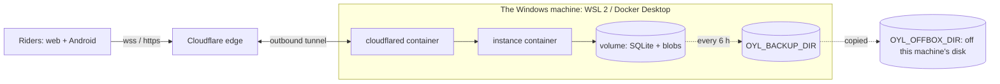

# Running the instance on a home Windows machine

The project's first instance runs on the owner's own Windows machine, in Docker, reached from the
internet **only** through a Cloudflare Tunnel
([#807](https://github.com/openzigs/onyourleft/issues/807), ADR 0037 D-8). This guide is written so
that **somebody who has never seen this repository** can follow it on their own Windows machine.
Everything after setup is in [`operating-an-instance.md`](../operating-an-instance.md).



**What you need**: Windows 10 22H2 or 11 with virtualisation enabled; about 4 GB of memory to spare;
a Cloudflare account (free) with a domain on it; and — for the off-box backup, which the deploy
requires — a drive that is not this machine's own disk, and **not a removable USB stick** (see
[Backups](#backups)). **The router opens no port**: `cloudflared` dials out.

## 1. Install Docker Desktop, with the WSL 2 backend

1. Install **WSL**: in an administrator PowerShell, `wsl --install`, and restart when it asks.
2. Install **Docker Desktop** from docker.com. In *Settings → General*, tick **Use the WSL 2 based
   engine** and **Start Docker Desktop when you sign in to your computer**.
3. Install **Git for Windows** (it brings Git Bash, which `deploy.sh` runs in).
4. In Git Bash: `docker version` answers with a client and a server, and
   `docker compose version` with a version.

⚠️ **Git Bash rewrites anything that looks like a path** before `docker` sees it, so a path INSIDE
a container (`/backups`, `/restore`) arrives as `C:/Program Files/Git/backups`, and the command
fails with nothing but `the command failed (Error)`. `deploy.sh` turns this off itself. When you type
a command from this guide that names a path inside a container, start it with
`MSYS_NO_PATHCONV=1` (the restore drill below does).

⚠️ **Docker Desktop starts when you SIGN IN, not when Windows boots.** After a reboot the instance
comes back only once somebody has signed in — set Windows to sign in automatically
(`netplwiz`), or accept that a reboot at night leaves the instance down until morning.

## 2. Get the code

```bash
git clone https://github.com/openzigs/onyourleft.git
cd onyourleft
```

## 3. Create the tunnel and its public hostname

1. In the Cloudflare dashboard: **Zero Trust → Networks → Tunnels → Create a tunnel**, type
   **Cloudflared**. Name it (`onyourleft`).
2. It shows an install command containing a long token after `--token`. **Copy only the token.** Do
   not run the command: the tunnel runs as a container here.
3. **Public hostname**: a subdomain on your domain (`rides.example.org`), service type **HTTP**, URL
   **`instance:8787`** — the instance's name on the deployment's own Docker network.
4. Nothing else. WebSockets go through a tunnel with no extra setting.
5. **Optional: only your own address.** While you are the only rider, a WAF custom rule on the zone
   (*Security → WAF → Custom rules*, free on every plan) keeps everybody else out:
   `(http.host eq "rides.example.org" and not ip.src in {<your home IP>})`, action **Block**. Check it
   from a phone **on mobile data** — blocked — and from home — answers. If your home address changes,
   change the rule. It also blocks a phone hotspot, which matters in
   [Measuring the tunnel](#measuring-the-tunnel).

⚠️ **The token is a secret.** It goes in `.env` in step 4 and nowhere else — not a commit, not a
chat, not a screenshot. Anybody holding it can serve your hostname.

## 4. Fill in `.env`

```bash
cd apps/instance/deploy/home
cp instance.env.example .env
```

Edit `.env`:

| Variable | Set it to |
|---|---|
| `OYL_INSTANCE_ORIGIN` | `https://` and the public hostname from step 3 |
| `OYL_INSTANCE_REGISTRATION` | `approval` (you or your deputy approve each new account), `invite`, `open`, or `closed`. Left empty here it is `closed` — see [`docs/moderation.md`](../moderation.md). ⚠️ `closed` turns away **your own** first device too: the app says the instance is not taking new riders. Set `open` while your own devices connect (`docker compose up -d instance`), then set it back |
| `OYL_INSTANCE_OWNER_KEY`, `OYL_INSTANCE_DEPUTY_KEY` | the device keys of the two moderators, which the app shows; empty names nobody |
| `CLOUDFLARE_TUNNEL_TOKEN` | the token from step 3 |
| `OYL_INSTANCE_SECRET_KEY` | empty to start with. It is what a hosted model key and the instance's own keys are encrypted under — read [`operating-an-instance.md`](../operating-an-instance.md) before setting it, and keep it out of both backup folders |
| `OYL_INSTANCE_NAME` | optional: the name the app shows for this instance, at most 64 characters |
| `OYL_BACKUP_DIR` | a folder on this machine for snapshots, e.g. `C:/onyourleft/backups` |
| `OYL_OFFBOX_DIR` | **required — the deploy refuses to start without it.** A folder that is **not** on this machine's own disk. ⚠️ On Windows **a USB stick does not work here**: read [Backups](#backups) first |
| `OYL_INSTANCE_WS_COMPRESSION` | `off` unless your upload is the limit — see [Compression](#compression-and-your-upload) |

`.env` is ignored by git, so `git pull` never overwrites it and never uploads it.

**The rider's address, and why `compose.yaml` fixes the tunnel's.** Every connection reaches the
instance from `cloudflared`, so the per-address rate limits read the rider's own address from the
`cf-connecting-ip` header Cloudflare writes (`OYL_INSTANCE_CLIENT_ADDRESS_HEADER`). The instance
believes that header only from a proxy it trusts — loopback, or an address in
`OYL_INSTANCE_TRUSTED_PROXIES` — so `compose.yaml` gives `cloudflared` the fixed address
`172.30.87.10` on the project's own network and names exactly that address. You do not set either in
`.env`. If `172.30.87.0/24` is already in use on this machine, change the subnet, the tunnel's
address and `OYL_INSTANCE_TRUSTED_PROXIES` in `compose.yaml` together. Anything else on that network,
or a port published for local debugging, is counted as itself, whatever header it sends.

## 5. Deploy — one command

```bash
bash apps/instance/deploy/home/deploy.sh
```

It builds the image from this checkout (tagged with the commit), runs the database's migrate step,
starts the instance, waits until `/ready` says ready, then starts the tunnel and the scheduled
backup. It prints how long it took. If the new build never becomes ready it puts the previous one
back by itself, with the data as it was — see
[`operating-an-instance.md` → Upgrading](../operating-an-instance.md#upgrading).

**Check it from outside**: `https://rides.example.org/health` answers `{"status":"ok",…}` and
`/ready` answers `{"status":"ready",…}`.

## 6. A room to ride in

Until riders can make rooms in the app ([#784](https://github.com/openzigs/onyourleft/issues/784),
[#785](https://github.com/openzigs/onyourleft/issues/785)), the operator opens one:

```bash
cd apps/instance/deploy/home
docker compose run --rm --no-deps --entrypoint node migrate \
  src/operator/cli.ts room-open saturday-ride --kind ride --length 40000
```

## The history index (optional)

The post-ride write-up can look back at a rider's own history — their earlier write-ups, ride
summaries, goals, notes and documents — when the instance keeps a searchable index of it
([ADR 0040](../adr/0040-a-history-index-on-the-riders-instance.md), #835). The index is worked out
by an embedding model **on this machine**: nothing is sent anywhere else to build it. Without it
the instance works exactly as before, and a write-up is written without history.

1. In `.env`: `COMPOSE_PROFILES=history` and `OYL_INSTANCE_EMBEDDING_URL=http://ollama:11434`.
2. Start the model server and pull the model once:

   ```bash
   cd apps/instance/deploy/home
   docker compose up -d ollama
   docker compose exec ollama ollama pull nomic-embed-text
   docker compose up -d instance
   ```

   `nomic-embed-text` (`nomic-ai/nomic-embed-text-v1.5`, Apache-2.0, 274 MB) is the default. You may
   name another in `OYL_INSTANCE_EMBEDDING_MODEL`; changing it re-embeds everything, and until that
   has finished a write-up gets less history, never a mixture of two models'.

3. `docker compose logs instance` says `"event":"history-index","state":"on"`. If it says `off`,
   the `code` says why, and the instance's standard error has the whole sentence.

⚠️ **Never publish Ollama's port and never point the tunnel at it.** Its API has **no
authentication**: a published port is an open model server for anybody who can reach it. The
compose file publishes none, and the instance is the only thing that talks to it, by its service
name over this project's own network. The instance also refuses an embedding address that is not
this machine or its private network, and checks where the name resolved to on every request.

**A GPU is optional.** On the processor, four cores embed about six passages a second, measured on
an Apple M4 Pro in Docker — enough for a rider's history, but ⚠️ **not measured on a Windows PC**
([#835](https://github.com/openzigs/onyourleft/issues/835) owes that figure). Docker Desktop passes
through an NVIDIA GPU only, on the WSL 2 backend: add to the `ollama` service

```yaml
    deploy:
      resources:
        reservations:
          devices:
            - driver: nvidia
              count: all
              capabilities: [gpu]
```

and check it with `docker run --rm -it --gpus=all nvcr.io/nvidia/k8s/cuda-sample:nbody nbody -gpu
-benchmark` ([Docker's GPU guide](https://docs.docker.com/desktop/features/gpu/)).

## Compression and your upload

A home connection's **upload** is the first thing a room runs out of — before the CPU and before
memory ([ADR 0037](../adr/0037-instance-runtime-hosting-and-transport.md) D-8.3). One 50-rider room
sends:

| | Upload per 50-rider room | Rooms on a 10 Mbit/s upload |
|---|--:|--:|
| Compression **off** (the default) | ≈ 0.36 Mbit/s | about 27 |
| Compression **on** | ≈ 0.18 Mbit/s | about 55 |

That is arithmetic from spike 0013 §5, before headroom and before the tunnel's own framing — not a
measurement of your line ([#792](https://github.com/openzigs/onyourleft/issues/792) measures it).
Compression roughly **doubles the memory** each rider costs, so turn it on
(`OYL_INSTANCE_WS_COMPRESSION=on`, then `docker compose up -d instance`) only when the upload binds
first. Measure your upload with any speed test.

## Sleep, updates and reboots

**While rooms are open, stop Windows sleeping**: *Settings → System → Power → Screen and sleep →
When plugged in, put my device to sleep after: Never*. A sleeping machine answers nothing.

What happens when it sleeps, reboots, or loses its connection anyway:

| Event | What a rider sees | What survives |
|---|---|---|
| **Asleep** | their app cannot reach the instance, and must say *"The instance is not reachable"* in words — the client's half, [#782](https://github.com/openzigs/onyourleft/issues/782), not built yet; **their ride goes on recording on their own device** | everything on the instance, untouched |
| **A Windows update reboots it mid-ride** | the room closes; on reconnecting, a **race** says `room-closed` — it does not resume — and a **group ride** opens again, empty | every result already final (a rider who had crossed the line); the database and blobs; nothing about the race in progress |
| **Back on**, after sign-in (step 1) | the instance is back by itself: Docker restarts every container (`restart: unless-stopped`) | — |
| **Cloudflare restarts its servers** (it says it may, daily) | a dropped socket; the app rejoins at once, into the same seat and place (ADR 0028 D-2 rule 1) | the room: the rider was coasted at 0 W while they were away |

To keep a Windows update from rebooting during an evening's rides, set **active hours**
(*Settings → Windows Update → Advanced options*) to cover them.

Stopping it on purpose: `cd apps/instance/deploy/home && docker compose stop`. Riders are told the
server is stopping (close code 1001) and results already final are written first.

## Updating

```bash
git pull
bash apps/instance/deploy/home/deploy.sh
```

A snapshot is taken first; the database is migrated as its own step before the new build starts;
and a build that does not become ready is replaced by the previous one, with the snapshot restored.
To go back by hand: `bash apps/instance/deploy/home/deploy.sh --rollback`.

## Backups

The `backup` service takes an online snapshot every six hours into `OYL_BACKUP_DIR`, copies it to
`OYL_OFFBOX_DIR`, and keeps the newest fourteen of each (`OYL_BACKUP_INTERVAL_SECONDS`,
`OYL_BACKUP_KEEP`). A copy that cannot be written fails, and says so in `docker compose logs backup`.

⚠️ **On Windows, a USB stick cannot be `OYL_OFFBOX_DIR`.** Docker Desktop reaches Windows drives
through WSL, and WSL does not mount a removable drive by itself, not even after `wsl --shutdown`
with the stick plugged in. Docker still accepts `E:/onyourleft-backups`, but it gives the container
an empty folder inside its own VM instead: every copy fails with *Permission denied*, and nothing
reaches the stick. Measured on the project's Windows box, 2026-10-09
([#807](https://github.com/openzigs/onyourleft/issues/807)). Check yours before you trust it:

```bash
MSYS_NO_PATHCONV=1 docker run --rm -v "E:/onyourleft-backups:/t" alpine sh -c 'mount | grep " /t "'
```

A Windows drive shows as `9p` with `aname=drvfs`. `ext4` means Docker made the folder in its VM, so
the copy is not on that drive. Until there is a supported way for a removable drive, use a drive
that WSL does mount.

**Restoring on another machine** — the drill worth doing once, before it is needed:

1. On the second machine, steps 1, 2 and 4 of this guide.
2. Copy one `snapshot-…` folder from the off-box drive to it.
3. `cd apps/instance/deploy/home`, then restore into the deployment's volume and check it:

   ```bash
   docker build --build-arg OYL_INSTANCE_COMMIT="$(git rev-parse HEAD)" -f ../../Dockerfile -t onyourleft-instance:local ../../../..
   MSYS_NO_PATHCONV=1 docker compose run --rm --no-deps -v "C:/path/to/snapshot-…:/restore:ro" --entrypoint node migrate \
     src/operator/cli.ts restore /restore
   docker compose run --rm --no-deps --entrypoint node migrate src/operator/cli.ts verify
   ```

4. Compare `verify`'s row and blob counts with the `manifest.json` in the snapshot folder, and time
   it.

⚠️ **If the second machine already runs an instance, its stack is project `onyourleft` too**, and
the commands above would restore into ITS volume. Give the drill a project of its own: add
`-p onyourleft-drill` after every `docker compose`, and remove it afterwards with
`docker compose -p onyourleft-drill down -v`.

## Measuring the tunnel

[#807](https://github.com/openzigs/onyourleft/issues/807) asks for a measurement, not a number from a
forum. From a **different** machine (a laptop on a phone's hotspot is ideal — but if you set up
step 3's address rule, a hotspot is blocked: use another machine on your home network), with the
repository and Node 24:

```bash
cd apps/instance
# 1. The tunnel's idle timeout: open a race lobby, and turn the instance's own ping off for it.
#    (In .env on the box: OYL_INSTANCE_PING_INTERVAL_MS=0, then `docker compose up -d instance`.)
node tools/tunnel-soak.ts --url https://rides.example.org --room lobby-probe --idle-probe --minutes 5
#    Then remove OYL_INSTANCE_PING_INTERVAL_MS from .env and `docker compose up -d instance` again.

# 2. Thirty minutes, two riders, one room, rejoining whenever a socket drops.
node tools/tunnel-soak.ts --url https://rides.example.org --room tunnel-soak --minutes 30
```

The rooms first: `room-open lobby-probe --kind race --length 1000` and
`room-open tunnel-soak --kind ride --length 100000 --countdown 0`, and `OYL_INSTANCE_REGISTRATION=open`
while it runs (it signs its riders up). The first prints how long an idle socket lived; the second
the disconnects, each rejoin's time and the longest silence. The ride's keepalive (30 s, ADR 0037
D-8.1) and the instance's ping (25 s) must both be shorter than the idle timeout the first printed.
Close registration again afterwards.

On the project's Windows box (2026-10-09, run from a Mac on the same home network), the idle socket
lived **125 s**, and the 30-minute run had no disconnects, 1,799 frames for each rider and a
longest silence of 1.3 s. Those are one line's figures, not yours.

## What is not here

- **Metrics for the public.** `OYL_INSTANCE_METRICS` is off; turned on, `/metrics` answers only a
  request carrying `OYL_INSTANCE_METRICS_TOKEN`, which stays in the box's `.env`.
- **A second instance while one updates.** One box, one instance: an update closes rooms for the
  seconds it takes. A managed deploy with no gap is [#790](https://github.com/openzigs/onyourleft/issues/790).
- **The Durable Object adapter.** Built and not deployed (the owner's Q3/Q6).
