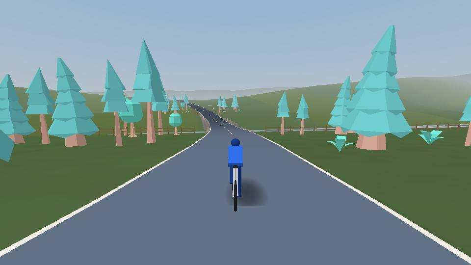
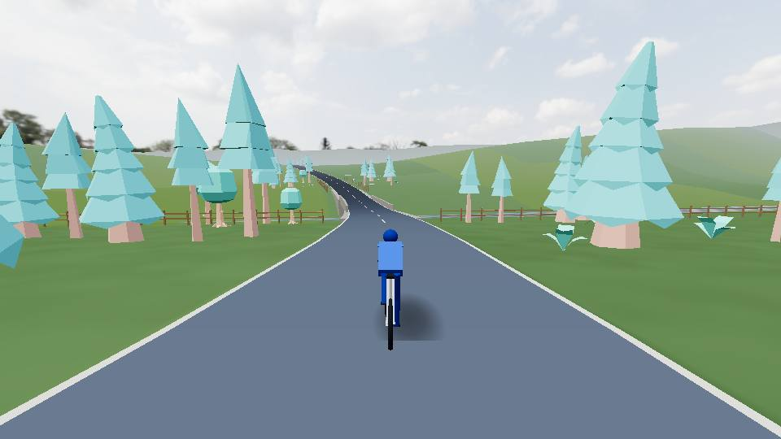
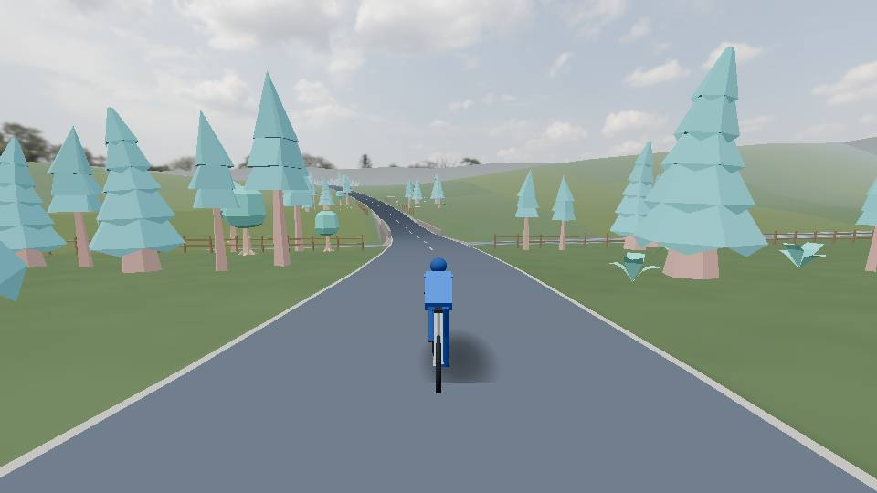
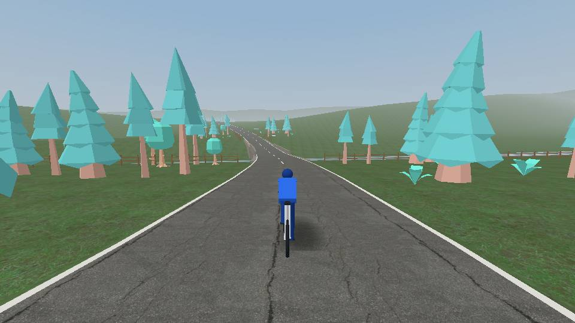
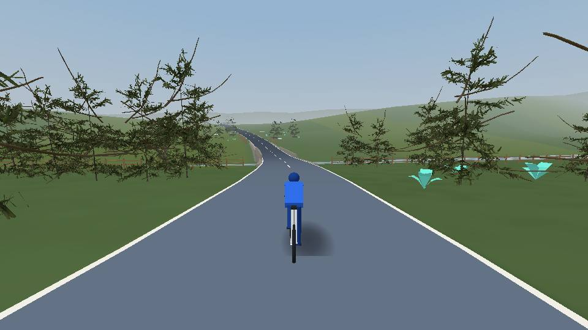
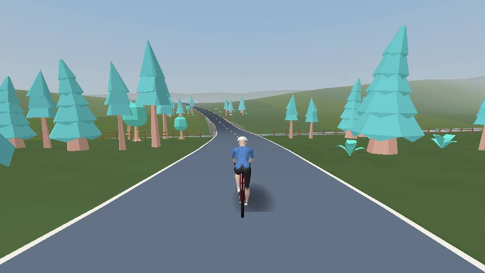
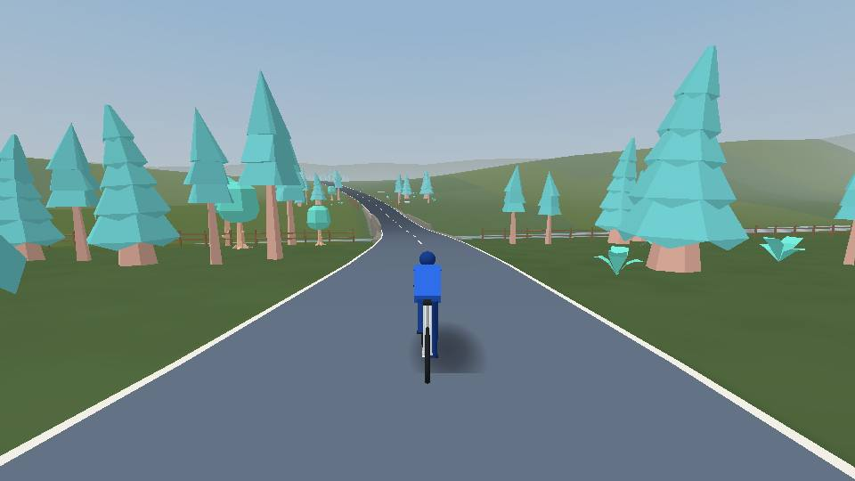
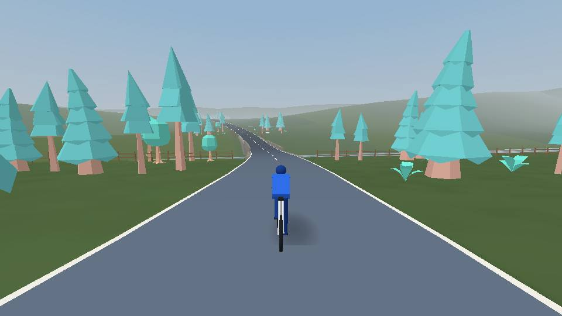
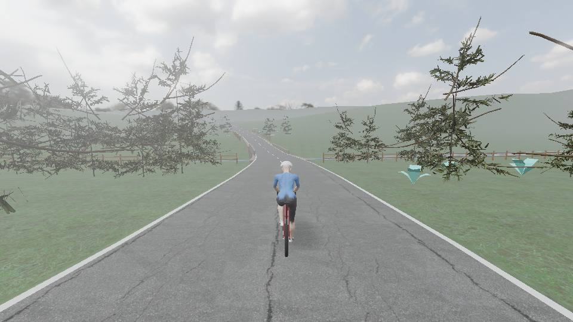

# Spike 0005 — how realistic the world can look on the Pixel Tablet, measured

- **Issue**: [#457](https://github.com/openzigs/onyourleft/issues/457) — refs epic
  [#429](https://github.com/openzigs/onyourleft/issues/429), the pipeline
  [#430](https://github.com/openzigs/onyourleft/issues/430), the ADR it feeds
  [#431](https://github.com/openzigs/onyourleft/issues/431), and
  [#433](https://github.com/openzigs/onyourleft/issues/433),
  [#434](https://github.com/openzigs/onyourleft/issues/434),
  [#247](https://github.com/openzigs/onyourleft/issues/247)
- **Written**: 2026-09-21, on `spike/issue-457-realism-on-the-device-floor` from `main` at `c48daa0`
- **Status**: the page, the pipeline and the procedure are built; ⚠️ **the device tables below are
  EMPTY and waiting for the owner's run**. Nothing here is a device number yet.

> ⚠️ **A spike is a dated measurement and decides nothing** (CLAUDE.md §7). This branch is **never
> merged**: #431 — the ADR that would take the world realistic — has not landed, and it is what
> would let a realistic asset into the product. The pull request carrying this file is a draft
> titled "Spike (do not merge)", says `Refs #457`, and closes nothing. #457 is closed by hand once
> the owner has looked at the device screenshots and the numbers below are filled in.

## The question

**How realistic can the trainer game look on the owner's Pixel Tablet (Tensor G2, Mali-G710,
WebView 151), at a sustained frame rate, with three.js as it is?** #457's items, each behind its
own toggle so each one's cost is read alone:

1. an HDRI sky, as background **and** as PMREM environment light; ACES and AgX tone mapping;
2. photographic road and ground, 1K and 2K;
3. three photoscanned tree species with baked ambient occlusion, and an impostor far band;
4. a placeholder realistic rider on a road bike, skinned, pedalling from `bicycle.ts`'s crank angle;
5. distance/height haze, and a cheap bloom;
6. render scale 1.0 / 0.75 / 0.5;
7. WebGPURenderer as one extra column — ⚠️ **not built**; see §"Deferred".

## What was built

| File | What it is |
|---|---|
| [`apps/web/browser/realism.html`](../../apps/web/browser/realism.html), [`realism-harness.ts`](../../apps/web/browser/realism-harness.ts) | the page. Rides the product's own world at 9 m/s, measures, publishes on `window.__oylRealism` and logs one `OYL-REALISM {json}` line to the console |
| [`browser/realism/config.ts`](../../apps/web/browser/realism/config.ts) | the URL is the configuration; an unknown parameter or value is **refused**, so a typo cannot measure the baseline under an item's name. `MEASUREMENT_MATRIX` is the table below |
| [`browser/realism/view.ts`](../../apps/web/browser/realism/view.ts) | the view. **With every item off it is the product's own scene, drawn by the product's own belts** (`TerrainBelt`, `HorizonRing`, `SkyDome`, `WaterBelt`, `BridgeBelt`, `ScatterBelt`, `RiderBelt`, `ContactShadowBelt`, `WorldLamps`, all exported by `three-renderer.ts`) at the target rung of `quality.ts`. Each item replaces or adds one piece |
| [`browser/realism/surfaces.ts`](../../apps/web/browser/realism/surfaces.ts) | (2): the product's corridor and landform geometry, with world-planar texture coordinates and a two-scale distance blend on the ground |
| [`browser/realism/trees.ts`](../../apps/web/browser/realism/trees.ts) | (3): the product's scatter positions, drawn as scans within 45 m and as eight-frame impostors beyond |
| [`browser/realism/rider.ts`](../../apps/web/browser/realism/rider.ts) | (4): the body posed every frame from `bicycle.ts`'s joints; the bike modelled from `RIDER_BODY_PARTS` |
| [`browser/realism/atmosphere.ts`](../../apps/web/browser/realism/atmosphere.ts) | (1) and (5) |
| [`browser/realism/route.ts`](../../apps/web/browser/realism/route.ts) | the stretch of road — see below |
| [`apps/web/tools/realism/`](../../apps/web/tools/realism/) | `fetch-assets.ts`, `process-assets.ts`, `blender/*.py`, `screenshots.ts`, `stage-into-apk.ts` |

**Two differences from the product's own view, stated so they can be weighed:** the baseline road
is drawn without its surface grain (`withSurfaceDetail` is private to `three-renderer.ts`), and the
page does **not** cap the frame rate at 30 fps as `quality.ts` does — a cap would hide every cost
below it. Read the product's own rides against 33.3 ms; read this page against 16.7 ms, which is
the budget #457 states.

**The road.** Not a recorded ride — there is none in the repository, and somebody's own road is
location data. It is a 4 km meandering route drawn **through the product's own world generators**
(`landform.ts`, `waterways.ts`, `settlements.ts` — #468): a 30 m descent into a valley with a level
floor where `settlements.ts` puts a farmstead (≈ 700–1 600 m), a climb, and a 12 m dip where
`waterways.ts` finds a stream at ≈ 2 847 m and builds a bridge. A measured run starts at 2 550 m, so
30 s at 9 m/s rides over the bridge. No lake: `waterways.ts` declined one on this route's seed.

**Where the realism sits.** The HDRI lights only `MeshStandardMaterial`s — the spike's road,
ground, trees and rider. The product's Lambert belts (buildings, walls, bridges, rocks, shrubs) are
left as the baseline draws them, lit by `world.ts`'s sun; converting them would change what the
baseline row measures. The ambient lamp is turned off under the HDRI, because the environment *is*
the ambient term.

### Why a staged debug APK, rather than Chrome or a route in the app

- **Not Chrome on the tablet.** What #431 decides is what the *app* can draw, and the app is a
  WebView — the same engine, but a different process and compositor path. `dumpsys gfxinfo` is read
  against the app's own package.
- **Not a debug route in the product.** A route is product code whatever flag hides it: it is in
  `index.html`'s module graph, in the precache and in every build. The spike must not change the
  product's default path, so the page is never in the product build.
- **So:** `vite.browser.config.ts` builds the page (entry `realism`) beside the gates, and
  [`stage-into-apk.ts`](../../apps/web/tools/realism/stage-into-apk.ts) copies that harness build
  under `apps/web/dist/spike/` on the developer's machine, rebuilt with `--base /spike/`. `cap sync`
  and `assembleDebug` put it in a **local debug APK**; `webview-probe.mjs` navigates the app's own
  WebView to it. `apps/web/dist` is ignored, a release is built from a clean checkout, and the next
  `pnpm run build` empties `dist` — the spike cannot reach a rider. The service worker is not in the
  way: it does not register inside the shell (ADR 0024 D-4).

Verified on 2026-09-21, without the tablet: the product build, the staging, `cap sync android` and
`./gradlew assembleDebug` produced `app-debug.apk` (63.5 MB) carrying
`assets/public/spike/realism.html` and `assets/public/spike/realism-assets/rider.glb`; the staged
`/spike/realism.html` loaded in headless Chromium with the assets present and no error. `cap sync`
changed no committed file. ⚠️ **The APK was not installed**: the tablet was attached to this machine
but another session had installed `main` to it that evening, and replacing the owner's build on a
shared device is the owner's call.

## The assets — fetched at build time, never committed

`fetch-assets.ts` downloads into `apps/web/tools/realism/build/raw/`, which `.gitignore` ignores
(`build/`) and `check-repo-rules.sh` prunes by name — so no realistic asset is in the tree and
`ASSET001` has nothing to report. `process-assets.ts` writes `build/processed/`, and
`vite.browser.config.ts` copies that into the harness build **when it exists**; on CI and any clean
clone it does not, and the page says `ASSETS NOT IN THIS BUILD` instead of failing.

**The licence is read off each asset's own page at download time**, and the asset is refused unless
the page states it: Poly Haven's page for that asset must carry *"CC0 1.0 Universal - public domain
dedication, no attribution required"* in its structured data; MakeHuman's `LICENSE.md` must say
*"These assets have been released under CC0 1.0 Universal"* **and** `base.obj`'s own header must say
*"This asset was explicitly released as CC0 in september 2020"*. A page that also names an NC or ND
licence is refused. A marketplace label is not a grant. **No Mixamo** — refused by host, because
Adobe's terms bar redistributing the raw character, which is what a web bundle does. MakeHuman is
pinned to commit `a8bc2d54ff0ac92e78ff71431b1023eda42bf482`. Poly Haven's published MD5 is checked
for every file.

**The bike is not downloaded.** No road bike whose *own page* states CC0 or CC-BY-4.0 was found on
Poly Haven or ambientCG, the two sources that state a licence per asset; Sketchfab's licences are
uploader-declared behind a login. So the bike is `bicycle.ts`'s `RIDER_BODY_PARTS` re-drawn in
`rider.ts` with real proportions — round tubes at the product's radii, 20-spoke wheels with rims and
tyres, drops, a saddle, a crankset turning at the same angle. It is this project's own code.

Read 2026-09-22 UTC (2026-09-21 local) by `fetch-assets.ts`; `build/raw/provenance.json` is the
machine-written copy of this table. The `.bin` files are served from Poly Haven's `8k/` path for
every resolution — the geometry is the same; only the textures differ.

| Asset | File | Bytes | SHA-256 | Licence (as its own page states it) | Read |
|---|---|--:|---|---|---|
| `farm_field` | [`farm_field_2k.hdr`](https://dl.polyhaven.org/file/ph-assets/HDRIs/hdr/2k/farm_field_2k.hdr) | 6,459,236 | `d5d5ea57e929a3b938b44a9f7788d08d2ae85f1849ae0b4cd6eb538be1475b52` | CC0-1.0 — [polyhaven.com](https://polyhaven.com/a/farm_field) | 2026-09-22 |
| `asphalt_02` | [`asphalt_02_diff_1k.jpg`](https://dl.polyhaven.org/file/ph-assets/Textures/jpg/1k/asphalt_02/asphalt_02_diff_1k.jpg) | 731,707 | `1aa5ce99f58a625c71d48cfc3e68b65ca85ccb00f39e045c0a928608a0ea25ed` | CC0-1.0 — [polyhaven.com](https://polyhaven.com/a/asphalt_02) | 2026-09-22 |
| `asphalt_02` | [`asphalt_02_nor_gl_1k.jpg`](https://dl.polyhaven.org/file/ph-assets/Textures/jpg/1k/asphalt_02/asphalt_02_nor_gl_1k.jpg) | 1,240,122 | `42a1c381b53204e83a982db2864479a30bc127bbdeebb1006f8ee51bff099df3` | CC0-1.0 — [polyhaven.com](https://polyhaven.com/a/asphalt_02) | 2026-09-22 |
| `asphalt_02` | [`asphalt_02_rough_1k.jpg`](https://dl.polyhaven.org/file/ph-assets/Textures/jpg/1k/asphalt_02/asphalt_02_rough_1k.jpg) | 544,032 | `70ba3edc65525eb4dc366cf010ca7ae0bd34e0251ff0225c2dad627a873d0712` | CC0-1.0 — [polyhaven.com](https://polyhaven.com/a/asphalt_02) | 2026-09-22 |
| `asphalt_02` | [`asphalt_02_diff_2k.jpg`](https://dl.polyhaven.org/file/ph-assets/Textures/jpg/2k/asphalt_02/asphalt_02_diff_2k.jpg) | 3,075,676 | `28f5ba8690553f192c0e5e1a5ff40f34765b4b93f4cc7059b1a3e9c795b6c28c` | CC0-1.0 — [polyhaven.com](https://polyhaven.com/a/asphalt_02) | 2026-09-22 |
| `asphalt_02` | [`asphalt_02_nor_gl_2k.jpg`](https://dl.polyhaven.org/file/ph-assets/Textures/jpg/2k/asphalt_02/asphalt_02_nor_gl_2k.jpg) | 4,943,950 | `ffe49db71a0fd34c1e259625df66a302a237597d6ef655307987ec4e45bc6f21` | CC0-1.0 — [polyhaven.com](https://polyhaven.com/a/asphalt_02) | 2026-09-22 |
| `asphalt_02` | [`asphalt_02_rough_2k.jpg`](https://dl.polyhaven.org/file/ph-assets/Textures/jpg/2k/asphalt_02/asphalt_02_rough_2k.jpg) | 2,230,457 | `b9a516b61b7040a9245ac206642d5f767ad9589a0169c4a1668221429e8a998c` | CC0-1.0 — [polyhaven.com](https://polyhaven.com/a/asphalt_02) | 2026-09-22 |
| `sparse_grass` | [`sparse_grass_diff_1k.jpg`](https://dl.polyhaven.org/file/ph-assets/Textures/jpg/1k/sparse_grass/sparse_grass_diff_1k.jpg) | 955,945 | `ae94f2b34597b9108eefd88217f55eccaec6d6b382e858a478ee92df90e66617` | CC0-1.0 — [polyhaven.com](https://polyhaven.com/a/sparse_grass) | 2026-09-22 |
| `sparse_grass` | [`sparse_grass_nor_gl_1k.jpg`](https://dl.polyhaven.org/file/ph-assets/Textures/jpg/1k/sparse_grass/sparse_grass_nor_gl_1k.jpg) | 1,440,314 | `1c840a24807346ddaaf94a5057aee4078fcec3a4cd84bfe45da7d3b480ef460b` | CC0-1.0 — [polyhaven.com](https://polyhaven.com/a/sparse_grass) | 2026-09-22 |
| `sparse_grass` | [`sparse_grass_rough_1k.jpg`](https://dl.polyhaven.org/file/ph-assets/Textures/jpg/1k/sparse_grass/sparse_grass_rough_1k.jpg) | 463,340 | `9ebe6d03a9551c17d1802835c92c1442acb8f5d38d4874ee8c37770f11c4bed1` | CC0-1.0 — [polyhaven.com](https://polyhaven.com/a/sparse_grass) | 2026-09-22 |
| `sparse_grass` | [`sparse_grass_diff_2k.jpg`](https://dl.polyhaven.org/file/ph-assets/Textures/jpg/2k/sparse_grass/sparse_grass_diff_2k.jpg) | 3,733,797 | `3b655de96161164bf2324e136b3409ad8417c9f94750bc008e9c93ee507c2fac` | CC0-1.0 — [polyhaven.com](https://polyhaven.com/a/sparse_grass) | 2026-09-22 |
| `sparse_grass` | [`sparse_grass_nor_gl_2k.jpg`](https://dl.polyhaven.org/file/ph-assets/Textures/jpg/2k/sparse_grass/sparse_grass_nor_gl_2k.jpg) | 5,892,473 | `5539a5913653a106a4e8a699a1d288f0b41907775b5fb36156ef5be2e937718b` | CC0-1.0 — [polyhaven.com](https://polyhaven.com/a/sparse_grass) | 2026-09-22 |
| `sparse_grass` | [`sparse_grass_rough_2k.jpg`](https://dl.polyhaven.org/file/ph-assets/Textures/jpg/2k/sparse_grass/sparse_grass_rough_2k.jpg) | 1,729,786 | `b023f187999956449b5f25df19f4eaae1c891f474e0a599b23d986118fe706d7` | CC0-1.0 — [polyhaven.com](https://polyhaven.com/a/sparse_grass) | 2026-09-22 |
| `island_tree_02` | [`island_tree_02_1k.gltf`](https://dl.polyhaven.org/file/ph-assets/Models/gltf/1k/island_tree_02/island_tree_02_1k.gltf) | 8,545 | `d8c5d9ead41cdbef91a648f40ff60470faa19eb3a7010e59e44cb1a01250f75d` | CC0-1.0 — [polyhaven.com](https://polyhaven.com/a/island_tree_02) | 2026-09-22 |
| `island_tree_02` | [`textures/island_tree_02_nor_gl_1k.jpg`](https://dl.polyhaven.org/file/ph-assets/Models/jpg/1k/island_tree_02/island_tree_02_nor_gl_1k.jpg) | 1,157,226 | `1580d5a42d02f4ede51bfb03972ab0aef3d8acafbd3692276879171007bb70ec` | CC0-1.0 — [polyhaven.com](https://polyhaven.com/a/island_tree_02) | 2026-09-22 |
| `island_tree_02` | [`textures/island_tree_02_diff_1k.jpg`](https://dl.polyhaven.org/file/ph-assets/Models/jpg/1k/island_tree_02/island_tree_02_diff_1k.jpg) | 738,738 | `8fc20397ab5d514c119d7a025868414d78e436138d3867a4b7ba12334a72ec3a` | CC0-1.0 — [polyhaven.com](https://polyhaven.com/a/island_tree_02) | 2026-09-22 |
| `island_tree_02` | [`textures/island_tree_02_arm_1k.jpg`](https://dl.polyhaven.org/file/ph-assets/Models/jpg/1k/island_tree_02/island_tree_02_arm_1k.jpg) | 688,305 | `ada61dd4fad023e699b6314b8b76590017b301719bf74ffc9e20b95893ed62b6` | CC0-1.0 — [polyhaven.com](https://polyhaven.com/a/island_tree_02) | 2026-09-22 |
| `island_tree_02` | [`textures/island_tree_02_leaves_nor_gl_1k.jpg`](https://dl.polyhaven.org/file/ph-assets/Models/jpg/1k/island_tree_02/island_tree_02_leaves_nor_gl_1k.jpg) | 379,443 | `07ba461c0c95da4e49a42981766bdb6191d4c3c4d815796c082266dcc3cecdb8` | CC0-1.0 — [polyhaven.com](https://polyhaven.com/a/island_tree_02) | 2026-09-22 |
| `island_tree_02` | [`textures/island_tree_02_leaves_diff_1k.jpg`](https://dl.polyhaven.org/file/ph-assets/Models/jpg/1k/island_tree_02/island_tree_02_leaves_diff_1k.jpg) | 191,886 | `f56d762a1507754752abf164cc12acbc1e87ce87fa609ac44b98a1b0037c89d8` | CC0-1.0 — [polyhaven.com](https://polyhaven.com/a/island_tree_02) | 2026-09-22 |
| `island_tree_02` | [`textures/island_tree_02_leaves_arm_1k.jpg`](https://dl.polyhaven.org/file/ph-assets/Models/jpg/1k/island_tree_02/island_tree_02_leaves_arm_1k.jpg) | 489,476 | `90da3a072dbcb052715b1313b9dbc69a4aa8a09a31a4b3868411a2bb51d72037` | CC0-1.0 — [polyhaven.com](https://polyhaven.com/a/island_tree_02) | 2026-09-22 |
| `island_tree_02` | [`textures/island_tree_02_branches_nor_gl_1k.jpg`](https://dl.polyhaven.org/file/ph-assets/Models/jpg/1k/island_tree_02/island_tree_02_branches_nor_gl_1k.jpg) | 819,101 | `2d67393ba76a0f49cf965fa0c99d8c16268e71e87b1203d35539bfdb971a514e` | CC0-1.0 — [polyhaven.com](https://polyhaven.com/a/island_tree_02) | 2026-09-22 |
| `island_tree_02` | [`textures/island_tree_02_branches_diff_1k.jpg`](https://dl.polyhaven.org/file/ph-assets/Models/jpg/1k/island_tree_02/island_tree_02_branches_diff_1k.jpg) | 528,304 | `bee5ec22196e9e31ad0c95a5a9b4636571cc0124d5bb27a92f1e307d289cc60d` | CC0-1.0 — [polyhaven.com](https://polyhaven.com/a/island_tree_02) | 2026-09-22 |
| `island_tree_02` | [`textures/island_tree_02_branches_arm_1k.jpg`](https://dl.polyhaven.org/file/ph-assets/Models/jpg/1k/island_tree_02/island_tree_02_branches_arm_1k.jpg) | 484,806 | `9e3f82263247ce4f619692cea4c4f6fe9936ff465a86623481849062642c7d05` | CC0-1.0 — [polyhaven.com](https://polyhaven.com/a/island_tree_02) | 2026-09-22 |
| `island_tree_02` | [`island_tree_02.bin`](https://dl.polyhaven.org/file/ph-assets/Models/gltf/8k/island_tree_02/island_tree_02.bin) | 40,686,576 | `427d69ccc1ea12d1fb9c6af89691563b4a097f39a6f34c15be6e45ef5e5fd4ce` | CC0-1.0 — [polyhaven.com](https://polyhaven.com/a/island_tree_02) | 2026-09-22 |
| `tree_small_02` | [`tree_small_02_1k.gltf`](https://dl.polyhaven.org/file/ph-assets/Models/gltf/1k/tree_small_02/tree_small_02_1k.gltf) | 9,075 | `3062a709614c05b80fdc1e56583998bc3cb1027b0d52f956c8ecfb882ff8ca6d` | CC0-1.0 — [polyhaven.com](https://polyhaven.com/a/tree_small_02) | 2026-09-22 |
| `tree_small_02` | [`textures/tree_small_02_branch_nor_gl_1k.jpg`](https://dl.polyhaven.org/file/ph-assets/Models/jpg/1k/tree_small_02/tree_small_02_branch_nor_gl_1k.jpg) | 581,596 | `a2efae9e7fede259601188cd5cb7e561fc502bd87e04d862a9532b2d8e647a62` | CC0-1.0 — [polyhaven.com](https://polyhaven.com/a/tree_small_02) | 2026-09-22 |
| `tree_small_02` | [`textures/tree_small_02_branch_diff_1k.jpg`](https://dl.polyhaven.org/file/ph-assets/Models/jpg/1k/tree_small_02/tree_small_02_branch_diff_1k.jpg) | 449,977 | `a71b768e330c0c6cca097e30314f6b4e842ef724a1370f6aab14b4434eec64cb` | CC0-1.0 — [polyhaven.com](https://polyhaven.com/a/tree_small_02) | 2026-09-22 |
| `tree_small_02` | [`textures/tree_small_02_branch_arm_1k.jpg`](https://dl.polyhaven.org/file/ph-assets/Models/jpg/1k/tree_small_02/tree_small_02_branch_arm_1k.jpg) | 375,732 | `8968b46d76c67da09ebbf4eed04b8123c9e0ddf5b55d123968b35b32aa76d27a` | CC0-1.0 — [polyhaven.com](https://polyhaven.com/a/tree_small_02) | 2026-09-22 |
| `tree_small_02` | [`textures/tree_small_02_leaves_nor_gl_1k.jpg`](https://dl.polyhaven.org/file/ph-assets/Models/jpg/1k/tree_small_02/tree_small_02_leaves_nor_gl_1k.jpg) | 681,604 | `8c72e04fb23e16ae1df79c01385a638473d1dd4dede3d51e83d70153c129f09b` | CC0-1.0 — [polyhaven.com](https://polyhaven.com/a/tree_small_02) | 2026-09-22 |
| `tree_small_02` | [`textures/tree_small_02_leaves_diff_1k.jpg`](https://dl.polyhaven.org/file/ph-assets/Models/jpg/1k/tree_small_02/tree_small_02_leaves_diff_1k.jpg) | 340,003 | `261e7d7a5ac7d2e16ea8823ff8510be8f3f615999724232994039ad2885e5c36` | CC0-1.0 — [polyhaven.com](https://polyhaven.com/a/tree_small_02) | 2026-09-22 |
| `tree_small_02` | [`textures/tree_small_02_leaves_arm_1k.jpg`](https://dl.polyhaven.org/file/ph-assets/Models/jpg/1k/tree_small_02/tree_small_02_leaves_arm_1k.jpg) | 633,698 | `71f81374daf5a8f3e6eb2c694264a1769fdb0bea508178e4105618eecea83c3e` | CC0-1.0 — [polyhaven.com](https://polyhaven.com/a/tree_small_02) | 2026-09-22 |
| `tree_small_02` | [`textures/tree_small_02_nor_gl_1k.jpg`](https://dl.polyhaven.org/file/ph-assets/Models/jpg/1k/tree_small_02/tree_small_02_nor_gl_1k.jpg) | 1,228,646 | `9c83be074c950ea1b94c732c0c0291b53b9ba357f932d378bafe3ca3b4418871` | CC0-1.0 — [polyhaven.com](https://polyhaven.com/a/tree_small_02) | 2026-09-22 |
| `tree_small_02` | [`textures/tree_small_02_diff_1k.jpg`](https://dl.polyhaven.org/file/ph-assets/Models/jpg/1k/tree_small_02/tree_small_02_diff_1k.jpg) | 863,246 | `4e0093f407b3a1120a36de49a48ebe5a465a9a9b77e361c7a3e66866e115e404` | CC0-1.0 — [polyhaven.com](https://polyhaven.com/a/tree_small_02) | 2026-09-22 |
| `tree_small_02` | [`textures/tree_small_02_arm_1k.jpg`](https://dl.polyhaven.org/file/ph-assets/Models/jpg/1k/tree_small_02/tree_small_02_arm_1k.jpg) | 708,242 | `891c5a1bb124292984b01558e9f2b0302d27d2fa3ccf9dfc6c34f9ea4ca24e6c` | CC0-1.0 — [polyhaven.com](https://polyhaven.com/a/tree_small_02) | 2026-09-22 |
| `tree_small_02` | [`tree_small_02.bin`](https://dl.polyhaven.org/file/ph-assets/Models/gltf/8k/tree_small_02/tree_small_02.bin) | 95,102,324 | `8da6c3c389ad8748286d1b7488cd827f75ebdad9d8f59ef7dfb0916df5edc634` | CC0-1.0 — [polyhaven.com](https://polyhaven.com/a/tree_small_02) | 2026-09-22 |
| `fir_sapling` | [`fir_sapling_1k.gltf`](https://dl.polyhaven.org/file/ph-assets/Models/gltf/1k/fir_sapling/fir_sapling_1k.gltf) | 10,979 | `a9466ca9d8c5b9b2eeeeafd3ce426f8912dcbd98a7281bad8c734833eb35b186` | CC0-1.0 — [polyhaven.com](https://polyhaven.com/a/fir_sapling) | 2026-09-22 |
| `fir_sapling` | [`textures/fir_sapling_twigs_nor_gl_1k.jpg`](https://dl.polyhaven.org/file/ph-assets/Models/jpg/1k/fir_sapling/fir_sapling_twigs_nor_gl_1k.jpg) | 474,717 | `34928b2a9d1f722d2f64a7da468c790ecaca9b89c00ac0878a9e0bad26748368` | CC0-1.0 — [polyhaven.com](https://polyhaven.com/a/fir_sapling) | 2026-09-22 |
| `fir_sapling` | [`textures/fir_sapling_branches_diff_1k.jpg`](https://dl.polyhaven.org/file/ph-assets/Models/jpg/1k/fir_sapling/fir_sapling_branches_diff_1k.jpg) | 776,633 | `46d216526b6203dbd5dc3cfce5e49d7a4cc1770da2420faab45adf33671c7de4` | CC0-1.0 — [polyhaven.com](https://polyhaven.com/a/fir_sapling) | 2026-09-22 |
| `fir_sapling` | [`textures/fir_sapling_twigs_diff_1k.jpg`](https://dl.polyhaven.org/file/ph-assets/Models/jpg/1k/fir_sapling/fir_sapling_twigs_diff_1k.jpg) | 252,678 | `a9900fafad850deeb5f79b928fd7590bca9e8ec8734d2368d4c64bba8b0c5b22` | CC0-1.0 — [polyhaven.com](https://polyhaven.com/a/fir_sapling) | 2026-09-22 |
| `fir_sapling` | [`textures/fir_sapling_branches_nor_gl_1k.jpg`](https://dl.polyhaven.org/file/ph-assets/Models/jpg/1k/fir_sapling/fir_sapling_branches_nor_gl_1k.jpg) | 1,137,599 | `dbe474f6cd593d51a19fb92a627ad900b9ab47dabd1bf60117a2cf9d110f79ea` | CC0-1.0 — [polyhaven.com](https://polyhaven.com/a/fir_sapling) | 2026-09-22 |
| `fir_sapling` | [`textures/fir_sapling_twigs_arm_1k.jpg`](https://dl.polyhaven.org/file/ph-assets/Models/jpg/1k/fir_sapling/fir_sapling_twigs_arm_1k.jpg) | 300,249 | `d1ec27a55bb67bfe5fa2c8a41a545dc71769934b142db56ad7c703d4146e1770` | CC0-1.0 — [polyhaven.com](https://polyhaven.com/a/fir_sapling) | 2026-09-22 |
| `fir_sapling` | [`textures/fir_sapling_branches_arm_1k.jpg`](https://dl.polyhaven.org/file/ph-assets/Models/jpg/1k/fir_sapling/fir_sapling_branches_arm_1k.jpg) | 793,567 | `44c32b056b78c1046aeeb44c973a1d1352ea12d0d7ef2425527555f1256a0964` | CC0-1.0 — [polyhaven.com](https://polyhaven.com/a/fir_sapling) | 2026-09-22 |
| `fir_sapling` | [`fir_sapling.bin`](https://dl.polyhaven.org/file/ph-assets/Models/gltf/8k/fir_sapling/fir_sapling.bin) | 21,677,180 | `efdebfae6ee4b3ea20c7a85eb9f798ff4953259a3616bcff0b7e580b00f34f40` | CC0-1.0 — [polyhaven.com](https://polyhaven.com/a/fir_sapling) | 2026-09-22 |
| `makehuman` | [`base.obj`](https://raw.githubusercontent.com/makehumancommunity/makehuman/a8bc2d54ff0ac92e78ff71431b1023eda42bf482/makehuman/data/3dobjs/base.obj) | 1,749,303 | `8e761e6624b8f54536409135d1636da63b32486a90d4897f84e121d144f6fb4c` | CC0-1.0 — [LICENSE.md](https://raw.githubusercontent.com/makehumancommunity/makehuman/a8bc2d54ff0ac92e78ff71431b1023eda42bf482/LICENSE.md) and the file's own header | 2026-09-22 |
| `makehuman` | [`default.mhskel`](https://raw.githubusercontent.com/makehumancommunity/makehuman/a8bc2d54ff0ac92e78ff71431b1023eda42bf482/makehuman/data/rigs/default.mhskel) | 117,790 | `99f179bce0aa850b45d4191a1d0d234c5851f881c057439470ded3bddf729a24` | CC0-1.0 — [LICENSE.md](https://raw.githubusercontent.com/makehumancommunity/makehuman/a8bc2d54ff0ac92e78ff71431b1023eda42bf482/LICENSE.md) | 2026-09-22 |
| `makehuman` | [`default_weights.mhw`](https://raw.githubusercontent.com/makehumancommunity/makehuman/a8bc2d54ff0ac92e78ff71431b1023eda42bf482/makehuman/data/rigs/default_weights.mhw) | 897,521 | `0f3641d651ae3d00ad6b4ccee43142edb109d3bd909d27d9e4139ef1beed8625` | CC0-1.0 — [LICENSE.md](https://raw.githubusercontent.com/makehumancommunity/makehuman/a8bc2d54ff0ac92e78ff71431b1023eda42bf482/LICENSE.md) | 2026-09-22 |
| `makehuman` | [`LICENSE.ASSETS.md`](https://raw.githubusercontent.com/makehumancommunity/makehuman/a8bc2d54ff0ac92e78ff71431b1023eda42bf482/LICENSE.ASSETS.md) | 6,962 | `f6089cba01cb570a24712b41ab8a586ccd3cc5ef53dc266ca50b95c288956d2c` | CC0-1.0 — [LICENSE.md](https://raw.githubusercontent.com/makehumancommunity/makehuman/a8bc2d54ff0ac92e78ff71431b1023eda42bf482/LICENSE.md) | 2026-09-22 |

**The only binaries this branch commits** are the ten screenshots under
[`apps/web/browser/realism/screenshots/`](../../apps/web/browser/realism/screenshots/) — pictures of
this project's own renderer, 29–65 KB each, one `ASSETS.toml` row each, recorded as `CC0-1.0`: their
inputs are the product's scene and the CC0 assets above, and `ASSET004` admits `CC0-1.0` under
`apps/` only, which is why they are there and not beside this file. `AGPL-3.0-or-later` is on none
of `ASSET004`'s lists, and dedicating this project's own pictures `CC0-1.0` is the move
[ADR 0024](../adr/0024-offline-and-caching-posture.md) D-5 made for the app's icons, for the same
reason. ADR 0009 forbids a reference image *from another product*; these are not that.

### What this branch changes outside the spike's own files, and why

| File | Change |
|---|---|
| `apps/web/vite.browser.config.ts` | one entry (`realism`) and a plugin that copies `tools/realism/build/processed/` into the harness build **when it exists** — on CI it does not, and nothing is emitted |
| `.env.example` | `BLENDER=`, because `process-assets.ts` reads it and `ENV001` requires every variable read under `apps/` to be listed |
| `ASSETS.toml` | one row per committed screenshot — and **no row for any fetched asset**, since a row naming a file that is not in the tree is `ASSET002` |
| `apps/web/src/game/three-seam.test.ts` | ⚠️ **a narrowing of the one-importer rule, stated as one.** The spike imports `three` directly (`PMREMGenerator`, `HDRLoader`, `SkinnedMesh`, `EffectComposer`), none of which the product's seam offers, and routing them through `three-renderer.ts` would change the product's own module. So `apps/web/browser/realism/` — one directory, on this branch only — is exempt from *"exactly one file imports three"*. The **other two rules are held over the exempt files too**, in a new case: no illumination class beyond `AmbientLight`/`DirectionalLight` may be named there (the HDRI lights through `scene.environment`, which is not a lamp), and no file under `apps/web/src/` or `packages/` may import the spike. The shadow-state rule already walked every file and still does; the spike writes no shadow state |

Mutations run against that case: a `HemisphereLight` named in `atmosphere.ts` → red; an
`import('../../browser/realism/view')` added to `src/game/scene.ts` → red; the exemption removed →
*"has exactly one file importing three"* red, naming each of the spike's six importers (five modules and `rider.test.ts`).

## The pipeline — headless Blender, and what it taught #430

Blender 4.4.3, `-b --factory-startup --python`, driven by `process-assets.ts`. Blender is a tool and
never a dependency: no gate runs it, and the processed output is not committed. 30 s for the lot on
an M-series Mac.

| Step | Script | What it does |
|---|---|---|
| Trees | [`blender/process_tree.py`](../../apps/web/tools/realism/blender/process_tree.py) | import the glTF; render the **full** scan from eight azimuths onto one 2048 × 512 transparent strip (the impostor); split wood from foliage by material; **thin** the foliage by deleting whole cards at random and scaling each survivor about its centre; collapse-decimate the wood; bake AO into a colour attribute with Cycles and wire it into the base colour; export GLB |
| Rider | [`blender/process_rider.py`](../../apps/web/tools/realism/blender/process_rider.py) | parse MakeHuman's `base.obj` (not import it — Blender's importer renumbers vertices, and the skeleton and weights index the original list); build the skeleton from `default.mhskel`'s joint groups, **reduced from 163 bones to 24**, with each dropped bone's weights merged into its nearest kept ancestor; colour by dominant bone (jersey, bib, skin, shoes) so the body needs no texture; drop the helper geometry; decimate; export a skinned GLB in rest pose |

| Processed asset | Source triangles | Shipped triangles | Materials | Notes |
|---|--:|--:|--:|---|
| `island_tree_02.glb` (7.7 MB) | 1 072 212 | 19 998 | 3 | foliage kept 2.0 % of cards, each grown ×4; mean baked AO 0.63 |
| `tree_small_02.glb` (8.8 MB) | 2 062 487 | 20 000 | 3 | foliage kept 0.72 %, ×4; mean AO 0.70 |
| `fir_sapling.glb` (4.9 MB) | 157 402 | 12 060 | 2 | one sapling of three (`_a`, 1.3 m, scaled to a conifer); kept 7.1 %, ×3.7; mean AO 0.49 |
| each `*-impostor.png` (1.0–1.3 MB) | — | 2 per tree | 1 | eight 256 × 512 frames |
| `rider.glb` (1.8 MB) | 26 756 | 8 998 | 1 | **24 bones**, no texture |
| bike (in code) | — | ≈ 10 000 | 3 | frame, rubber, metal |

**What it taught #430:**

1. **Every step is a script with its inputs on the command line and a JSON report out.** The
   numbers in this document were read from those reports, not from Blender's status bar, and a
   re-run reproduces them. #430 should keep that shape and make the report the thing a gate reads.
2. **A photoscanned canopy cannot be decimated; it has to be thinned.** A collapse on 700 000 leaf
   triangles melts them into a handful of blobs. Deleting whole cards and growing the survivors keeps
   the outline — but at a 20 k budget it keeps only 0.7–2 % of the cards, and that is visible up
   close. #430 needs either a far bigger near-LOD budget, cluster cards baked from the scan, or both.
3. **Render the impostor from the full scan, before thinning.** The far band is a picture, so it can
   be a picture of every leaf; rendering it after thinning threw away the canopy for nothing.
4. **The bark of `island_tree_02` is alpha-hashed.** A rule "anything alpha-blended is foliage" thinned
   the trunk away; foliage has to be recognised by name first and blend mode second.
5. **Poly Haven's model packs mix sizes and counts** (`fir_sapling` is three saplings; the tallest is
   1.3 m). A pipeline has to pick an object and state its real height, and the runtime has to scale
   by the product's own rule (`sceneryFitMetres`), which is what `trees.ts` does.
6. **MakeHuman's assets are plain text and need no MakeHuman.** The mesh, the skeleton and the
   weights share one vertex list; parsing it directly is shorter and more reliable than any importer.
7. **The body is posed at runtime from `bicycle.ts`, not baked.** One source for where a leg is; the
   realistic rider pedals from exactly the crank angle the product's HUD drives.
8. **A skinned mesh from the glTF exporter loses the `.` in its bone names** (three's
   `PropertyBinding.sanitizeNodeName` strips it): `upperleg01.L` arrives as `upperleg01L`.

## Pre-filled: what can be read without the tablet

### Assets and counts

The **spike texture memory** column is an *estimate* — width × height × 4 bytes, a third again for
mips, half-float for the HDR — not a driver's figure. It is uncompressed, which is the point: 2K
surfaces as plain JPEG cost ~128 MiB of GPU memory before a tree is drawn.

### ⚠️ The pinned Chromium's software rasteriser — MEANINGLESS for a phone

SwiftShader rasterises on the CPU of a desktop Mac. These figures are published so that the page's
own timer and counts are shown to work, and **for nothing else**; they say nothing about a Mali
GPU, and the ratios between rows are not even a guide to the device's ratios (a CPU rasteriser pays
for pixels and texture reads very differently). 960 × 540, rider held at 2 790 m (the bridge ahead),
HeadlessChrome 153.0.8010.12, 2026-09-21. GPU time from `EXT_disjoint_timer_query_webgl2`, which
SwiftShader exposes.

| Configuration | SwiftShader GPU ms p50 / p90 / p99 | rAF frame ms p50 | Draw calls | Triangles | Textures | Spike texture memory, estimate |
|---|--:|--:|--:|--:|--:|--:|
| baseline (the product) | 6.4 / 6.7 / 7.0 | 16.7 | 21 | 25,786 | 0 | 0 MiB |
| (1) sky + environment, ACES | 21.7 / 31.7 / 54.5 | 16.7 | 21 | 25,078 | 3 | 40 MiB |
| (1) sky + environment, AgX | 19.8 / 22.8 / 27.4 | 16.7 | 21 | 25,078 | 3 | 40 MiB |
| (2) surfaces 1K | 20.8 / 23.7 / 28.4 | 16.7 | 21 | 25,786 | 7 | 32 MiB |
| (2) surfaces 2K | 20.9 / 24.5 / 28.0 | 16.7 | 21 | 25,786 | 7 | 128 MiB |
| (3) trees + impostors | 52.9 / 66.7 / 75.1 | 50.0 | 28 | 347,080 | 28 | 187 MiB |
| (4) rider | 10.3 / 15.5 / 24.6 | 16.7 | 24 | 39,444 | 2 | 0 MiB |
| (5) haze | 6.7 / 8.5 / 9.4 | 16.7 | 21 | 25,786 | 0 | 0 MiB |
| (5) bloom | 22.3 / 24.7 / 29.1 | 16.7 | 35 | 25,800 | 13 | 0 MiB |
| all on | 90.7 / 101.3 / 202.8 | 83.4 | 45 | 360,044 | 51 | 355 MiB |

What *is* portable from this table is the **counts**: trees add
7 draw calls and ~320 000 triangles at this spot (26 scans within 45 m, 104 impostors beyond), the
rider adds 3 draw calls net and ~13 600 triangles, bloom adds 14 draw calls (its mip chain), and the
sky and surfaces add none.

### Screenshots from the headless browser

Same spot, same browser. The look before the tablet is touched — **not** the device screenshots
#457 asks for, which go in the table further down.

| | |
|---|---|
|  baseline — the product |  (1) HDRI + environment, ACES |
|  (1) HDRI + environment, AgX |  (2) surfaces 1K |
|  (2) surfaces 2K |  (3) trees + impostors |
|  (4) rider |  (5) haze |
|  (5) bloom |  all on |

**What the pictures already say, before any number:**

- **The rider is the biggest single gain for the least cost.** A skinned, clothed body pedalling on a
  modelled bike reads as a cyclist at a glance; the product's boxes do not.
- **The photographed ground is recoloured to the product's own ground colour** (`surfaces.ts`
  §`groundMaterial`). Every grass on Poly Haven is brown-green — the colour of the field that was
  photographed — and unmodified it made the world look dead. The photo now contributes grain and
  light, and the hue stays `world.ts`'s.
- **The fir is the weakest asset.** `fir_sapling` is a 1.3 m sapling scaled to a tree; thinned to
  12 000 triangles it reads as bare twigs. Poly Haven's real conifer (`fir_tree_01`) is a 487 MB
  download and 7.8 M triangles — #430 has to decide whether to process something that size.
- **The HDRI makes the scene flatter, not richer, without shadows.** An overcast-ish environment
  lights everything from everywhere; the product's single sun gave the scenery a lit side and a dark
  side, and the environment washes that out. Worth reading the device numbers before deciding
  either way.
- **Haze and bloom are subtle to the point of invisible at this tuning** — see "Deferred".

## Build and install on the tablet

On the developer machine (macOS paths; Node 24 and pnpm 11 as CLAUDE.md §4a; Blender 4.4.3 at
`/Applications/Blender.app`, override with `BLENDER=`):

```bash
ADB=/opt/homebrew/share/android-commandlinetools/platform-tools/adb
export ANDROID_HOME=/opt/homebrew/share/android-commandlinetools

git switch spike/issue-457-realism-on-the-device-floor
pnpm install --frozen-lockfile

node apps/web/tools/realism/fetch-assets.ts        # ~210 MB into apps/web/tools/realism/build/raw
node apps/web/tools/realism/process-assets.ts      # headless Blender, ~30 s, into build/processed

pnpm run build                                     # the product, into apps/web/dist
node apps/web/tools/realism/stage-into-apk.ts      # the spike, into apps/web/dist/spike/
( cd apps/mobile && pnpm exec cap sync android )
pnpm run check:capacitor                           # cap sync must not have changed a committed file
( cd apps/mobile/android && ./gradlew assembleDebug )
unzip -l apps/mobile/android/app/build/outputs/apk/debug/app-debug.apk | grep 'public/spike/realism.html'

"$ADB" install -r apps/mobile/android/app/build/outputs/apk/debug/app-debug.apk
```

⚠️ `install -r` keeps the app's data only when the installed build is signed with the same debug
key. If it fails with `INSTALL_FAILED_UPDATE_INCOMPATIBLE`, **stop** — uninstalling erases the
rides on the tablet.

**Open the page** — launch the app normally, then point its own WebView at the spike:

```bash
"$ADB" shell svc power stayon true
"$ADB" shell monkey -p dev.openzigs.onyourleft -c android.intent.category.LAUNCHER 1
PID=$("$ADB" shell pidof dev.openzigs.onyourleft)
"$ADB" forward tcp:9222 localabstract:webview_devtools_remote_"$PID"
node apps/mobile/tools/webview-probe.mjs "location.href = '/spike/realism.html'"
```

The page has tappable toggles for every item; each change reloads it with the new configuration.
To go back to the app: `node apps/mobile/tools/webview-probe.mjs "location.href = '/'"`. When the
measurement is done, `pnpm run build` again and re-sync, so the next APK carries no spike.

## The device procedure — for the owner's run

Landscape, full brightness, on charge, Wi-Fi on, nothing else running. Let the tablet cool to room
temperature before the first row. For **each** configuration in the table (its query string is in
the first column):

```bash
Q='?sky=1&tone=agx'                                       # the row's query
"$ADB" shell dumpsys gfxinfo dev.openzigs.onyourleft reset
node apps/mobile/tools/webview-probe.mjs "location.href = '/spike/realism.html$Q&panel=0'"
sleep 38                                                  # 3 s warm-up + 30 s measured + margin
"$ADB" logcat -d -s chromium | grep 'OYL-REALISM ' | tail -1   # the page's own numbers
"$ADB" shell dumpsys gfxinfo dev.openzigs.onyourleft | grep -iE "Total frames|Janky|percentile|GPU"
"$ADB" exec-out screencap -p > realism-row.png           # the device screenshot
"$ADB" shell dumpsys thermalservice | grep -iE "mThermalStatus|Temperature\{" | head -5
```

Or read the same JSON with `node apps/mobile/tools/webview-probe.mjs 'window.__oylRealism.result'`.
`gpuMs` is `null` when the WebView offers no `EXT_disjoint_timer_query_webgl2` — Android Chrome
often does not — and then `dumpsys gfxinfo`'s GPU percentiles are the GPU column.

**The 20-minute run** — all on, at the render scale the rows say fits (start at 0.75):

```bash
"$ADB" shell dumpsys gfxinfo dev.openzigs.onyourleft reset
node apps/mobile/tools/webview-probe.mjs "location.href = '/spike/realism.html?sky=1&tone=agx&surfaces=2k&trees=1&rider=1&haze=1&bloom=1&scale=0.75&soak=20&panel=0'"
for minute in $(seq 1 20); do
  sleep 60
  "$ADB" logcat -d -s chromium | grep 'OYL-REALISM-SOAK ' | tail -1
  "$ADB" shell dumpsys thermalservice | grep -iE "mThermalStatus|Temperature\{" | head -5
done
```

### Results — ⚠️ EMPTY, for the owner's run

Device: Pixel Tablet · Android ____ · WebView ____ · build `spike/issue-457-realism-on-the-device-floor` @ ______ · date ______

| Configuration (query) | Frame ms p50 / p90 / p99 (page) | Frame ms p50 / p90 / p99 (gfxinfo) | GPU ms p50 / p90 / p99 | Janky % | Draw calls | Triangles | Texture memory (estimate) | Screenshot |
|---|---|---|---|---|---|---|---|---|
| baseline (the product) — *(none)* | | | | | | | | |
| (1) sky, ACES — `?sky=1&tone=aces` | | | | | | | | |
| (1) sky, AgX — `?sky=1&tone=agx` | | | | | | | | |
| (2) surfaces 1K — `?surfaces=1k` | | | | | | | | |
| (2) surfaces 2K — `?surfaces=2k` | | | | | | | | |
| (3) trees + impostors — `?trees=1` | | | | | | | | |
| (4) rider — `?rider=1` | | | | | | | | |
| (5) haze — `?haze=1` | | | | | | | | |
| (5) bloom — `?bloom=1` | | | | | | | | |
| all on — `?sky=1&tone=agx&surfaces=2k&trees=1&rider=1&haze=1&bloom=1` | | | | | | | | |
| (6) all on, scale 0.75 — the same `&scale=0.75` | | | | | | | | |
| (6) all on, scale 0.5 — the same `&scale=0.5` | | | | | | | | |
| (7) all on, WebGPURenderer | *not built — see "Deferred"* | | | | | | | |

**The 20-minute all-on run** — scale ____:

| Minute | Frame ms p50 / p90 / p99 | GPU ms p50 | Thermal status | Skin / CPU temperature |
|--:|---|---|---|---|
| 1 | | | | |
| 2 | | | | |
| 3 | | | | |
| 4 | | | | |
| 5 | | | | |
| 6 | | | | |
| 7 | | | | |
| 8 | | | | |
| 9 | | | | |
| 10 | | | | |
| 11 | | | | |
| 12 | | | | |
| 13 | | | | |
| 14 | | | | |
| 15 | | | | |
| 16 | | | | |
| 17 | | | | |
| 18 | | | | |
| 19 | | | | |
| 20 | | | | |

**The realism budget** — which of items 1–6 fit together inside 16.7 ms with ≥ 3 ms headroom for
20 minutes, and at what render scale: ______

**What did not fit, with its cost:** ______

**Owner-viewed** — which look to pursue (recorded on #457): ______

## Deferred, and what this cannot establish

- **(7) WebGPURenderer is not built.** It is a different renderer with different materials (the node
  material system), so every item here would have to be written twice; #457 makes it optional and
  WebGL first. The tablet's WebView returns a WebGPU adapter (arm / valhall), so the column is
  possible — as its own follow-up, once the WebGL rows say which items are worth porting.
- **Compressed textures (KTX2/ASTC) are not measured.** Plain mipmapped JPEG first, as #457's
  dispatch asked. `KTX2Loader` ships with `three` 0.185.1 and needs the Basis Universal transcoder
  (`three/examples/jsm/libs/basis/`; its README, shipped beside it, states Apache-2.0 — permissive,
  so admissible under either path). The estimate column is what makes the case for it: 2K surfaces uncompressed are
  ~128 MiB, where ASTC 6×6 would be about a ninth of that.
- **No shadows beyond the product's contact shadow.** #457's research puts cascaded shadows at
  1–3 ms on this class of GPU; the screenshots suggest the HDRI needs them more than it needs bloom.
- **Haze and bloom are tuned conservatively** (bloom threshold 0.92 without the HDRI, 1.6 with it;
  haze 1.3× thicker at the valley floor). The first all-on screenshot bloomed the HDR sky into a veil
  over the whole frame; the thresholds are what stopped it, and they are a starting point.
- **The HDRI's sun is not the world's sun.** `farm_field` is rotated by eye so its bright side is
  roughly where `world.ts` puts the sun; the directional light is still `world.ts`'s.
- **The page's frame time cannot go below the display's refresh period** — it is the interval
  between `requestAnimationFrame` timestamps, which is what a rider sees. A row that reads 16.7 ms
  at p50 has headroom this column cannot show; the GPU column and `gfxinfo` are where it shows.
- **Nothing here measured a device.** Every number above the empty tables is from a desktop.
