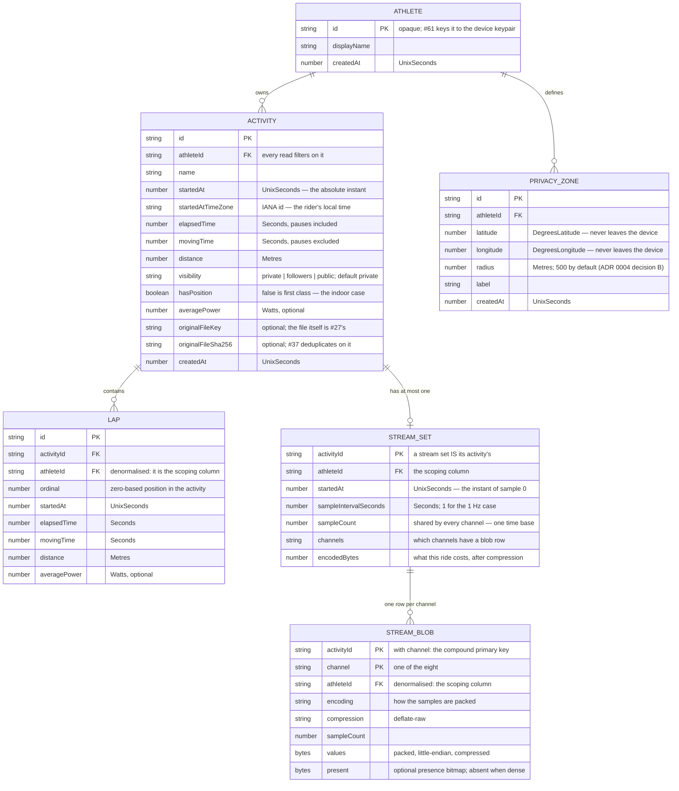

# `@onyourleft/store`

The local activity store: **athletes, activities, laps, privacy zones and per-second streams**, in
IndexedDB via [Dexie](https://dexie.org) 4.4.5 (Apache-2.0), on the athlete's own device. Plus the
**round-trip persistence harness** at `@onyourleft/store/testing`, which every later issue's
persistence tests are meant to be written against.

Phase 1 has no server, no account and no network — owner decision D6. There is no SQL here, no
foreign keys, no query planner and no separate migration tool, and #26's acceptance criteria are
translated to this engine rather than approximated on it. The reasoning for each translation is in
the file that implements it and in the pull request that added the package.

## Schema



Version 1 (#26) is the first four object stores. **Version 2 (#27) adds `streamSets` and
`streamBlobs` and changes no existing record's shape**, which is why `SCHEMA_MIGRATIONS` is still
empty — see *Migrations* below.

`FK` in that diagram is a description, not a mechanism: **IndexedDB has no foreign keys**. Both
edges are enforced by code in `activity-store.ts`, and both are tested.

Quantities are `@onyourleft/domain` types — `Seconds`, `Metres`, `Watts`, `UnixSeconds`,
`DegreesLatitude`, `DegreesLongitude`. They erase to plain numbers on disk, which is why
`persisted.ts` re-enters every one of them through its domain constructor on the way back out.

`startedAtTimeZone` is an **IANA identifier**, not a UTC offset. It survives daylight saving, which
a stored offset does not, and it needs no unit: `@onyourleft/domain` has no signed-duration
quantity, and a UTC offset cannot be `Seconds`, which is non-negative by construction.

## Indexes, and the query each one serves

| Index | Query |
|---|---|
| `[athleteId+id]` | `getActivity` — the athlete-scoped point lookup |
| `[athleteId+startedAt]` | `listActivitySummaries` by date (#62's default) |
| `[athleteId+distance]` | `listActivitySummaries` by distance (#62's second sort) |
| `[athleteId+originalFileSha256]` | `findActivityByOriginalFileHash` (#37's dedup lookup) |
| `athleteId` on `activities` | `deleteAthlete`'s cascade |
| `[athleteId+activityId+ordinal]` | `listLaps` |
| `activityId`, `athleteId` on `laps` | the two cascades |
| `athleteId` on `privacyZones` | `listPrivacyZones` |
| `[athleteId+activityId]` on `streamSets` | `getStreamSet`, `getStreamSetSummary` |
| `[athleteId+activityId+channel]` on `streamBlobs` | `getStreamSet`'s blob fetch and `getStreamChannel`'s single-channel one |
| `athleteId` on `streamSets`, `activityId`/`athleteId` on `streamBlobs` | the cascades |

Every activity and lap index leads with `athleteId`. That is not for speed: it means there is no
index that answers "the record with this id" without also being told whose it is, so the
cross-athlete lookup `CLAUDE.md` section 6 warns about is awkward to write by accident.

IndexedDB has no `EXPLAIN`, so "this query uses an index" is asserted one level down — at
`IDBIndex` versus `IDBObjectStore` — in `activity-store.index-path.test.ts`.

## Referential behaviour: cascade, chosen explicitly

| Deleting | Also deletes |
|---|---|
| an athlete | their activities, those activities' laps, their privacy zones, their stream sets and blobs |
| an activity | that activity's laps, its stream set and its blobs |

Each cascade runs in one Dexie read-write transaction across every affected store. The reasoning,
including what cascade costs, is at the top of `activity-store.ts`.

## Migrations

The migration tool is **Dexie's own versioning** (ADR 0005 section F). Every migration is a pair of
pure functions, `up` and `down`, over serialisable records, and `down` is tested by applying `up`
then `down` to a fixture containing records and asserting the original shape returns.

`SCHEMA_MIGRATIONS` is empty today. Version 1 is the initial schema of a store that has never
shipped, and version 2 **adds** two object stores without touching any existing record — so there
is no record to transform and no `down` to write. "No migration needed" is a claim about an
athlete's existing data, so it is tested rather than asserted: `migrations.test.ts` puts rows into a
version-1 database, opens it at version 2, and checks every record survived and the new stores work.
The `up`/`down` machinery is tested end to end through a real Dexie version bump, so the first
record-shape change is an entry in an array.

**There is no in-place rollback**, and this package guards the case where someone tries. IndexedDB
raises `VersionError` for a downgrade; Dexie 4.4.5 does not pass that on, and opens the newer
database at the older declared version without complaint. `ActivityStore` checks the backing
database's version on open and throws `StoreVersionError`. The supported path back is
**export → downgrade → re-import**.

## Streams — #27, decided in [ADR 0011](../../docs/adr/0011-stream-storage.md)

Streams are **append-once and read-whole**: nobody asks for "power at second 4,137", they fetch a
series to draw a chart. So a stream set is stored as **one packed typed array per channel**, not as
rows and not as JSON.

| Channel | Stored as | Bytes/sample | Resolution |
|---|---|---|---|
| `power` | `uint16` | 2 | 1 W |
| `heartRate` | `uint8` | 1 | 1 bpm |
| `cadence` | `uint8` | 1 | 1 rpm |
| `speed` | `uint16`, mm/s | 2 | 0.001 m/s |
| `latitude` | `sint32` FIT semicircles | 4 | 8.4 × 10⁻⁸° (~9 mm) |
| `longitude` | `sint32` FIT semicircles | 4 | 8.4 × 10⁻⁸° |
| `altitude` | `uint16`, FIT scale 5 offset 500 | 2 | 0.2 m |
| `temperature` | `sint8` | 1 | 1 °C |

**The resolution is the contract.** A value on the grid round-trips exactly; a value off it comes
back at the nearest grid point. That is acceptable only because ADR 0002 makes the athlete's
original file the canonical artefact and this set a derived rendering aid.

**A gap is `undefined`, never a zero and never interpolated.** A heart-rate strap that dropped for
thirty seconds comes back as thirty absent samples. On disk that is a packed presence bitmap, one
bit per sample, omitted entirely when the channel is dense.

Each blob is compressed with the platform's `CompressionStream` in `deflate-raw` framing.

**Measured**, by `stream-store.test.ts`, for a four-hour 1 Hz eight-channel ride:

| | |
|---|---|
| Packed, before compression | 244,800 B (239 KiB) |
| Stored | 90,763 B (88.6 KiB), **2.70×** |
| **Per recorded hour** | **22.2 KiB** |
| Retrieval of the whole set | ~6 ms on `fake-indexeddb`; product budget 500 ms on a device |

The write is **one Dexie transaction across `activities`, `streamSets` and `streamBlobs`**, so a
failure part way through leaves neither a metadata row nor a blob. Encoding and compression happen
before the transaction opens, because awaiting a promise Dexie did not create inside one lets the
IndexedDB transaction commit out from under the code still using it.

```ts
await store.putStreamSet({ activityId, athleteId, startedAt, sampleInterval: seconds(1),
                           sampleCount, channels: { power: [...], heartRate: [...] } });
const set     = await store.getStreamSet(owner, activityId);        // every channel
const power   = await store.getStreamChannel(owner, activityId, 'power');  // one channel
const summary = await store.getStreamSetSummary(owner, activityId); // no samples decoded
```

## The round-trip harness — #28

`@onyourleft/store/testing`. The primitive is **write through the public path → close every
connection → open a fresh one → read through the public path → compare**, and `read()` cannot be
served by the handle that wrote.

```ts
import { createStoreHarness, seedAthletes, seedRide, streamSetFor,
         assertStreamSetRoundTrip, ATHLETE_A } from '@onyourleft/store/testing';

const harness = createStoreHarness();
await seedAthletes(harness);                       // three athletes, always
const ride = await seedRide(harness, ATHLETE_A);
await assertStreamSetRoundTrip(harness, streamSetFor(ride));
await harness.destroy();
```

It is **proved by deliberately breaking persistence**: `fakes.ts` holds three broken repositories —
one that writes to memory, one that commits to the real database under a key the reader does not
use, and one that fills every gap with a zero — and `harness.test.ts` runs the *same* assertion body
against all three and requires each to go red. Adding a write path to `ActivityStore` fails to
compile until `fakes.ts` accounts for it.

`CLAUDE.md` section 5 documents it for the issues that will consume it.

## Not in this package

- **Devices and gear.** Additive object stores in a later schema version.
- **Anything server-shaped.** There is no server in Phase 1.
