# `@onyourleft/store`

The local activity store: **athletes, activities, laps, privacy zones and per-second streams**, in
IndexedDB via [Dexie](https://dexie.org) 4.4.5 (Apache-2.0), on the athlete's own device. Plus the
**round-trip persistence harness** at `@onyourleft/store/testing`, which every later issue's
persistence tests are meant to be written against.

Phase 1 has no server, no account and no network — owner decision D6. There is no SQL here, no
foreign keys, no query planner and no separate migration tool, and #26's acceptance criteria are
translated to this engine rather than approximated on it. The reasoning for each translation is in
the file that implements it and in the pull request that added the package.

## Schema

```mermaid
erDiagram
    ATHLETE ||--o{ ACTIVITY : owns
    ATHLETE ||--o{ PRIVACY_ZONE : defines
    ACTIVITY ||--o{ LAP : contains
    ACTIVITY ||--o| STREAM_SET : "has at most one"
    STREAM_SET ||--o{ STREAM_BLOB : "one row per channel"
    ATHLETE ||--o{ RECORDING_SESSION : "is recording"
    RECORDING_SESSION ||--o{ RECORDING_CHUNK : "one row per flush"
    ATHLETE ||--o| DEVICE_KEY : "has exactly one, write-once"
    ACTIVITY ||--o| ACTIVITY_RECORD : "has at most one signed record"
    ATHLETE ||--o{ ROUTE : "saves"
    ATHLETE ||--o{ WORKOUT : "saves"

    ATHLETE {
        string  id                  PK "opaque; #61 keys it to the device keypair"
        string  displayName
        number  createdAt              "UnixSeconds"
        number  thresholdPower         "Watts, optional — #78's zone basis"
        number  thresholdHeartRate     "BeatsPerMinute, optional — #78's zone basis"
    }
    ACTIVITY {
        string  id                 PK
        string  athleteId          FK "every read filters on it"
        string  name
        number  startedAt              "UnixSeconds — the absolute instant"
        string  startedAtTimeZone      "IANA id — the rider's local time"
        number  elapsedTime            "Seconds, pauses included"
        number  movingTime             "Seconds, pauses excluded"
        number  distance               "Metres"
        string  visibility             "private | followers | public; default private"
        boolean hasPosition            "false is first class — the indoor case"
        number  averagePower           "Watts, optional"
        string  originalFileKey        "optional; the file itself is #27's"
        string  originalFileSha256     "optional; #37 deduplicates on it"
        number  createdAt              "UnixSeconds"
    }
    LAP {
        string  id           PK
        string  activityId   FK
        string  athleteId    FK "denormalised: it is the scoping column"
        number  ordinal          "zero-based position in the activity"
        number  startedAt        "UnixSeconds"
        number  elapsedTime      "Seconds"
        number  movingTime       "Seconds"
        number  distance         "Metres"
        number  averagePower     "Watts, optional"
    }
    PRIVACY_ZONE {
        string  id         PK
        string  athleteId  FK
        number  latitude       "DegreesLatitude — never leaves the device"
        number  longitude      "DegreesLongitude — never leaves the device"
        number  radius         "Metres; 500 by default (ADR 0004 decision B)"
        string  label
        number  createdAt      "UnixSeconds"
    }
    STREAM_SET {
        string  activityId            PK "a stream set IS its activity's"
        string  athleteId             FK "the scoping column"
        number  startedAt                "UnixSeconds — the instant of sample 0"
        number  sampleIntervalSeconds    "Seconds; 1 for the 1 Hz case"
        number  sampleCount              "shared by every channel — one time base"
        string  channels                 "which channels have a blob row"
        number  encodedBytes             "what this ride costs, after compression"
    }
    STREAM_BLOB {
        string  activityId   PK "with channel: the compound primary key"
        string  channel      PK "one of the eight"
        string  athleteId    FK "denormalised: the scoping column"
        string  encoding        "how the samples are packed"
        string  compression     "deflate-raw"
        number  sampleCount
        bytes   values          "packed, little-endian, compressed"
        bytes   present         "optional presence bitmap; absent when dense"
    }
    RECORDING_SESSION {
        string  id                    PK
        string  athleteId             FK "the scoping column"
        number  startedAt                "UnixSeconds — the instant of sample 0"
        number  sampleIntervalSeconds    "Seconds; 1 for the 1 Hz case"
        string  state                    "recording | paused | stopped"
        number  updatedAt                "UnixSeconds — what the recovery list orders by"
        string  pauses                   "the intervals that keep a pause apart from a dropout"
    }
    RECORDING_CHUNK {
        string  sessionId    PK "with seq: the compound primary key"
        number  seq          PK "append order, from zero"
        string  athleteId    FK "denormalised: the scoping column"
        number  fromIndex       "this window's first slot in the whole recording"
        number  sampleCount
        string  channels        "packed bytes per channel; NOT compressed"
    }
    DEVICE_KEY {
        string  athleteId    PK "one row per athlete; write-once"
        string  algorithm       "Ed25519"
        string  publicKey       "32 bytes, lowercase hex"
        string  privateKey      "a NON-EXTRACTABLE CryptoKey, never bytes"
        number  createdAt       "UnixSeconds"
    }
    ACTIVITY_RECORD {
        string  activityId   PK
        string  athleteId    FK "the scoping column"
        string  record          "the signed, publishable JSON document"
    }
```



Version 1 (#26) is the first four object stores. **Version 2 (#27) adds `streamSets` and
`streamBlobs`**, **version 3 (#46) adds `recordingSessions` and `recordingChunks`**, and
**version 4 (#61) adds `deviceKeys` and `activityRecords`**. No later version changes an existing
record's shape, which is why `SCHEMA_MIGRATIONS` is still empty — see *Migrations* below.

`FK` in that diagram is a description, not a mechanism: **IndexedDB has no foreign keys**. Both
edges are enforced by code in `activity-store.ts`, and both are tested.

Quantities are `@onyourleft/domain` types — `Seconds`, `Metres`, `Watts`, `UnixSeconds`,
`DegreesLatitude`, `DegreesLongitude`. They erase to plain numbers on disk, which is why
`persisted.ts` re-enters every one of them through its domain constructor on the way back out.

`startedAtTimeZone` is an **IANA identifier**, not a UTC offset. It survives daylight saving, which
a stored offset does not, and it needs no unit: `@onyourleft/domain` has no signed-duration
quantity, and a UTC offset cannot be `Seconds`, which is non-negative by construction.

## Indexes, and the query each one serves

| Index | Query |
|---|---|
| `[athleteId+id]` | `getActivity` — the athlete-scoped point lookup |
| `[athleteId+startedAt]` | `listActivitySummaries` by date (#62's default) |
| `[athleteId+distance]` | `listActivitySummaries` by distance (#62's second sort) |
| `[athleteId+originalFileSha256]` | `findActivityByOriginalFileHash` (#37's dedup lookup) |
| `athleteId` on `activities` | `deleteAthlete`'s cascade |
| `[athleteId+activityId]` on `activityRecords` | `getActivityRecord` — the athlete-scoped point lookup for a signed record |
| `athleteId` on `activityRecords` | `deleteAthlete`'s cascade over signed records |
| `[athleteId+activityId+ordinal]` | `listLaps` |
| `activityId`, `athleteId` on `laps` | the two cascades |
| `athleteId` on `privacyZones` | `listPrivacyZones` |
| `[athleteId+activityId]` on `streamSets` | `getStreamSet`, `getStreamSetSummary` |
| `[athleteId+activityId+channel]` on `streamBlobs` | `getStreamSet`'s blob fetch and `getStreamChannel`'s single-channel one |
| `athleteId` on `streamSets`, `activityId`/`athleteId` on `streamBlobs` | the cascades |
| `[athleteId+id]` on `recordingSessions` | `getRecordingSession` — the athlete-scoped point lookup |
| `[athleteId+updatedAt]` on `recordingSessions` | `listRecordingSessions`, newest checkpoint first |
| `[athleteId+sessionId+seq]` on `recordingChunks` | `recoverRecording` and `getRecordingFootprint`, walking the append order |
| `athleteId` on `recordingSessions`, `sessionId`/`athleteId` on `recordingChunks` | the cascades |

Every activity and lap index leads with `athleteId`. That is not for speed: it means there is no
index that answers "the record with this id" without also being told whose it is, so the
cross-athlete lookup `CLAUDE.md` section 6 warns about is awkward to write by accident.

IndexedDB has no `EXPLAIN`, so "this query uses an index" is asserted one level down — at
`IDBIndex` versus `IDBObjectStore` — in `activity-store.index-path.test.ts`.

## Referential behaviour: cascade, chosen explicitly

| Deleting | Also deletes |
|---|---|
| an athlete | their activities, those activities' laps, their privacy zones, their stream sets and blobs, **and their recordings in progress with every chunk** |
| an activity | that activity's laps, its stream set and its blobs |

A half-recorded ride is a GPS trace like any other, so erasure that left it behind would leave the
athlete's route on the device under a row no scoped read can reach. That is the orphan-as-privacy-
liability case, and it is why the recording cascade is not optional.

Each cascade runs in one Dexie read-write transaction across every affected store. The reasoning,
including what cascade costs, is at the top of `activity-store.ts`.

## Migrations

The migration tool is **Dexie's own versioning** (ADR 0005 section F). Every migration is a pair of
pure functions, `up` and `down`, over serialisable records, and `down` is tested by applying `up`
then `down` to a fixture containing records and asserting the original shape returns.

`SCHEMA_MIGRATIONS` is empty today. Version 1 is the initial schema of a store that has never
shipped, and version 2 **adds** two object stores without touching any existing record — so there
is no record to transform and no `down` to write. "No migration needed" is a claim about an
athlete's existing data, so it is tested rather than asserted: `migrations.test.ts` puts rows into a
version-1 database, opens it at version 2, and checks every record survived and the new stores work.
The `up`/`down` machinery is tested end to end through a real Dexie version bump, so the first
record-shape change is an entry in an array.

### `ensureAthlete`, and why `putAthlete` is the wrong call at start-up

Every write path that carries an owner — `putActivity`, `putRecordingSession`, `putPrivacyZone`,
`putDeviceKey` — calls `#requireAthlete` and throws `StoreReferentialError` when there is no such
row. That is what stops an orphaned ride, and it means **a client has to establish its athlete
before its first write**.

⚠️ **`putAthlete` is a `put`.** A client calling it on every start-up to make sure the row exists
would rewrite it on every page load, discarding `displayName`, `createdAt` and — since #78 —
`thresholdPower` and `thresholdHeartRate`. `ensureAthlete(record)` inserts **only if absent**, in one
transaction, and returns whatever is on disk afterwards — the *existing* row when there was one,
never the record it was handed. Idempotent, so a reload is not an error, and transactional, so two
tabs opening at the same moment cannot both decide the row is missing and have the loser erase the
winner.

`apps/web` never made either call until [#184](https://github.com/openzigs/onyourleft/issues/184),
so on a browser nobody had seeded by hand every import failed and every recording checkpoint failed
— the second one silently, because the recorder catches its own write failure and carries on in
memory. `apps/web/src/local-athlete.ts` is the fix and the seam that had no test.

`setAthleteThresholds(id, thresholds)` is the write half, added by #76, and it is narrow for the
same reason: it replaces the two thresholds and touches nothing else, so a rider saving a number
cannot destroy their display name. ⚠️ **It replaces both, and `undefined` means "not set" rather
than "leave alone"** — with the other reading there would be no way to clear a threshold at all, and
a rider who set one by mistake could never get back to the default.

`setActivityLoadSummary(owner, id, summary)` (#77) is the same shape again, for a ride: it writes
the threshold-independent half of a ride's load and touches nothing else, and it is **athlete-scoped**
— a ride id alone must never be enough to modify a row (CLAUDE.md §6). ⚠️ The *load* is deliberately
not stored: it depends on a threshold the rider can change, so a stored one would go silently stale
across the whole history. `ActivityRecord.effortWeightedPower` records the split.

### An optional field is not a migration, and that is why #78's thresholds are optional

`AthleteRecord.thresholdPower` and `thresholdHeartRate` (#78) are **optional**, and that is a
deliberate choice about the migration path rather than about the domain. An absent field reads back
as `undefined` from a row written before it existed, so an athlete's existing database needs no data
transform, no schema version and no `.upgrade()` hook — the same reason versions 1–4 needed no
record migrations at all.

A **required** field would have been a different piece of work: it would need the first entry in
`SCHEMA_MIGRATIONS`, **and** the Dexie `.upgrade()` wiring, which does not exist yet. `upgradeWith`
in `migrations.ts` is written and is tested and is never called from `ActivityStore`. Making a field
required is therefore a change to this store's core with real risk to real databases, and it belongs
to whoever needs it rather than to a feature that only needs a number.

`AthleteRecord.units` (#238) is optional for the same reason and lands the same way — an absent field
means "nobody has chosen", and exactly one place in `apps/web` substitutes the default. ⚠️ It is the
**one** field on this row whose decode is not faithful: a stored value outside the two falls back to
`metric` rather than raising a `StoreDecodeError`. `unit-system.ts` says why — a visibility outside
its three values could publish a private ride, so refusing the row is right there; a unit preference
outside its two decides only whether a number reads `km` or `mi`, and taking a rider's whole library
away over a hand-edited setting is not a trade worth making.

⚠️ **A narrow write must be built from the row it read, not from a list of the fields it knows
about.** `setAthleteThresholds` rebuilt the record from `id`, `displayName` and `createdAt` until
#238, so saving a threshold silently erased `mass` — and would have erased `units`. The write it was
*about* landed and the read for it agreed, which is why nothing noticed: it is CLAUDE.md §5's "a
write that reports success while the read cannot see it", applied to the field nobody was looking
at. Both narrow athlete writes now spread the decoded record, and
`activity-store.units.test.ts` holds it.

`fromPersistedAthlete` reads the field **faithfully** — absent stays absent — because a decoder that
substituted a default would be lying about what is on disk. Exactly one place in the program
substitutes one, `apps/web/src/analysis/thresholds.ts`, which is what makes #78's "a single athlete
threshold setting" a fact rather than a hope. A value that *is* present is validated on the way out
like every other field: a negative threshold on disk is a `StoreDecodeError`, not a zone table with
a negative boundary.

**There is no in-place rollback**, and this package guards the case where someone tries. IndexedDB
raises `VersionError` for a downgrade; Dexie 4.4.5 does not pass that on, and opens the newer
database at the older declared version without complaint. `ActivityStore` checks the backing
database's version on open and throws `StoreVersionError`. The supported path back is
**export → downgrade → re-import**.

## Streams — #27, decided in [ADR 0011](../../docs/adr/0011-stream-storage.md)

Streams are **append-once and read-whole**: nobody asks for "power at second 4,137", they fetch a
series to draw a chart. So a stream set is stored as **one packed typed array per channel**, not as
rows and not as JSON.

| Channel | Stored as | Bytes/sample | Resolution |
|---|---|---|---|
| `power` | `uint16` | 2 | 1 W |
| `heartRate` | `uint8` | 1 | 1 bpm |
| `cadence` | `uint8` | 1 | 1 rpm |
| `speed` | `uint16`, mm/s | 2 | 0.001 m/s |
| `latitude` | `sint32` FIT semicircles | 4 | 8.4 × 10⁻⁸° (~9 mm) |
| `longitude` | `sint32` FIT semicircles | 4 | 8.4 × 10⁻⁸° |
| `altitude` | `uint16`, FIT scale 5 offset 500 | 2 | 0.2 m |
| `temperature` | `sint8` | 1 | 1 °C |

**The resolution is the contract.** A value on the grid round-trips exactly; a value off it comes
back at the nearest grid point. That is acceptable only because ADR 0002 makes the athlete's
original file the canonical artefact and this set a derived rendering aid.

**A gap is `undefined`, never a zero and never interpolated.** A heart-rate strap that dropped for
thirty seconds comes back as thirty absent samples. On disk that is a packed presence bitmap, one
bit per sample, omitted entirely when the channel is dense.

Each blob is compressed with the platform's `CompressionStream` in `deflate-raw` framing.

**Measured**, by `stream-store.test.ts`, for a four-hour 1 Hz eight-channel ride:

| | |
|---|---|
| Packed, before compression | 244,800 B (239 KiB) |
| Stored | 90,763 B (88.6 KiB), **2.70×** |
| **Per recorded hour** | **22.2 KiB** |
| Retrieval of the whole set | ~6 ms on `fake-indexeddb`; product budget 500 ms on a device |

The write is **one Dexie transaction across `activities`, `streamSets` and `streamBlobs`**, so a
failure part way through leaves neither a metadata row nor a blob. Encoding and compression happen
before the transaction opens, because awaiting a promise Dexie did not create inside one lets the
IndexedDB transaction commit out from under the code still using it.

```ts
await store.putStreamSet({ activityId, athleteId, startedAt, sampleInterval: seconds(1),
                           sampleCount, channels: { power: [...], heartRate: [...] } });
const set     = await store.getStreamSet(owner, activityId);        // every channel
const power   = await store.getStreamChannel(owner, activityId, 'power');  // one channel
const summary = await store.getStreamSetSummary(owner, activityId); // no samples decoded
```

## Recording checkpoints — #46

A **recording in progress** is stored differently from a finished ride, and the difference is the
whole of #46's guarantee.

| | `streamSets` + `streamBlobs` (#27) | `recordingSessions` + `recordingChunks` (#46) |
|---|---|---|
| Written | once, when the ride is saved | every few seconds, while it is being ridden |
| Shape | whole set, replaced | contiguous windows, appended |
| Compressed | yes, `deflate-raw` | **no** — packed only |
| Lifetime | the athlete's history | until the ride is finalised or discarded |

**Append-only is what makes a crash survivable.** A chunk covers `[fromIndex, fromIndex +
sampleCount)` and is never revisited, and an IndexedDB transaction either commits or does not — so a
crash mid-write leaves the chunk absent, never half-written, and the chunks before it are still a
correct prefix of the ride.

`recoverRecording` therefore reads the **contiguous prefix** and stops at the first hole, counting
what it skipped in `chunksAfterGap`. Rows either side of a lost flush are both real, and joining
them would shift every later sample onto the wrong second while producing an array of exactly the
length a caller expects — the right shape and the wrong ride.

**Chunks are deliberately not compressed.** Deflate earns its place on a finished set (239 KB to
about 53 KB) and not on a five-sample chunk: it would emit more bytes than it saved,
`CompressionStream` is asynchronous so it would put a suspension point in the one path that must
complete before the tab dies, and a chunk lives for minutes. The bytes are still packed by
`stream-codec.ts`, gaps included as a presence bitmap — a recovery that filled its gaps would return
a ride that reads as complete and is not.

**Measured**, by `recording-store.test.ts` and asserted exactly there: a four-hour, 1 Hz,
eight-channel recording occupies **244,806 bytes — 239.07 KiB** of packed samples across 2,880
chunk rows. 17 bytes per sample, plus one presence-bitmap byte per chunk that carries a gap. Against
the 1 GiB an origin can conservatively rely on, that is headroom for roughly four thousand
simultaneous four-hour checkpoints, and a checkpoint is transient.

The flush cadence, and the data-loss bound that follows from it, belong to the client:
`apps/web/src/recording/recorder.ts`.

## The round-trip harness — #28

`@onyourleft/store/testing`. The primitive is **write through the public path → close every
connection → open a fresh one → read through the public path → compare**, and `read()` cannot be
served by the handle that wrote.

```ts
import { createStoreHarness, seedAthletes, seedRide, streamSetFor,
         assertStreamSetRoundTrip, ATHLETE_A } from '@onyourleft/store/testing';

const harness = createStoreHarness();
await seedAthletes(harness);                       // three athletes, always
const ride = await seedRide(harness, ATHLETE_A);
await assertStreamSetRoundTrip(harness, streamSetFor(ride));
await harness.destroy();
```

It is **proved by deliberately breaking persistence**: `fakes.ts` holds five broken repositories —
one that writes to memory, one that commits to the real database under a key the reader does not
use, one that fills every gap with a zero, one whose every second flush is acknowledged and never
written, and one that tidies a signed claim on its way in — and the *same* assertion body is run
against each and required to go red. Adding a write path to `ActivityStore` fails to compile until
`fakes.ts` accounts for it, which is how the fourth fake arrived with #46's checkpoint write and the
fifth with #61's signed record. The fifth one's red/green pair is in `identity-store.test.ts` rather
than `harness.test.ts`, because it needs WebCrypto and that file imports no platform primitive.

`CLAUDE.md` section 5 documents it for the issues that will consume it.

## Identity — #61, decided in [ADR 0014](../../docs/adr/0014-portable-identity.md)

Schema version 4 adds two stores and no field to any existing one.

| Store | Row | Leaves the device |
|---|---|---|
| `deviceKeys` | one per athlete: the Ed25519 keypair, private half as a **non-extractable `CryptoKey`**, public half as lowercase hex | never, in any form |
| `activityRecords` | one per ride: the signed, content-addressed record | that is what it is *for* |

The record format itself is specified in
[`docs/architecture.md`](../../docs/architecture.md) §"The signed activity record", written so a
verifier can be built from the prose. The *algorithm* — the canonical byte encoding, the record
shape and the verification logic — lives in `@onyourleft/domain`, which cannot name `crypto`; this
package supplies the primitive, in `web-crypto.ts`, and nothing else in the program calls
`crypto.subtle` for a signature.

```ts
import { ensureSigningKey } from '@onyourleft/domain';
import { createWebCryptoKeystore, webCryptoVerifier } from '@onyourleft/store';

// Generated on first run; every launch after that reuses it.
const key = await ensureSigningKey(createWebCryptoKeystore(store, athlete));
```

Six things to know before you touch it:

- **`deviceKeys` has no secondary index, on purpose.** Its primary key is `athleteId`, so the only
  lookup it admits is already scoped. An index by public key would be a query that finds a key
  without being told whose it is, which is the shape CLAUDE.md §6 names.
- **An identity is write-once.** `putDeviceKey` refuses to replace an existing key with a different
  one. Two tabs racing to create one both end up with the winner's — the alternative outcomes are
  "one tab cannot sign" and "the athlete's history splits in two", and the second is the failure
  #61's first acceptance criterion is about.
- **The private key is a handle, never bytes.** `extractable: false`, so `crypto.subtle.exportKey`
  on it rejects. Do not "simplify" it to a stored byte array: the non-extractability *is* "the
  private key never leaves the device". ⚠️ That flag is set by `generateDeviceKey` and **is not
  re-checked when a row is read or written** (#161). It is a property of the only factory
  production code has, not of the store, and that is a decision rather than an oversight: a guard
  at the store boundary would reject the extractable key `identity-safety.test.ts` deliberately
  stores, and that test proves the stronger property — that the private bytes appear in no
  serialised shape, no log line and no error stack — which it can only do with a key whose bytes it
  can compute.
- **A read is not a verification** (#161). `getActivityRecord` re-parses through
  `parseSignedActivityRecord`, which establishes *shape* and nothing more; neither it nor
  `putActivityRecord` checks a signature. A `StoredActivityRecord` this store hands back looks
  authentic and may not be, so a consumer that needs authenticity calls `verifyRecordSignature`
  itself. ADR 0014 puts verification at #37's import, where a record crosses a trust boundary.
- **The two halves of a stored key are checked against each other before it signs** (#161).
  `signingKeyFor` signs a fixed probe with the private handle and verifies it against the public
  half the row advertises, once per key. Without it, a `deviceKeys` row whose `publicKey` was
  altered would sign with one half and advertise the other, and every record the device produced
  would be permanently unverifiable with nothing raising an error. `putActivityRecord`'s
  key-binding guard cannot see that: it compares the row with itself.
- **A round trip over a record ends in a verification, not a comparison.** Use
  `assertSignedRecordRoundTrip`. `roundedClaimStoreFactory` is a store that rounds one claim on its
  way in; the record comes back complete, well-formed and parseable, and only the signature check
  notices.

### Key loss and key rotation, and what happens to records already signed

Stated here because #61 asks for them to be documented behaviours with a stated consequence rather
than silent ones. The full reasoning is
[ADR 0014](../../docs/adr/0014-portable-identity.md) §Consequences.

**Key loss.** The key cannot be exported, so it cannot be backed up, and IndexedDB is deletable by
the athlete, by "clear browsing data", and by the browser under storage pressure.

| | After key loss |
|---|---|
| Records already signed | **still verify, forever** — each carries its own public key |
| The activity files | untouched; they are not encrypted |
| Signing a **new** record as the same identity | **impossible** |
| Riding, recording and exporting | unaffected |

The recovery is a **new identity**. The athlete's history then has two eras, both valid and provably
by different keys. Nothing is silently re-signed — that would be the device asserting something it
did not witness.

**Key rotation.** There is none in Phase 1, and replacing a key is refused rather than merely
undocumented. If rotation is added it must be **additive**: a new key, a transition record signed by
the *old* one, and old records left alone. Silent replacement would make every previously signed
record unverifiable against the athlete's current identity.

**Downgrading a device** is export → downgrade → re-import (ADR 0005 §F), and
`identity-rollback.test.ts` executes it: every record comes back and still verifies. The key does
not come back, for the same reason it cannot be backed up.

## Routes — #89

Schema version 7 adds one store, `routes`, keyed on `id` with every index leading with `createdBy`.
A route is a line somebody intends to ride — imported from a file, named by the rider — together
with the profile `@onyourleft/domain` built from it: elevation and gradient on a fixed 10 m grid,
the path at the same grid points, and a `loop` flag.

**Why the whole computed profile is stored, when `ActivityRecord` deliberately stores only half a
load.** The rule is the same in both places and it is about *staleness*, not about size: a ride's
load depends on the athlete's threshold, so storing the finished number would leave last year's
rides quoting a threshold the rider has since changed. A route's profile depends on **nothing but
the file it came from**. There is no setting behind it to go stale, so the expensive half is stored
and #90 reads a gradient from it at 1 Hz without recomputing a median filter between "the rider
pressed start" and "the trainer felt right".

⚠️ **A route holds no reference to an activity and no OSM identifier.** The first because it was
imported rather than cut from a ride, so `deleteActivity` has nothing to cascade — asserted, so that
nobody adds a cascade to a foreign key that is not there. The second per
[ADR 0012](../../docs/adr/0012-data-licence.md) D-1, for `SegmentRecord`'s reason: a way id would
convert the route corpus into an ODbL Derivative Database and would arrive looking like a rendering
optimisation.

⚠️ **Erasing an athlete DOES delete their routes**, and the count is reported. A saved route is a
line through the places somebody rides, which is location data about them in exactly ADR 0004's
sense; leaving it behind would leave their roads on the device under a row no scoped read can reach.

**The eighth fake is a one-bit failure.** `openedLoopStoreFactory` writes `loop: false` and gets
every coordinate, elevation and gradient right to the last bit. Nothing about the stored route is
corrupt and nothing structural notices — the ride simply stops accumulating at the end of the first
lap. `assertRouteRoundTrip` checks `loop` first and on its own line for that reason, and deleting
that line turns a test red rather than leaving the suite green.

## Workouts — #14

Schema version 8 adds one store, `workouts`, the same shape as `routes`: keyed on `id`, every index
leading with `createdBy`. A workout is a named list of blocks — steady, ramp, intervals, free ride —
each carrying a duration and, except for a free ride, a target expressed as a share of the rider's
threshold.

⚠️ **This is the only record in this package whose contents become a command to a trainer**, and
every decision below follows from that one sentence. A ride's samples are a report of something that
already happened; a route is a line to look at. A workout's blocks are turned into `setTargetPower`
writes against a machine applying physical resistance to somebody pedalling, which CLAUDE.md §6 puts
in the safety class.

**So the read path re-validates.** `fromPersistedWorkout` puts the decoded blocks back through
`validateWorkout` and rewrites a `WorkoutError` as a `StoreDecodeError`. Every other decoder here
reconstructs a record that will be *displayed*, and trusting the row costs a wrong number on a
screen. Here a row reading `target: 88` where `0.88` was meant is a plausible-looking number that
asks a trainer for 88 times threshold, and the only thing that tells the two apart is the
constructor's own guard — which never ran, because the row came off a disk rather than out of
TypeScript.

⚠️ **That guard did not cover targets until #14's store slice, and the gap was found by writing this
test.** `validateWorkout` checked every duration and every repeat count and took the `ThresholdShare`
brand at face value. A brand is a compile-time fiction for a value that arrived as data, so
`assertShare` now sits beside `assertDuration` in `packages/domain/src/workout/workout.ts` and both
are checked on the way in. The two guards exist for one reason and neither is redundant with the
constructor.

**Blocks are stored, not the timeline.** `expandWorkout` is cheap and deterministic, so a stored
expansion is the second copy that goes stale — the same argument `ActivityRecord` makes for storing
half a load. It is the opposite call from `RouteRecord`, which stores its whole computed profile, and
the difference is what the derivation reads: a profile is derived from a file the store does not
keep, and a timeline is derived from the blocks in the row beside it.

⚠️ **`description` was dropped on the way to disk until #202, and nothing noticed.** `Workout`
has carried an optional `description` since #201, `toPersistedWorkout` never wrote it and
`fromPersistedWorkout` never read it, so an imported workout's text was lost on save. The reason it
went unseen is worth more than the fix: every round-trip assertion in `workout-store.test.ts` used a
fixture with **no description in it**, so the field that was silently discarded was also the field
nothing looked at. `workoutFor` still defaults to having none — that is the absent-stays-absent case
and every existing assertion goes on covering it — and the tests that want the other case ask for
it.

It needed **no schema version**: §"An optional field is not a migration" is the rule, and an absent
key reads back as `undefined` from a row written before the field existed. The decode is faithful in
both directions — a description that is not a string on disk is a `StoreDecodeError`, and one that
is absent stays absent rather than becoming an empty string.

⚠️ **No `visibility` column, deliberately.** ADR 0004's default exists because a route or a ride
carries coordinates — a route's endpoints are usually the athlete's front door. A workout carries
none: durations and fractions, and not even the threshold they are fractions of. The privacy
machinery would be ceremony around a record with nothing private in it. A later issue that shares
workouts adds the column and the migration.

**The tenth fake loses a block.** `truncatedWorkoutStoreFactory` drops the last one on its way in,
and it survives every check a careless round trip makes: a workout missing its last block is still a
valid workout, so the re-validation passes it; the name, the id, the owner and the timestamps are
right; the list renders. A rider opens their hour-long session and it is fifty-three minutes long.
`assertWorkoutRoundTrip` compares the block count first and on its own line for that reason.

⚠️ **Erasing an athlete deletes their workouts too, and the reason is not privacy.** Nothing about a
workout is sensitive. It cascades because an erasure that leaves rows behind under an athlete id
that no longer exists is an erasure that did not happen — and the next athlete created with a
recycled id would inherit them.

## Not in this package

- **Devices and gear.** Additive object stores in a later schema version.
- **Anything server-shaped.** There is no server in Phase 1.
- **The record format.** It is `@onyourleft/domain`'s, so that the same code verifies on a device
  and on an instance. This package stores records and supplies the primitive.
