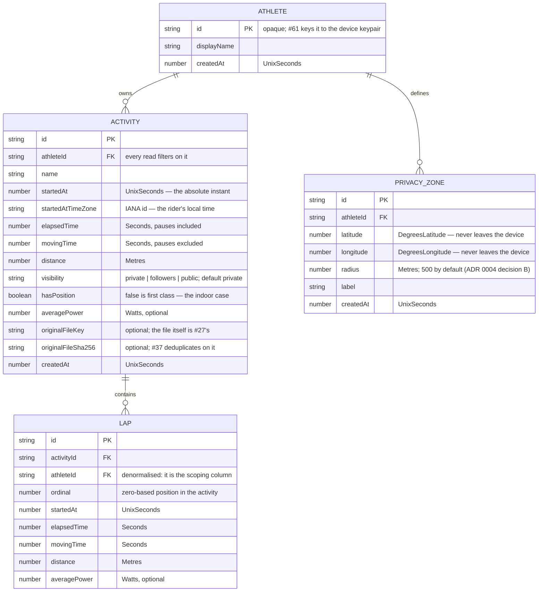

# `@onyourleft/store`

The local activity store: **athletes, activities, laps and privacy zones**, in IndexedDB via
[Dexie](https://dexie.org) 4.4.5 (Apache-2.0), on the athlete's own device.

Phase 1 has no server, no account and no network — owner decision D6. There is no SQL here, no
foreign keys, no query planner and no separate migration tool, and #26's acceptance criteria are
translated to this engine rather than approximated on it. The reasoning for each translation is in
the file that implements it and in the pull request that added the package.

## Schema, version 1

`FK` in that diagram is a description, not a mechanism: **IndexedDB has no foreign keys**. Both
edges are enforced by code in `activity-store.ts`, and both are tested.

Quantities are `@onyourleft/domain` types — `Seconds`, `Metres`, `Watts`, `UnixSeconds`,
`DegreesLatitude`, `DegreesLongitude`. They erase to plain numbers on disk, which is why
`persisted.ts` re-enters every one of them through its domain constructor on the way back out.

`startedAtTimeZone` is an **IANA identifier**, not a UTC offset. It survives daylight saving, which
a stored offset does not, and it needs no unit: `@onyourleft/domain` has no signed-duration
quantity, and a UTC offset cannot be `Seconds`, which is non-negative by construction.

## Indexes, and the query each one serves

| Index | Query |
|---|---|
| `[athleteId+id]` | `getActivity` — the athlete-scoped point lookup |
| `[athleteId+startedAt]` | `listActivitySummaries` by date (#62's default) |
| `[athleteId+distance]` | `listActivitySummaries` by distance (#62's second sort) |
| `[athleteId+originalFileSha256]` | `findActivityByOriginalFileHash` (#37's dedup lookup) |
| `athleteId` on `activities` | `deleteAthlete`'s cascade |
| `[athleteId+activityId+ordinal]` | `listLaps` |
| `activityId`, `athleteId` on `laps` | the two cascades |
| `athleteId` on `privacyZones` | `listPrivacyZones` |

Every activity and lap index leads with `athleteId`. That is not for speed: it means there is no
index that answers "the record with this id" without also being told whose it is, so the
cross-athlete lookup `CLAUDE.md` section 6 warns about is awkward to write by accident.

IndexedDB has no `EXPLAIN`, so "this query uses an index" is asserted one level down — at
`IDBIndex` versus `IDBObjectStore` — in `activity-store.index-path.test.ts`.

## Referential behaviour: cascade, chosen explicitly

| Deleting | Also deletes |
|---|---|
| an athlete | their activities, those activities' laps, their privacy zones |
| an activity | that activity's laps |

Each cascade runs in one Dexie read-write transaction across every affected store. The reasoning,
including what cascade costs, is at the top of `activity-store.ts`.

## Migrations

The migration tool is **Dexie's own versioning** (ADR 0005 section F). Every migration is a pair of
pure functions, `up` and `down`, over serialisable records, and `down` is tested by applying `up`
then `down` to a fixture containing records and asserting the original shape returns.

`SCHEMA_MIGRATIONS` is empty today, because version 1 is the initial schema of a store that has
never shipped. The machinery is tested end to end through a real Dexie version bump, so the first
real migration is an entry in an array.

**There is no in-place rollback**, and this package guards the case where someone tries. IndexedDB
raises `VersionError` for a downgrade; Dexie 4.4.5 does not pass that on, and opens the newer
database at the older declared version without complaint. `ActivityStore` checks the backing
database's version on open and throws `StoreVersionError`. The supported path back is
**export → downgrade → re-import**.

## Not in this package

- **Stream data.** No samples, no channels, no blobs — #27 owns stream storage, and ADR 0005
  section F is explicit that raw per-sample rows are never stored.
- **Devices and gear.** Additive object stores in a later schema version.
- **Anything server-shaped.** There is no server in Phase 1.
